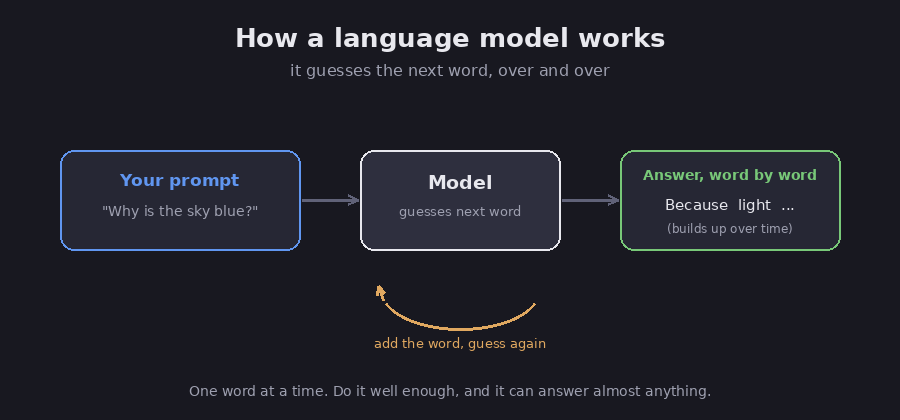

# Start here: what is an AI model?

This is the ground floor. If words like "model," "token," or "prompt" feel fuzzy, read
this first, because the rest of the section leans on them. You do not need any computer
background to follow it.

## The one big idea: it guesses the next word

A large language model, usually shortened to LLM, is a computer program that works with
words. The "large" simply means it is big, and "language model" means it deals with
language.

Here is the whole trick: the model guesses the next word, then the word after that, and
the one after that, building an answer one word at a time until it is done. That sounds
far too simple to be useful, but it turns out that a program which gets very, very good at
guessing the next word can answer questions, write emails, explain ideas, and much more.
Picture someone who has read an enormous amount of text and has become remarkably good at
finishing your sentences.

*A model builds an answer one guessed word at a time. Diagram.*

## How it learned: training

The model became good at guessing by reading an enormous amount of text first.

FACT: before you ever use it, the model is "trained," which means it is shown a huge body
of text and slowly adjusts itself to predict text more accurately. (This is the standard
description of how these models are built.)

Two consequences matter for you. The model learned all of this **ahead of time**, so it
is not reading the live internet while it talks to you, unless it is given a search tool,
which we cover later. And by default it does **not** remember your past chats: each new
conversation starts from scratch, a point we return to in the
[memory chapter](08-memory-for-agents).

## A few words you will keep seeing

You only need a handful of terms to follow everything else in this section.

- **Model.** The program itself, the "brain" that does the guessing. Newer models are
  better at it, and Claude is one well-known family of models.
- **Prompt.** Whatever you type to the model: your question, plus any background you
  provide. Better prompts produce better answers, which is a small skill of its own.
- **Token.** Models do not read whole words; they read small chunks called tokens. FACT:
  one token is roughly three-quarters of a word, very approximately four characters of
  English, so "tokenize" might be split into "token" and "ize." You never have to count
  them yourself, but two things follow: you usually **pay per token**, and there is a
  **limit** on how many a model can handle at once.
- **Context window.** This is how much the model can read at one time, meaning your prompt
  plus everything said in the chat so far. Picture a desk that only holds so many papers:
  once it is full, something has to come off. The size of that desk is the context window.

## Three limits to always keep in mind

Nearly everything else in this section exists to work around these three limits, so if you
remember nothing else, remember these.

1. **It can be wrong and still sound certain.** The model is guessing, and most of the
   time the guess is good, but sometimes it is wrong while the writing sounds just as
   confident. FACT: producing something false but believable is called a
   **hallucination**, and it is why you check important answers against a real source.
   (More in the [safety chapter](13-safety-and-best-practices).)
2. **It forgets between chats.** Open a new conversation and it has no idea what you said
   yesterday, unless you tell it again or the app stores it for you.
3. **It can only read so much at once.** That is the context window from above: hand it a
   giant pile of text and it begins to lose track of the middle. (More in the
   [context chapter](09-context-engineering).)

## Why this matters for the rest of this section

Once you see those three limits, the rest of the section falls into place, because each
part is really a way to give the model something it cannot do on its own:

- **[Tools](07-tools-and-mcp)** let it *do things*, such as searching the web or running
  code, instead of only writing.
- **[Memory](08-memory-for-agents)** lets it *remember* across chats.
- **[Context engineering](09-context-engineering)** keeps its "desk" tidy so it does not
  lose track.
- **[Retrieval](10-retrieval-and-rag)** feeds it the right facts so it does not have to
  guess from memory.

Assessment: the most useful way to read this whole section is "the model, plus help." The
model writes and reasons; everything else helps it act, remember, and stay accurate.

## Sources

- Anthropic, *Introduction to Claude / models overview* — https://docs.anthropic.com/en/docs/about-claude/models
- Anthropic, *Token counting and context windows* — https://docs.anthropic.com/en/docs/build-with-claude/context-windows
