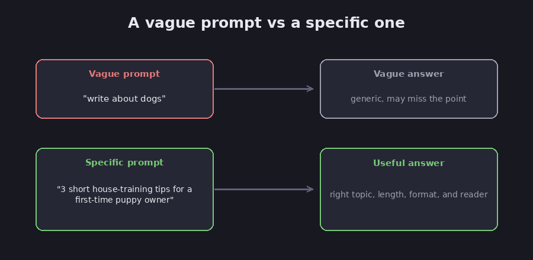

# How to write a good prompt

A prompt is simply what you type to the model: your request, plus any background you give
it. Writing a clear prompt is the single easiest way to get better answers, and it takes no
technical skill whatsoever. This chapter covers the handful of habits that make the biggest
difference.

The core idea is that the model is not a mind reader. It knows only what you tell it and
what it absorbed during training, so the more clearly you describe what you want, the better
the result will be.

## Be specific about what you want

Vague prompts produce vague answers, and the cure is to spell out the details. Compare a
weak prompt, "write about dogs," with a strong one, "write three short tips for
house-training a puppy, aimed at a first-time owner." That second version hands the model
four useful hints at once, the topic, the length, the format, and the audience, whereas the
first gives it almost nothing to work with.

*A little detail in the prompt goes a long way. Diagram.*

## Give it the facts it needs

The model cannot see your files, your screen, or your situation unless you actually include
them. If you want feedback on an email, paste the email in; if the answer depends on your
numbers, provide those numbers. Whenever you leave out a relevant fact, the model quietly
fills the gap with a guess, and that is precisely where confidently wrong answers come from.

## Say the format you want

If you want a bulleted list, ask for a bulleted list; if you want a table, a short
paragraph, or an answer "under 100 words," say so directly. You can also paste a small
example of the shape you are after, and the model will follow it. FACT: giving one or two
examples inside the prompt is a well-established way to steer both the format and the style
of the answer. (Anthropic, *Prompt engineering overview*.)

## Set the scene when it helps

Telling the model who to be can noticeably sharpen its answer. Asking it to "explain this as
if I am new to the topic" produces a gentler response than "explain this to an expert." This
is not magic, but it reliably nudges the wording and the level of detail in a helpful
direction.

## Break big jobs into steps

When a request is large, split it into stages: ask for an outline first, then have the model
fill in each part. Smaller steps are easier for the model to get right and easier for you to
check along the way, which is the same idea as the "chain" pattern from the
[workflows chapter](06-workflows-vs-agents).

## Tell it what to do when unsure

As the [foundation chapter](01-what-is-an-llm) explained, a model would rather give a
confident wrong answer than admit that it does not know, but you can push back on that
tendency. Adding a line such as "if you are not sure, say so instead of guessing" will not
catch every mistake, though it genuinely helps.

## Just try again

Your first prompt rarely needs to be perfect. If the answer misses the mark, simply tell the
model what to change, whether that is "make it shorter," "make it more formal," or "you got
the date wrong, it was June." Treating the whole exchange as a back-and-forth almost always
beats laboring over one flawless prompt up front.

## The short version

Assessment: a good prompt usually carries four things, what you want, the facts it needs, the
format you want, and what to do when it is unsure. State those plainly and you will get
noticeably more out of any model, without learning a single technical trick.

## Sources

- Anthropic, *Prompt engineering overview* — https://docs.anthropic.com/en/docs/build-with-claude/prompt-engineering/overview
