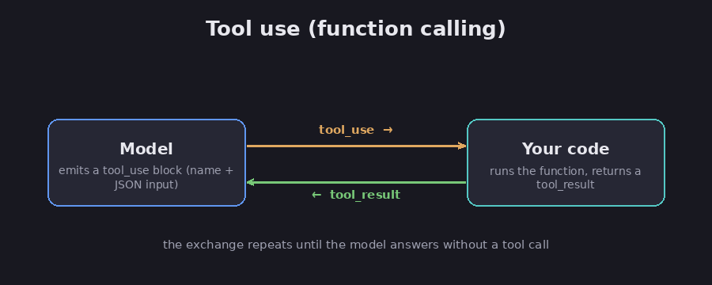
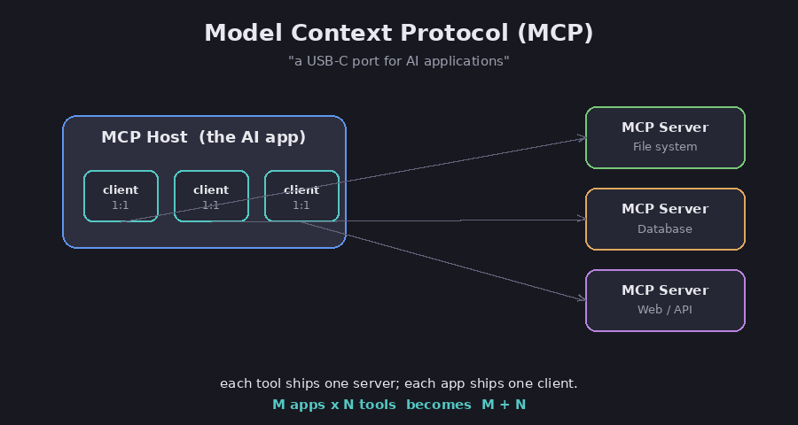

# Tools and MCP

The [foundation chapter](00-what-is-an-llm) made one thing clear: a model on its own
can only produce text. It can tell you how to send an email, but it cannot send one.
Tools are what close that gap. This chapter explains how a model uses a tool, what
makes a tool good, and a standard called MCP that lets any app plug into any tool.

A tool is any outside action you allow the model to trigger: searching the web, reading a
file, querying a database, or running another piece of software. Builders usually say the
model "calls an API" to do this. An API (application programming interface) is simply an
agreed-upon way for one program to request something from another program. Connecting a
model to tools is the single biggest step from a chatbot to a system that accomplishes
real work.

## How a model uses a tool

You begin by handing the model a short menu of tools. Each tool carries a name, a
plain-English description of what it does, and a list of the inputs it requires. The
overall mechanism is usually called "tool use" or "function calling," and the two terms
mean the same thing.

The crucial detail is that the model never runs the tool itself. When it determines that
a tool would help, it pauses and issues a request, in effect, "run the weather tool with
the input Tokyo." Your software executes the tool, captures the result, and returns that
result to the model. The model reads it and continues. This exchange repeats as many
times as necessary until the model has enough information to produce a final answer.

*The model requests a tool; your code runs it and returns the result. Diagram.*

FACT: you can let the model decide when to reach for a tool, or you can require it to use
one. Some tools run on your own computer, where your code runs them and returns the
result. Others, like built-in web search, run on the AI provider's servers and return
results on their own. A model can even ask for several tools at once. (Claude Developer
docs, *Tool use with Claude*.)

The inputs a tool needs are written in a simple data format called JSON, which is really
just a labeled list of values. You do not need to know JSON to understand any of this.

## Good tools matter more than clever ones

The mechanics above are the easy part. The hard part, and the part that decides whether
your system works, is designing tools the model can actually use well.

FACT: Anthropic calls this the Agent-Computer Interface, and says to put as much care
into it as you would into a screen built for a person. In plain terms, the advice is to
describe each tool the way you would brief a new employee, with an example and clear
limits; to make the inputs hard to get wrong, such as requiring a full file path so there
is nothing to guess; and to avoid handing the model a huge pile of overlapping tools,
which just leaves it unsure which one to pick. (Anthropic, *Building Effective Agents* and
*Effective Context Engineering*.)

Assessment: the description is the most important thing you write. A clear name, a sharp
"use this when..." line, and well-explained inputs matter far more than any technical
detail. Have tools return short, clean results instead of giant dumps of data. And when a
tool fails, hand the error back to the model and let it try again, rather than letting the
whole thing crash.

## MCP: one plug for every tool

Once tools are useful, a different problem emerges: every app that wants a given tool has
to be connected to it by hand. Ten apps and ten tools could require a hundred separate
connections. MCP is the standard that eliminates that overhead.

FACT: MCP (Model Context Protocol) is an open standard for connecting AI apps to outside
tools and data. "Open standard" means a public set of rules that anyone can build to,
owned by no single company. Its own documentation calls MCP "a USB-C port for AI
applications": one common plug, so anything that speaks MCP can connect to anything else
that speaks MCP. (modelcontextprotocol.io.)

*MCP turns a tangle of custom wiring into one shared plug. Diagram.*

FACT: it has three parts. The host is the AI app you actually use, such as a desktop
assistant or a coding tool. A server is a small program that offers one tool or data
source, like your files, a database, or a website. A client is the connector inside the
host that links it to a single server, one client per server. A server can offer three
kinds of thing: tools (actions the model can take), resources (data it can read, such as
the contents of a file), and prompts (ready-made templates). Underneath all of it, MCP
just sets a common message format so every piece understands the others.
(modelcontextprotocol.io.)

Assessment: the payoff is the USB-C idea. Instead of wiring every app to every tool, each
tool ships one MCP server and each app ships one MCP client. To the model, a tool offered
through MCP looks exactly like any other tool: a name, a description, and its inputs. MCP
just makes tools easy to share and reuse across different apps. By 2026 it had become the
common way for agents to reach the outside world.

## Sources

- Claude Developer docs, *Tool use with Claude* — https://platform.claude.com/docs/en/docs/build-with-claude/tool-use/overview
- Anthropic, *Building Effective Agents* — https://www.anthropic.com/engineering/building-effective-agents
- Anthropic, *Effective Context Engineering for AI Agents* — https://www.anthropic.com/engineering/effective-context-engineering-for-ai-agents
- Model Context Protocol, *Introduction* and *Architecture* — https://modelcontextprotocol.io/introduction and https://modelcontextprotocol.io/docs/learn/architecture
- OpenAI, *Function calling* — https://developers.openai.com/api/docs/guides/function-calling
