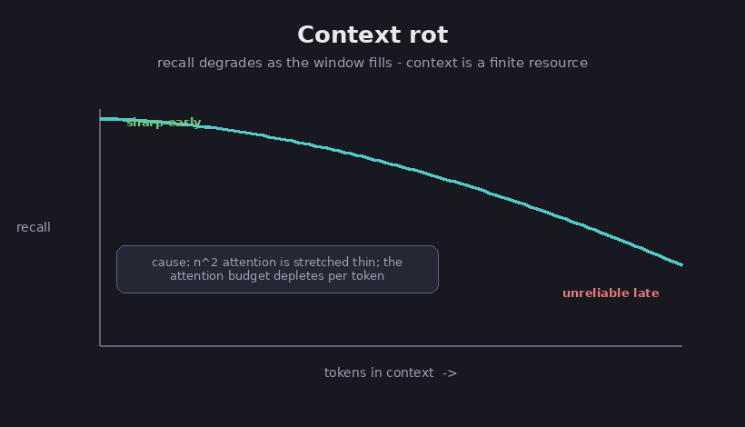

# Context engineering

The [foundation chapter](00-what-is-an-llm) gave the third big limit: a model can only
read so much at once, and when you cram in too much, it loses track of the middle. That
reading space is the context window. Context engineering is the skill of deciding what to
put into that window on each turn, and what to leave out. It is the natural next step
beyond [writing a single good prompt](10-how-to-prompt): not one prompt, but managing
everything in the window, turn after turn, as a system runs.

## Why the window is precious

FACT: the leading guidance treats the context window as a limited resource with
diminishing returns, meaning each extra token you add helps a little less than the last,
and past a point it can actually hurt. A model has a fixed "attention budget," a limited
amount of focus it can spread across whatever it is reading, much like a person's working
memory. Spend that budget carelessly and the quality of the answer drops. (Anthropic,
*Effective Context Engineering for AI Agents*.)

## Context rot

The main reason to manage the window carefully is that a long context quietly makes the
model worse.

FACT: this effect is called context rot. As the amount of text in the window grows, the
model becomes less reliable at recalling any particular detail from it. (Anthropic.)
Roughly speaking, the model has to weigh every piece of text against every other piece, so
the work grows much faster than the text itself does, and its attention gets spread thin.

*The fuller the window, the less reliably the model recalls any one detail. Diagram.*

FACT: a study by Chroma tested 18 different models and found that their performance
changes a great deal as the input gets longer, even on easy tasks, and that they do not
use a long input evenly. It also showed that the popular "needle in a haystack" test,
finding one planted sentence buried in a large pile of text, makes long context look
better than it really is. On more realistic tasks, even a single piece of distracting but
unrelated text lowers the score, and several such distractions lower it further. (Chroma.)

Assessment: you have probably heard that models recall the beginning and end of a long
input better than the middle, an effect nicknamed "lost in the middle." It is real in the
research, but the exact percentages people quote are shaky, and Chroma's own test did not
always find it. The safe lesson is the simple one: never assume the model truly uses
everything you hand it.

## How to keep the window clean

FACT: there is a standard toolkit for this, mostly from Anthropic:

- **Compaction.** When a conversation nears the window's limit, summarize what has
  happened so far and start a fresh window from that summary. Done well, the model barely
  misses a beat.
- **Note-taking.** The system writes notes to storage outside the window, then pulls them
  back when they are needed, a scratchpad it can return to. This is the short-term versus
  long-term split from the [memory chapter](03-memory-for-agents).
- **Helper agents.** Hand a focused job to a separate helper that works in its own clean
  window and returns only a short summary, so the main window stays uncluttered. The
  [many-agents chapter](07-multi-agent-systems) covers this in depth.
- **Load only when needed.** Instead of pouring everything in up front, keep small
  pointers, such as a file name or a saved search, and pull in the actual data only at the
  moment it is required. The trade-off is that fetching on the fly is slower than having
  everything ready.

## The rule of thumb

Assessment: more tokens is not better. The goal is the most useful information with the
least clutter, because a clean window beats a full one. This matters most for agents that
do a lot of searching, where old results and dead ends pile up as noise. The same idea
drives [retrieval](05-retrieval-and-rag), which pulls in only the facts you need, and
[splitting work across agents](07-multi-agent-systems), which gives each one its own clean
window.

## Sources

- Anthropic, *Effective Context Engineering for AI Agents* — https://www.anthropic.com/engineering/effective-context-engineering-for-ai-agents
- Anthropic, *Effective Harnesses for Long-Running Agents* — https://www.anthropic.com/engineering/effective-harnesses-for-long-running-agents
- Chroma, *Context Rot: How Increasing Input Tokens Impacts LLM Performance* — https://www.trychroma.com/research/context-rot
