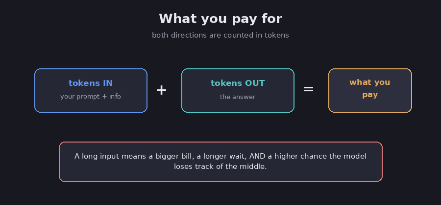

# Cost and speed

If you build anything real on top of a model, two practical concerns quickly start to
matter: how much it costs and how fast it answers. Both come down to the same underlying
thing, the amount of text the model has to handle. This chapter explains how you pay and how
to keep both the bill and the wait time under control.

## You pay by the token

Recall from the [foundation chapter](01-what-is-an-llm) that models read and write in small
chunks called tokens, each one worth about three-quarters of a word.

FACT: you are charged per token, and both directions count, the tokens you send in (your
prompt and any background) and the tokens the model writes back out. (Anthropic, *Pricing*.)
Input is usually cheaper per token than output, but the two together add up quickly.

*Both the text you send and the text you get back cost money. Diagram.*

## Longer means pricier and slower

This is the key habit to build. A long prompt costs more, takes longer to answer, and, as
the [context chapter](09-context-engineering) explains, can make the model lose track of the
middle, so pouring in everything you have is genuinely the worst of all worlds: more money,
more waiting, and often a worse answer. The same logic applies to the output, because asking
for a 2,000-word essay when a short summary would do costs more and takes longer for no real
gain.

## Speed: bigger and "thinking" models are slower

Two things mostly determine how long you wait for an answer. The first is the size of the
model, because bigger, smarter models are slower than small ones. The second is whether it
is a reasoning model (see the [reasoning chapter](03-reasoning-models)), which is slower
still because it does extra thinking before it replies. For a quick, simple task, a smaller
model will often answer in a fraction of the time and still be more than good enough.

## Simple ways to spend less

Assessment: a few habits cut both cost and wait time at the same time.

- **Keep prompts tight.** Send only what the model actually needs to do the job, rather than
  your whole document.
- **Match the model to the task.** Use a small, fast model for easy work, and save the big
  or reasoning models for the genuinely hard problems.
- **Ask for shorter answers** whenever a short answer is really all that you need.
- **Look things up instead of pasting everything.** Feeding in only the relevant facts, the
  idea behind [retrieval](10-retrieval-and-rag), beats stuffing the entire window full of
  text.
- **Reuse repeated text.** If you send the same long instructions on every call, some
  providers let you "cache" them so you are not billed the full price each time.

The theme here is the same one from the
[finite-resources thread](../../connections/finite-resources): the context window is a
budget, so spend it on what actually matters.

## Sources

- Anthropic, *Pricing* — https://www.anthropic.com/pricing
- Anthropic, *Prompt caching* — https://docs.anthropic.com/en/docs/build-with-claude/prompt-caching
