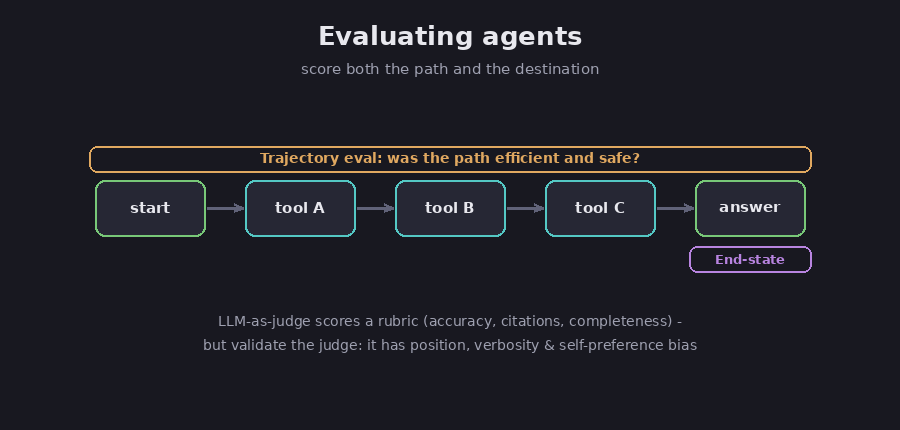

# Chapter 6 — Evaluation and testing

Agents are stochastic: the same input can produce different runs. Evaluation is the
feedback loop that tells you whether a change helped or hurt, and whether the thing is
safe to ship. This chapter covers building an eval set, using a model as a judge (and
the biases that come with it), and the distinction between scoring the path an agent
took and scoring where it ended up.

## Why evals, and offline versus online

Assessment: evals are what make an agent shippable. Without them you cannot detect
regressions or tell whether a prompt or model change actually improved anything. As
frontier models saturate the standard public benchmarks, the useful evals are
task-specific and application-level, built around your own use case.

Assessment: there are two settings. *Offline* evals run before deployment against a
fixed dataset, fast, repeatable, regression-style scoring. *Online* evals run on live
production traffic (sampled traces, user feedback, real inputs) to catch drift and the
edge cases an offline set never anticipated.

FACT: human spot-checks remain necessary alongside automated evals. Anthropic reports
that "people testing agents find edge cases that evals miss," including "hallucinated
answers on unusual queries, system failures, or subtle source selection biases."
(Anthropic, *How we built our multi-agent research system*.)

## The golden dataset

FACT: a "golden dataset" is a set of ideal interactions used as ground truth. In
Google's agent-evaluation framing it "captures the trajectory (the exact sequence of
tool calls) and the final response (the 'perfect' text answer)." (Google Codelabs /
Vertex.)

FACT: you do not need a big one to start. Anthropic reports that in early development
"even small samples" guide iteration, and that "a small sample of about 20 queries
that reflected real usage patterns" was enough to see the effect of changes.
(Anthropic.)

Assessment: start with a few dozen well-chosen cases drawn from real usage, then grow
the set from the failures you find in production. Because agents are stochastic, score
over multiple runs rather than a single sample, and pin model versions in the harness
so the eval itself is reproducible.

## LLM-as-judge, and its biases

The hardest part of evaluating open-ended output is grading it at scale. The common
answer is to use a model as the grader.

FACT: Anthropic uses an "LLM-as-judge" approach, scoring output against an explicit
rubric of factual accuracy, citation accuracy, completeness, source quality, and tool
efficiency; "a single LLM call with a prompt" returning a score and pass/fail
"matched our own judgments." (Anthropic.) OpenAI describes the same pattern as a
two-stage process: the model answers, then a (usually more capable) model grades the
answer against a rubric or a reference "gold standard." (OpenAI.)

FACT: judges have documented, systematic biases. *Position bias*: the judge favors the
first- or last-presented response regardless of quality; it "is not due to random
chance" and is "strongly affected by the quality gap between solutions." (*Judging the
Judges*, arXiv:2406.07791.) Other documented biases include self-preference
(preferring the judge model's own style), verbosity or length bias, and agreeableness
bias. Calibration methods help: swapping the order and averaging, ensembling several
judges or prompts, and concise prompts with explicit bias disclaimers. (CalibraEval,
arXiv:2410.15393.)

Assessment: treat the judge as a model that itself needs validating. Measure how well
its scores agree with human labels on a labeled set before you trust it, and keep
periodic human spot-checks. The specific magnitude numbers from individual bias
studies should be cited as "one study found," not as universal constants.

## Trajectory versus end-state

A correct answer reached through a dangerous or wasteful path is still a failure. So
you score both.

*Trajectory evaluation scores the path; end-state evaluation scores the destination. Diagram.*

FACT: trajectory evaluation scores the path, the sequence of tool calls, their inputs
and outputs, intermediate reasoning, and retries, not just the final answer. "An agent
that arrives at the correct final answer through a dangerous, redundant, or wildly
inefficient sequence of tool calls still represents a production failure." (Confident
AI; LangChain.) Google's Vertex service names specific trajectory metrics:
`trajectory_exact_match`, `trajectory_in_order_match`, `trajectory_precision`,
`trajectory_recall`, and `trajectory_any_order_match`. (Google Cloud.)

FACT: Anthropic deliberately evaluates "whether it achieved the correct final state"
rather than validating "every intermediate step," because agents take many valid paths
to the same goal. (Anthropic.)

Assessment: use both. End-state metrics catch wrong answers; trajectory metrics catch
unsafe or expensive right answers. Exact-match trajectory scoring is brittle for
open-ended tasks, prefer recall, in-order, or LLM-judged trajectory there. None of
this works without *tracing* (capturing each step's prompts, tool calls, latencies,
and costs); that instrumentation is the prerequisite for both debugging and online
evals.

## Sources

- Anthropic, *How we built our multi-agent research system* — https://www.anthropic.com/engineering/multi-agent-research-system
- OpenAI, *Evaluation best practices* — https://developers.openai.com/api/docs/guides/evaluation-best-practices
- Google Cloud, *Evaluate AI agents with Vertex Gen AI evaluation service* — https://cloud.google.com/vertex-ai/generative-ai/docs/models/evaluation-agents
- *Judging the Judges: A Systematic Study of Position Bias in LLM-as-a-Judge* (arXiv:2406.07791) — https://arxiv.org/abs/2406.07791
- *CalibraEval* (arXiv:2410.15393) — https://arxiv.org/pdf/2410.15393
- Confident AI, *LLM Agent Evaluation Metrics* — https://www.confident-ai.com/blog/llm-agent-evaluation-complete-guide
