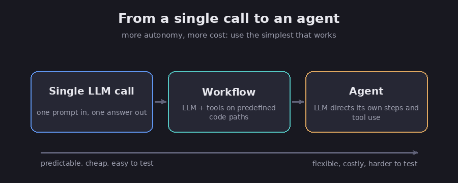
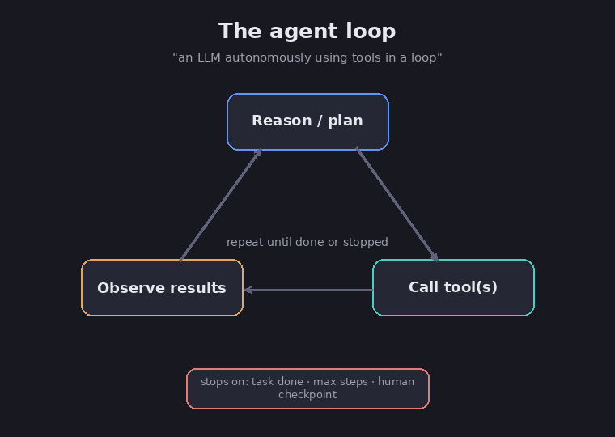

# Workflows vs agents

The first choice you make is simple to state: how much freedom do you give the model? You
can keep it on a track you laid down yourself, or you can let it find its own way. This
chapter explains both, and shows the common shapes that most real systems are built from.

## Two kinds: workflow and agent

There are two main ways to build with a model, and the difference comes down to who is in
charge of the steps. FACT: in a **workflow**, the model and its tools follow steps that you
wrote ahead of time, in code, whereas in an **agent**, the model decides its own steps as it
goes along. (Anthropic, *Building Effective Agents*; the same split appears in the LangGraph
docs.)

The real difference is who picks the order of the steps. In a workflow, you do, before it
ever runs; in an agent, the model does, while it runs, based on what it discovers along the
way.

*From one call to an agent: more freedom means more cost. Diagram.*

## Start simple

This is the most important habit in the whole section.

FACT: the standard advice is to "find the simplest solution possible, and only increase
complexity when needed." Workflows are steady and predictable for clear tasks, while agents
handle work that needs flexibility but cost more and run slower. (Anthropic.)

Assessment: a sensible default is a single model call, perhaps with a search step and a
couple of examples. Step up to a workflow only when the task breaks into a few set stages,
and step up to an agent only when you genuinely cannot know the steps in advance. Each step
up the ladder buys you flexibility but costs you money, speed, and the ability to test the
result.

FACT: ready-made frameworks such as LangGraph or Rivet make it easy to get started, but
they add extra layers that hide what the model is actually doing, which makes problems
harder to track down. The advice is to begin with the plain model and add a framework only
once you understand what sits underneath it. (Anthropic.)

## The building block: the model plus a few add-ons

Every workflow and every agent is built from the same base part, a model with a few
add-ons.

FACT: that base part is a model that can do three extra things: **search** (it writes its
own searches), **use tools** (it picks and runs them), and **keep notes** (it decides what
to hold on to). (Anthropic.) The rest of this section is really just a closer look at those
three abilities.

## Five common workflow patterns

FACT: most workflows take one of five shapes. They come from Anthropic and match what
LangGraph and OpenAI describe, so they are widely agreed on rather than one company's house
style.

1. **Chain (do it in steps).** Break the task into a fixed line of steps, where each step
   takes the previous step's output and you can drop a quick check in between, an approach
   that works well whenever a task splits cleanly into a set sequence of parts.
2. **Route (sort, then send).** First sort the incoming request into a type, then send it to
   the step that was built for that type, which works well when requests fall into clearly
   different groups, such as a refund question versus a technical one.
3. **Parallel (run at the same time).** Run several model calls at once and then combine
   their results, either by splitting a task into separate parts handled side by side, or by
   running the same task a few times and comparing the answers for more confidence.
4. **Manager and helpers.** A main "manager" model breaks the job into smaller jobs, hands
   them to helper models, and combines whatever comes back; what sets it apart from
   "parallel" is that the manager decides those smaller jobs on the spot rather than you
   fixing them in advance, which makes it a good fit for big, messy tasks such as changes
   spread across many files.
5. **Make and check.** One model writes a draft while a second model reviews it and offers
   notes, and the two loop back and forth until the result is good enough, which works well
   whenever you can clearly define what "good" looks like. It is the machine version of
   draft-and-revise.

Assessment: "route" and "chain" alone handle a surprising amount of real work. "Manager and
helpers" is the pattern that grows into a multi-agent system (see the
[many-agents chapter](12-multi-agent-systems)); the only real question there is whether the
helpers are full agents.

## The agent loop

When you do hand the model control, here is what it actually does: it runs a loop.

FACT: the short definition of an agent is a model "using tools in a loop." It begins from
your request, then plans and works on its own, and may come back to you for help. At each
turn it checks real results from the world, such as what a tool returned, to judge how it
is doing. (Anthropic, *Effective Context Engineering* and *Building Effective Agents*.)

*The agent loop. Diagram.*

FACT: the loop needs **rules for when to stop**, such as "the task is done," "you have hit
a set number of tries," or "pause and ask a human." Without a stop rule, an agent can run
on far too long. (Anthropic.)

FACT: small mistakes can pile up over many turns, so agents need careful testing in a safe,
walled-off setup, along with safety limits. (Anthropic.) That is exactly what the
[testing chapter](11-evaluation-and-testing) and the
[safety chapter](13-safety-and-best-practices) are about.

## Sources

- Anthropic, *Building Effective Agents* — https://www.anthropic.com/engineering/building-effective-agents
- Anthropic, *Effective Context Engineering for AI Agents* — https://www.anthropic.com/engineering/effective-context-engineering-for-ai-agents
- LangChain / LangGraph, *Workflows and agents* — https://docs.langchain.com/oss/python/langgraph/workflows-agents
