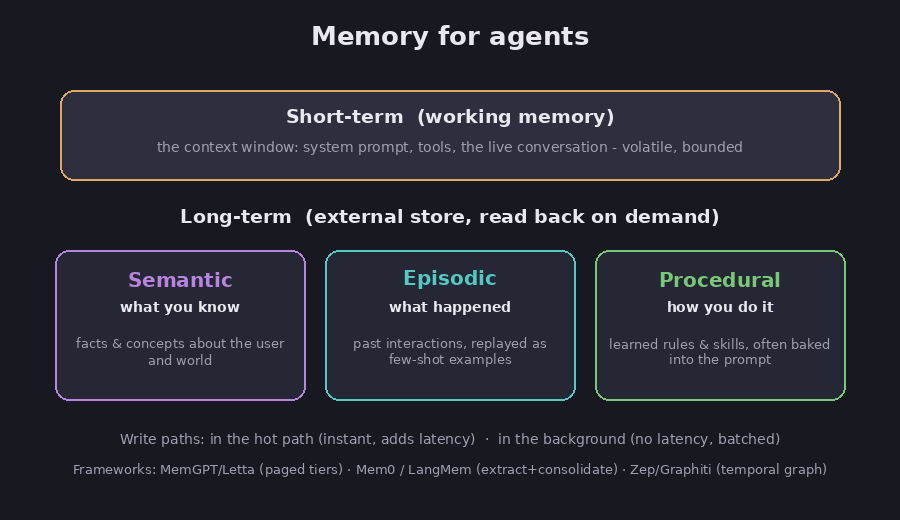

# Memory

The [foundation chapter](01-what-is-an-llm) pointed out a hard limit: a model forgets
everything between chats. On its own, all a model "knows" in a conversation is whatever
you have placed in front of it right now. Memory is the engineering that works around
this. It lets a system hold on to facts, past conversations, and learned habits from one
turn to the next, and from one session to the next. This chapter covers the two basic
kinds of memory, the three flavors of long-term memory, and the main tools people use to
build them.

## Short-term and long-term

FACT: memory divides into short-term (also called working memory) and long-term.
Short-term memory is the current conversation. It lasts only as long as the session and
vanishes when the session ends. Long-term memory is stored outside the conversation,
survives across sessions, and can be pulled back in whenever it is needed. (LangChain
documentation.)

Assessment: in practice, short-term memory *is* the context window, the limited space a
model can read at once that we met in the [foundation chapter](01-what-is-an-llm) and
return to in the [context chapter](09-context-engineering). Long-term memory lives in
outside storage, most often a vector database, which is a store that finds saved items by
their meaning rather than by exact wording. When the system needs an old fact, it looks it
up there and drops it back into the context window.

*Short-term memory is the live conversation; long-term memory comes in three kinds. Diagram.*

## The three kinds of long-term memory

FACT: long-term memory is usually split into three types, borrowed directly from how
psychologists describe human memory (LangChain; LangMem):

- **Semantic memory** holds facts: things the system knows about you or the world, such
  as your name or your preferences. It is the closest thing to a profile.
- **Episodic memory** holds past events: specific things that happened before. A common
  use is to save examples of earlier conversations that went well and replay them later
  as a guide, which is the same "show it an example" idea from the
  [prompting chapter](02-how-to-prompt).
- **Procedural memory** holds know-how: the rules and habits for doing a task. It often
  lives right in the model's instructions and gets updated as the system learns a better
  way to work.

Assessment: an easy way to keep them straight is semantic = *what you know*, episodic =
*what happened*, procedural = *how you do it*.

## Writing and reading memory

The hard part is not saving a single fact. It is deciding when to save, and keeping the
saved memories consistent as they pile up and sometimes contradict each other.

FACT: there are two moments you can write a memory. You can write it immediately, during
the conversation, which makes it available right away but adds a small delay (builders
call that delay "latency"). Or you can write it later, in the background, which avoids the
delay but forces you to decide how often to save. (LangChain.)

FACT: Mem0, a popular memory tool, writes in two steps. First it pulls the important facts
out of the conversation. Then it compares those facts against what it already stored and
decides whether to add, update, delete, or do nothing, so the store stays consistent over
time. (Mem0 paper, arXiv:2504.19413.)

Assessment: good moments to save are the end of a session, the point where a conversation
grows long, or any time the model judges something worth keeping. The genuinely hard
problem is keeping memory clean as it grows: resolving contradictions, removing
duplicates, and dropping facts that have gone stale. Saving is easy; tidy upkeep is not.

## The main tools

Assessment: the available tools fall into three shapes. Treat the performance numbers each
one advertises with some caution, because they come from each tool's own makers, measured
against rivals the makers themselves chose.

- **Tiered, like a computer's memory.** FACT: MemGPT, and its open-source version Letta,
  copies the way a computer juggles memory. It uses a small fast layer the model works in,
  a searchable record of the conversation, and a large long-term store, and the model
  shifts information between these layers itself. (MemGPT paper, arXiv:2310.08560.)
- **A drop-in memory layer.** FACT: Mem0 and LangMem sit on top of an existing system and
  handle the saving and recalling for you, extracting facts and storing them so you do not
  have to wire it up yourself. (Mem0 paper; LangMem.)
- **A memory that tracks time.** FACT: Zep, built on a tool called Graphiti, records not
  just what is true but *when* it was true. When a fact changes, it marks the old version
  as expired instead of deleting it, so you can still ask "what was the plan back in
  January?" (Zep paper, arXiv:2501.13956.)

Assessment: the simplest option is a store that only matches by meaning. It is easy to set
up but weak at questions that connect many facts or depend on timing. The time-aware and
connected stores handle those better, but they cost more to build and maintain. Which one
you need depends on your questions: plain recall, or "what changed, and when?" The
[MRAgent chapter](14-mragent) covers a newer fourth idea, a memory the model actively
rebuilds as it reasons, rather than one it just looks things up in.

## Sources

- LangChain, *Memory overview* — https://docs.langchain.com/oss/python/concepts/memory
- LangChain, *LangMem SDK launch* — https://www.langchain.com/blog/langmem-sdk-launch
- Mem0, *Building Production-Ready AI Agents with Scalable Long-Term Memory* (arXiv:2504.19413) — https://arxiv.org/abs/2504.19413
- MemGPT, *Towards LLMs as Operating Systems* (arXiv:2310.08560) — https://arxiv.org/abs/2310.08560
- Zep, *A Temporal Knowledge Graph Architecture for Agent Memory* (arXiv:2501.13956) — https://arxiv.org/abs/2501.13956
