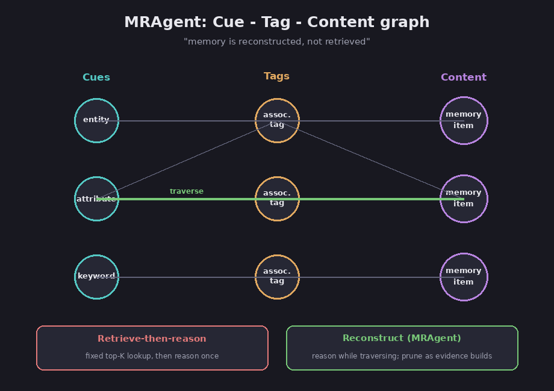

# Chapter 9 — MRAgent: reconstructive memory

MRAgent is a 2026 research framework for agent memory whose central claim is in the
title of its paper: *memory is reconstructed, not retrieved*. Instead of looking up a
fixed set of memory chunks and then reasoning over them, MRAgent reasons *while* it
walks an associative graph, deciding where to go next based on what it has found so
far. This chapter is the dedicated deep dive promised in [the memory
chapter](03-memory-for-agents): what the name means, how it works, the efficiency
numbers, the limits, and an honest read on what actually holds up versus what is only
claimed.

## What it is, and what the name means

FACT: the framework is named **MRAgent**, introduced in the paper as "a framework that
combines an associative memory graph with an active reconstruction mechanism." The
abbreviation `MR` stands for **Reconstructive Memory**: the paper's Section 4 is titled
"MRAgent: Reconstructive Memory Agent," and its conclusion calls it "a reconstructive
memory agent." (arXiv:2606.06036, *Memory is Reconstructed, Not Retrieved: Graph
Memory for LLM Agents*, verified against the arXiv full text.)

A caution worth stating plainly, because the wrong name is everywhere. Assessment:
several AI-generated summaries claim `MR` stands for "Memory Reasoning Architecture for
LLM Agents." That phrase does not appear anywhere in the paper; it is a recurring
machine-summary fabrication. The correct expansion is **Reconstructive Memory Agent**.
This is itself a small lesson in the [hallucination problem](08-safety-and-best-practices):
a confident, widely repeated, and simply false claim.

FACT: the authors are **Shuo Ji, Yibo Li, and Bryan Hooi** at the National University
of Singapore; the paper was submitted on 4 June 2026. The code is at
`github.com/Ji-shuo/MRAgent` (not to be confused with an unrelated biomedical `MRAgent`
tool for Mendelian-randomization analysis, published in *Briefings in Bioinformatics*).

## Where it was actually published

I chased the venue down, because the sources conflict and it matters for how much
weight to put on the results.

FACT: the authoritative record is OpenReview's structured metadata for the submission
(forum `YPoHy6lgKP`), which reads `venue: "ICLR 2026 Workshop MemAgents"` and `venueid:
ICLR.cc/2026/Workshop/MemAgent`, with a bibtex `booktitle` of "ICLR 2026 Workshop on
Memory for LLM-Based Agentic Systems." That workshop is real and verifiable (its site
is at sites.google.com/view/memagent-iclr26). So the paper is a **workshop paper at the
ICLR 2026 MemAgents workshop**, posted there in March 2026.

FACT: the one conflicting signal is the arXiv "Comments" field, which the authors typed
as "Accepted at ICML 2026." There is no structured record anywhere (no ICML OpenReview
forum, no proceedings entry, no journal reference) that corroborates an ICML acceptance.
Assessment: where a hand-typed arXiv note conflicts with the venue's own machine-set
OpenReview metadata, the metadata wins; the ICML line is most likely an author error,
an aspirational edit, or a separate submission not yet reflected anywhere I can check.
Treat the venue as the ICLR MemAgents workshop and the ICML claim as unverified.

FACT: this matters because the OpenReview forum has **no public reviews, rebuttals, or
meta-reviews at all** (the record returns an empty reply list). Assessment: a workshop
is a lighter, often non-archival bar than a main conference, and here there is no
visible peer-review signal in either direction. The honest consequence runs through the
rest of this chapter: **every number below is author-reported and has not been
independently peer-reviewed or reproduced.**

## The core idea: reconstruct, do not retrieve

FACT: standard memory agents use a static "retrieve-then-reason" paradigm, which the
paper argues "prevents them from dynamically adapting memory access to intermediate
evidence discovered during inference." In that paradigm retrieval is "passive,
selecting memory units as a fixed function of the query without reasoning over
intermediate evidence." (arXiv:2606.06036.)

FACT: MRAgent instead makes memory access "an active, multi-step reconstruction
process." It "integrates LLM reasoning directly into memory access, allowing the agent
to iteratively explore and prune retrieval paths based on accumulated evidence."
Intermediate findings are "transformed into new retrieval constraints, allowing the
agent to recover evidence that is unreachable under passive policies." The design is
motivated by cognitive neuroscience: human memory is reconstructive, an act of
rebuilding, rather than a lookup. (arXiv:2606.06036.)

## The structure: a Cue-Tag-Content graph

FACT: memory is stored as a **Cue-Tag-Content graph**, "where associative tags serve as
semantic bridges connecting fine-grained cues to memory contents." A *cue* is a
fine-grained keyword such as an entity or attribute; a *content* node is a specific
memory item; and a *tag* summarizes the associative relation between them. These are
linked as triplets (cue, tag, content). (arXiv:2606.06036.)

*The Cue-Tag-Content graph, with one reconstruction path highlighted. Diagram.*

FACT: the graph also has multi-granular memory layers (concrete events, stable facts,
and higher-level topics), and it is built by "memory population via LLM distillation,"
which rewrites dialogue turns into self-contained sentences and extracts keywords.
(arXiv:2606.06036; project README.)

## How a query is answered

FACT: answering a query is an iterative loop over a "reconstruction state" with
traversal actions: the LLM reasons over the query plus the evidence gathered so far and
selects promising directions to expand (reducing noise); it traverses the graph guided
by those selected actions "rather than exhaustive graph expansion"; and it routes and
prunes, selecting the most relevant content and "prun[ing] irrelevant branches" to
keep the context concise. The explicit goal is to adapt retrieval to the reasoning
context "while avoiding combinatorial explosion caused by unconstrained expansion."
(arXiv:2606.06036.) The released code implements this as a tool-calling reasoning loop
over seven specialized query tools.

Assessment: the elegant part is the feedback. Because the model reasons between graph
hops, what it learns at hop two changes which edge it follows at hop three. That is the
"reconstruction" that a fixed top-K retrieval cannot do, and it is what lets MRAgent
reach evidence a passive lookup would miss.

## The numbers, read carefully

The headline results are real, but they say something narrower than the marketing
around them. Here is the paper's own efficiency table (per sample, on LongMemEval),
with the lowest value in each row in bold.

| Per sample (LongMemEval) | MRAgent | Mem0 | MemoryOS | A-Mem | LangMem |
|---|---|---|---|---|---|
| Tokens | **118k** | 245k | 273k | 632k | 3,268k |
| Runtime (s) | 586 | **533** | 3,136 | 1,122 | 1,210 |

FACT: MRAgent used about **118,000 tokens** per query versus **LangMem's ~3,268,000**
(roughly 3.26 million), which is the famous **~27-fold** token reduction. (arXiv
2606.06036, efficiency table.)

Assessment: two caveats keep that honest. First, this is **query-time prompt tokens**,
and the paper's own design note says memory is built in a separate, static construction
step, so the 27x almost certainly does not include graph-building cost; read it as "27x
cheaper per query," not "27x cheaper end to end." Second, MRAgent is the most
token-efficient but **not the fastest**: Mem0 finished in 533 seconds to MRAgent's 586,
so any source calling MRAgent "the fastest" is simply wrong. And 586 seconds is roughly
ten minutes per query, a research-benchmark figure, not an interactive latency.

FACT: on accuracy, the gains are also real and (contrary to my earlier hedge) the
specific numbers are in the paper's tables. On LoCoMo with a Gemini-2.5-Flash backbone,
MRAgent scored **84.21** on the LLM-judge metric versus the best baseline (Mem0) at
**68.31**, a +23.3% relative gain, which is the "up to 23%" headline. On the
Claude-Sonnet-4.5 backbone the gap was smaller (88.32 versus 69.02, about +12%), and on
LongMemEval with Gemini the relative gain was actually larger (72.95 versus A-Mem's
52.98, roughly +32%). The benchmarks were LoCoMo and LongMemEval; the backbones were
Gemini-2.5-Flash and Claude-Sonnet-4.5; the baselines were RAG, A-Mem, MemoryOS,
LangMem, and Mem0. (arXiv:2606.06036, Tables 1 and 3.)

Assessment: notably absent from the baselines are **Zep/Graphiti and MemGPT/Letta**.
Zep is widely reported as the accuracy leader on LongMemEval, so leaving it out of the
comparison is a meaningful gap.

## The limits

FACT: the paper is candid about two limitations. First, **latency scales with
exploration depth**: "because relational reasoning is deferred to retrieval, the cost
of reconstruction grows with the depth of exploration, and queries that require many
traversal steps incur higher latency than single-shot retrieval." Second, **the memory
is static and grows without bound**: "our static construction does not update or
consolidate memory over time, so the memory graph grows monotonically as interactions
accumulate, raising storage overhead in long-lived deployments." Future work named is
adaptive construction, lightweight memory maintenance, and more robust traversal
policies. (arXiv:2606.06036, Section 7.)

Assessment: this places MRAgent neatly against the landscape in
[chapter 3](03-memory-for-agents). Where Mem0 and LangMem put their intelligence into
*writing* memory (extract and consolidate as you go) and Zep puts it into a *temporal*
graph that closes out stale facts, MRAgent puts its intelligence into *reading*, a
reasoning-driven traversal at query time. Its static, ever-growing store is the price
of that choice; it spends cheaply per query but does not yet forget. The
token-efficiency result is the genuinely striking part: doing more reasoning at read
time can cost dramatically *fewer* tokens than the alternatives, because it avoids
hauling large fixed retrievals into the context window.

## Trues and falses

A claim-by-claim audit, since this is a topic where confident, wrong statements
circulate widely.

| Claim you will see | Verdict |
|---|---|
| "MR stands for Reconstructive Memory" | **True.** The paper's Section 4 is titled "Reconstructive Memory Agent." |
| "MR stands for Memory Reasoning Architecture for LLM Agents" | **False.** That phrase appears nowhere in the paper; it is an AI-summary fabrication. |
| "~27x more token-efficient than LangMem" | **True, with a caveat.** 118k vs 3.26M tokens per query, but that is query-time tokens and excludes graph construction. |
| "MRAgent is the fastest memory system" | **False.** It is the most token-efficient; Mem0 is faster on wall-clock (533s vs 586s). |
| "Up to 23% more accurate" | **True.** LoCoMo, Gemini backbone: 84.21 vs 68.31. On LongMemEval the relative gain is even larger. |
| "Accepted at ICML 2026" | **Unverified.** Only the arXiv comment says so; OpenReview's metadata says ICLR 2026 MemAgents workshop. |
| "Peer-reviewed result" | **Misleading.** It is a workshop paper with no public reviews; treat numbers as author-reported. |
| "Independently reproduced" | **False / none found.** No third-party reproduction or benchmark exists yet. |

## Pros and cons

Assessment: pulling it together.

**Pros.** The central idea (reason while you traverse, instead of retrieve then reason)
is well-motivated and matches how the gains show up: the paper reports multi-hop recall
improving by over 30% across successive reconstruction steps, which is exactly what an
iterative, evidence-guided search should buy you. The typed Cue-Tag-Content graph is a
genuine design contribution, and the paper's own ablation shows both the tag layer and
the reasoning step each add value independently of the backbone model. The token
efficiency is striking and counter-intuitive: doing *more* reasoning at read time can
cost dramatically *fewer* tokens, because it avoids hauling large fixed retrievals into
the window. The released code looks complete (144 stars, bundled datasets, resumable
runs), even if no one has independently confirmed it reproduces the paper.

**Cons.** Every number is author-reported, from a workshop paper with no public peer
review and no independent reproduction, so the magnitude of the headline (27x) deserves
more suspicion than its direction (more efficient). Self-reported method papers tune
their own system, not the baselines, and LangMem's 3.26M-token figure is extreme enough
to suggest a possibly unfavourable baseline configuration. The latency floor is high and
grows with exploration depth, so the multi-hop queries reconstruction is *for* are
exactly the slow ones. The memory is static and grows without bound, with no update,
consolidation, or forgetting, which makes it a poor fit for long-lived agents whose
facts change. The evaluation is narrow (two long-dialogue QA benchmarks, no agentic or
fact-update tasks), and it omits the strongest accuracy rival (Zep).

## How it compares, and when to use it

Assessment: MRAgent is one of four shapes of agent memory from
[chapter 3](03-memory-for-agents), and the right choice depends on your bottleneck.

*Which memory approach fits which job. Diagram.*

Assessment: reach for MRAgent's approach when **multi-hop reasoning accuracy over a
fixed history** matters more than latency, and you want to keep query-time token cost
down. Reach for **Mem0** when you need low latency, evolving facts, and a maintained
production library; it is the one baseline that beats MRAgent on speed. Reach for
**Zep/Graphiti** when your facts change over time and recency or provenance matters, its
bi-temporal model can represent "this was true, now it is not," which MRAgent's static,
append-only graph structurally cannot. MemGPT/Letta is a different category again, an
agent runtime that treats memory as an operating-system-like primitive rather than a
drop-in memory layer.

## How solid is the evidence

Assessment: this is the part to be clear-eyed about. The idea is interesting and
plausibly motivated, the internal evidence (the ablations) is reasonable, but the entire
evidence base is **author-reported, workshop-level, and not independently validated.**
There is no genuinely independent analysis: the trade-press coverage (VentureBeat and
its syndications) rehashes the paper's claims without testing them, and the louder
social and SEO coverage is where distortions like the fabricated "Memory Reasoning
Architecture" name and the "fastest" claim came from. A useful counterpoint from the
broader field is a contemporaneous paper, *Does Memory Need Graphs?* (arXiv:2601.01280),
which argues that reported gains from graph memory are often "driven by foundational
system settings rather than specific architectural innovations," in other words, some of
what looks like a clever-graph win can be mundane configuration (chunking, prompts,
embedder). None of this says MRAgent is wrong; it says the honest status is "promising
and well-argued, but unproven outside the authors' own runs."

## Sources

- *Memory is Reconstructed, Not Retrieved: Graph Memory for LLM Agents* (arXiv:2606.06036) — https://arxiv.org/abs/2606.06036 (full text: https://arxiv.org/html/2606.06036v1)
- OpenReview record (venue metadata: ICLR 2026 Workshop MemAgents; no public reviews) — https://openreview.net/forum?id=YPoHy6lgKP
- ICLR 2026 MemAgents workshop — https://sites.google.com/view/memagent-iclr26
- MRAgent code repository — https://github.com/Ji-shuo/MRAgent
- *Does Memory Need Graphs?* (field counterpoint, arXiv:2601.01280) — https://arxiv.org/abs/2601.01280
