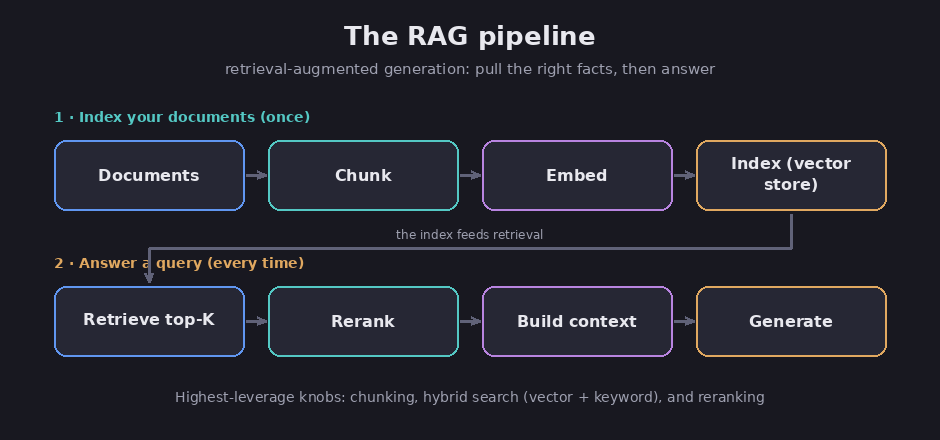

# Retrieval and RAG

The [foundation chapter](01-what-is-an-llm) explained that a model answers from what it
learned during training, and that it sometimes makes things up. Retrieval tackles both
problems by handing the model the actual facts before it answers. The common name for
this is RAG, short for retrieval-augmented generation: you store your documents, find the
pieces that match the question, and drop them into the context window so the model answers
from real text instead of from memory.

## How RAG works, in two phases

Assessment: RAG has two halves, a setup phase you do once and an answer phase you do for
every question. (This is the widely shared standard; see the Databricks and StackAI
guides.)

In the setup phase, you prepare your documents. You split them into small pieces called
chunks, and for each chunk you create an embedding, which is a list of numbers that
captures what the chunk means. You store those embeddings in a vector database, the
meaning-based store from the [memory chapter](08-memory-for-agents).

In the answer phase, you turn the incoming question into an embedding as well, find the
chunks whose meaning sits closest to it, and place the best few into the context window
before the model writes its reply. Matching by meaning is the point: the question and the
document can use different words and still line up.

*RAG in two phases: prepare the documents once, then answer from them. Diagram.*

## The parts that matter most

Assessment: a handful of choices drive most of the quality.

- **Chunk size.** Chunks that are too large drag in clutter; chunks that are too small
  split an answer across pieces, so the search misses it. A common starting point is a few
  hundred words per chunk, with a little overlap so a definition or a step is never cut in
  half.
- **The embedding model.** This is the part that decides which chunks "mean" the same as
  the question, and a general-purpose one can stumble on specialized wording. FACT: these
  models are compared on a public benchmark called MTEB, and the strongest score in the
  high sixties of a percent. (MTEB leaderboard.) Assessment: pick one that fits your
  subject.
- **How many chunks you pull.** Usually the top five to ten. You can do better by also
  matching exact keywords, not just meaning, which catches names and codes that
  meaning-matching alone can miss.
- **Reranking.** After the first rough search, a second and more careful pass re-sorts the
  results so the strongest ones land on top, before they reach the model.

## How RAG goes wrong

Assessment: the usual failures, and their fixes:

- **Bad chunking,** as above: pieces too big or too small.
- **Missed matches.** The question and the documents use different words, the embedding
  model is weak for the topic, or you pulled too few chunks. Fixes: add keyword matching,
  reword the question, and rerank.
- **Stale data.** If the documents change and you do not rebuild their embeddings, the
  system keeps answering, confidently, from the old version.
- **Too much stuffed in.** Dumping in many chunks brings back the context rot from the
  [context chapter](09-context-engineering). A tight, well-ranked handful beats a big pile.
- **No sourcing.** If you do not make the model cite where each fact came from, it can
  still blend correct chunks into a partly made-up answer.

## Do you even need RAG?

The real question is usually not "how do I do RAG" but "do I need it at all?" Here is the
plain version of the decision, which is judgment rather than hard fact:

- **Use RAG** when the knowledge is large, changes often, or must be traceable to a
  source: company documents, support answers, policy lookups. RAG fixes *missing facts*.
- **Use fine-tuning** to change behavior, not facts. Fine-tuning means training a model a
  little further on your own examples so it picks up a tone, a format, or a way of working.
  It fixes "it behaves wrong," not "it is missing facts."
- **Use a long context** (just paste the whole document into the window) for a quick
  one-off, but it costs far more at scale and still suffers context rot, so it is no
  substitute for real retrieval.
- **Use memory** (from the [memory chapter](08-memory-for-agents)) for facts that are
  personal and shift over time, such as a user's preferences, rather than a fixed library.

Assessment: in practice these mix. Most real systems use RAG for facts, a little
fine-tuning for behavior, and memory for per-person details, all at the same time.

## Sources

- Databricks, *The Ultimate Guide to Chunking Strategies for RAG* — https://community.databricks.com/t5/technical-blog/the-ultimate-guide-to-chunking-strategies-for-rag-applications/ba-p/113089
- StackAI, *RAG Best Practices for Enterprise AI* — https://www.stackai.com/insights/retrieval-augmented-generation-(rag)-best-practices-for-enterprise-ai-chunking-embeddings-reranking-and-hybrid-search-optimization
- MTEB (Massive Text Embedding Benchmark) — https://huggingface.co/spaces/mteb/leaderboard
