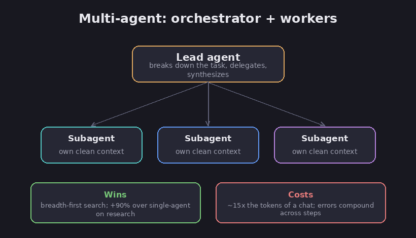

# Many agents at once

The [workflows chapter](06-workflows-vs-agents) introduced a pattern called "manager and
helpers," where a lead breaks a job into smaller jobs and hands them out. A multi-agent
system is that idea taken all the way: several full agents working on one problem at once,
with a lead agent that splits the work and passes the pieces to helper agents. It is the
most powerful pattern in this section, and the most expensive. This chapter covers when
the extra agents earn their cost, and when they just burn money.

## The usual shape: a lead and its helpers

FACT: the common setup is a lead agent that coordinates the work and hands pieces to a few
helper agents, usually three to five, that work at the same time. What sets it apart from
simply running several fixed tasks side by side is that the lead decides the pieces on the
spot, based on the specific request, rather than having them planned in advance.
(Anthropic, *Building Effective Agents* and *How we built our multi-agent research
system*.)

*A lead agent divides the work, helpers run in parallel, and the lead combines the results. Diagram.*

## When extra agents genuinely help

FACT: multiple agents shine on wide questions, the kind that call for chasing several
separate threads at once, where there is more to look at than fits in a single context
window. In Anthropic's tests, a team of agents (a strong lead with several helpers) beat a
single strong agent by about 90 percent on research tasks, and cut the time on complex
questions by up to 90 percent. (Anthropic.)

Assessment: the win comes from two things. The work is wide enough to split, so the
helpers cover ground in parallel. And each helper gets its own clean window and one clear
job, which is the tidy-window idea from the [context chapter](09-context-engineering).

## When they just burn money

FACT: the cost is steep. A single agent already uses about four times the tokens of a
plain chat, and a team of agents uses about fifteen times as many. In fact, how many
tokens a system spends explains most of the difference in how well it does. So a full team
is only worth it for high-value work. (Anthropic.)

FACT: it is a poor fit when the parts of a task depend on each other or need shared
context. Most coding work, for example, breaks into fewer truly separate pieces than
research does. Real failures Anthropic saw include a lead spinning up 50 helpers for a
simple question, helpers flooding each other with updates, and agents getting stuck
hunting for sources that do not exist. (Anthropic.)

## Why long chains fail

FACT: in a long chain of steps, errors pile up. One bad step can send the agents off in a
completely wrong direction. (Anthropic.) The math is unforgiving. If each step works 99
percent of the time, ten steps in a row work about 90 percent of the time, and a hundred
steps only about 37 percent, because the chances multiply rather than average. At 95
percent per step, ten steps in a row already drop to about 59 percent. And that is the
optimistic version, since related mistakes drag it lower still. (Compounding-error
analyses.)

Assessment: this is the hard arithmetic behind a rule from earlier chapters: keep chains
short, add checkpoints, and prefer an end-state you can actually check over a long chain
you cannot.

## Lessons that hold up

FACT: Anthropic's reported lessons:

- Tell each helper exactly what to do: its goal, the format to hand back, which tools and
  sources to use, and where its job ends. Vague hand-offs waste work fast.
- Scale the effort to the question. A simple fact-find needs one helper and a few tool
  calls; a real comparison might need a handful of helpers doing more.
- A current limit is that the lead waits for each round of helpers to finish before it
  moves on.

Assessment: the hidden tax is coordination. The lead has to carve the work cleanly and
stitch the results back together, and doing that badly leaves a team performing worse than
one good agent would have. The honest default, the same one from the
[workflows chapter](06-workflows-vs-agents), is to reach for a team only when the work is
genuinely wide and the payoff is worth roughly fifteen times the cost.

## Sources

- Anthropic, *How we built our multi-agent research system* — https://www.anthropic.com/engineering/multi-agent-research-system
- Anthropic, *Building Effective Agents* — https://www.anthropic.com/engineering/building-effective-agents
- *The math behind why multi-step AI agents fail in production* — https://medium.com/k8slens/the-math-behind-why-multi-step-ai-agents-fail-in-production-c6d60ea6ca31
