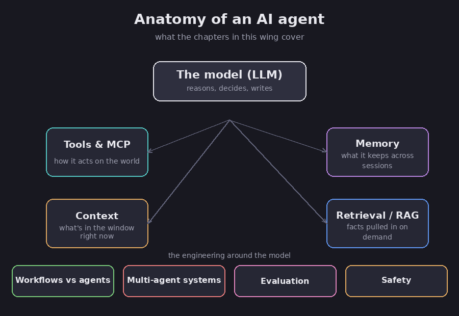

# AI agents, in plain English

This section explains how people build useful tools on top of AI models. It goes step
by step, in plain words. You do not need a computer background.

If the basics are new to you, start with **[what is an AI model?](00-what-is-an-llm)**.
It explains the few words (model, token, prompt) that the rest of this section uses.

A quick note on trust. AI can sound sure and still be wrong, so I mark each claim. FACT
means I checked it against a solid source. Assessment means it is my own read.
Speculation means it is a guess about the future.

## The one picture to keep in mind

Almost everything here is "the model, plus help." The model reads and writes. Around
it, people add a few things:

- **Tools** let it *do* things, like search the web or run code, instead of only
  writing.
- **Memory** lets it *remember* past chats.
- **Context** is the stuff you put in front of it right now. The trick is showing it the
  right stuff at the right time.
- **Retrieval** lets it *look up* facts instead of guessing from memory.

The rest of this section is how you put those pieces together, test them, and keep them
safe.

*What this section covers. Diagram.*

## The chapters

You can read these in order, but each one also stands on its own.

0. **[Start here: what is an AI model?](00-what-is-an-llm)** — the ground floor: model,
   token, prompt, and the three big limits to keep in mind. Read this first if you are
   new.
1. **[Workflows vs agents](01-workflows-vs-agents)** — the most important idea: how much
   freedom to give the model, and the common patterns. Start here after the basics.
2. **[Tools and MCP](02-tools-and-mcp)** — how a model does things in the real world,
   and the standard "plug" (MCP) for hooking tools up.
3. **[Memory](03-memory-for-agents)** — how a model remembers across chats: the kinds of
   memory, and how it gets saved and recalled.
4. **[Context](04-context-engineering)** — the model can only read so much at once. This
   is how you keep what it reads short and useful.
5. **[Retrieval and RAG](05-retrieval-and-rag)** — how you feed a model the right facts
   so it does not have to guess, and when to use this versus other options.
6. **[Testing](06-evaluation-and-testing)** — how you know it actually works, and why you
   should not fully trust an AI to grade another AI.
7. **[Many agents at once](07-multi-agent-systems)** — when using several agents helps,
   when it just wastes money, and how small mistakes pile up.
8. **[Safety and good habits](08-safety-and-best-practices)** — the main ways these
   systems get attacked or go wrong, and a plain checklist.
9. **[MRAgent: a closer look](09-mragent)** — a 2026 research idea for AI memory, with an
   honest read on what holds up and what does not.
10. **[Word list](glossary)** — the terms in one place.

## The most useful rule

FACT: the best-known advice for building these systems is to "find the simplest solution
possible, and only increase complexity when needed." (Anthropic, *Building Effective
Agents*.)

Assessment: this rule runs through the whole section. A plain model call beats a fancy
setup you do not need. One agent beats five that mostly talk to each other. Giving the
model more freedom costs more money, more waiting, and makes problems harder to find. So
add freedom only when you truly need it.
