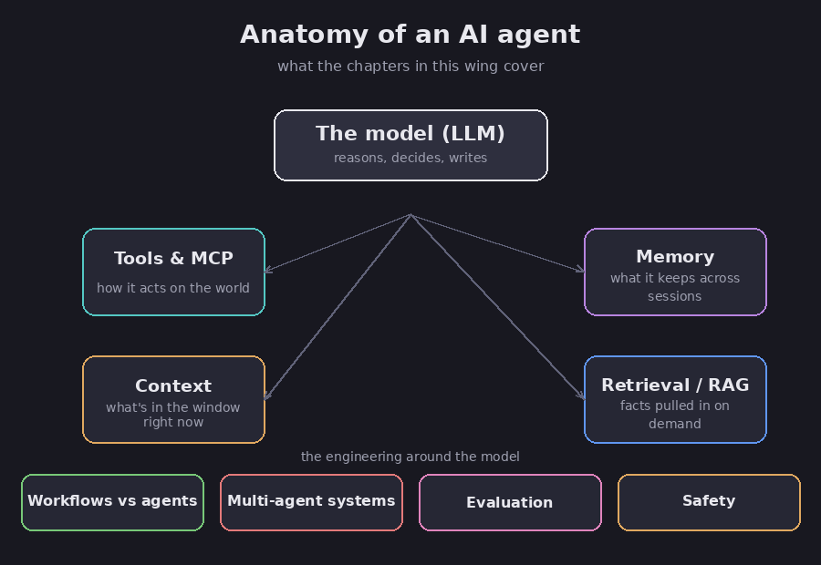

# AI agents, in plain English

This section explains how people build useful tools on top of AI models, one piece at a
time, in plain language. You do not need a computer background to follow it. If the whole
idea is new to you, begin with the first basics chapter on what a model actually is. It
explains the handful of words the rest of the section leans on.

A note on trust before we start. AI can sound completely sure and still be wrong, so every
claim here carries a label. FACT means I checked it against a reliable source. Assessment
means it is my own judgment. Speculation means it is a guess about where things are headed.

## The one picture to keep in mind

Almost everything in this section is "the model, plus help." On its own, a model reads and
writes. To make it genuinely useful, people add a few abilities around it:

- **Tools** let it do things, such as searching the web or running code, instead of only
  writing.
- **Memory** lets it remember earlier chats.
- **Context** is whatever you put in front of it right now, and the skill is choosing the
  right things to include.
- **Retrieval** lets it look up facts instead of guessing from memory.

Everything else is about combining those pieces, testing them, and keeping them safe.

*What this section covers. Diagram.*

## The chapters

Read them in order if you are learning, or jump to what you need. Each one stands on its
own.

**Start with the basics**

- **[What is an AI model?](01-what-is-an-llm)** — the ground floor: model, token, prompt,
  and the three big limits to keep in mind.
- **[How to write a good prompt](02-how-to-prompt)** — the easiest way to get better
  answers, with no technical skill needed.
- **["Thinking" and reasoning models](03-reasoning-models)** — what it means when a model
  works through a problem before answering, and when that is worth it.
- **[Cost and speed](04-cost-and-speed)** — how you pay (by the token), and why long
  inputs cost more and run slower.
- **[Pictures and voice](05-pictures-and-voice)** — models that can also read images and
  handle sound, and where they fall short.

**Then, building with models**

- **[Workflows vs agents](06-workflows-vs-agents)** — the most important idea: how much
  freedom to give the model, and the common patterns.
- **[Tools and MCP](07-tools-and-mcp)** — how a model does things in the real world, and
  the standard "plug" for hooking tools up.
- **[Memory](08-memory-for-agents)** — how a model remembers across chats.
- **[Context](09-context-engineering)** — the model can only read so much at once; this is
  how you keep what it reads short and useful.
- **[Retrieval and RAG](10-retrieval-and-rag)** — feeding a model the right facts so it
  does not have to guess.
- **[Testing](11-evaluation-and-testing)** — how you know it actually works.
- **[Many agents at once](12-multi-agent-systems)** — when several agents help, and when
  they just waste money.
- **[Safety and good habits](13-safety-and-best-practices)** — the main ways these systems
  go wrong, and a plain checklist.
- **[MRAgent: a closer look](14-mragent)** — a 2026 research idea for AI memory, with an
  honest read on what holds up.

**Reference**

- **[Word list](glossary)** — the terms in one place.

## The most useful rule

FACT: the best-known advice for building these systems is to "find the simplest solution
possible, and only increase complexity when needed." (Anthropic, *Building Effective
Agents*.)

Assessment: this rule runs through the whole section. A plain model call beats a fancy
setup you do not need. One agent beats five that mostly talk to each other. Giving the
model more freedom costs more money, more waiting, and makes problems harder to find. So
add freedom only when you truly need it.

## Who does this in the real world

Assessment: the chapters above are about building the thing. The last one is about the job
of making it work inside a real company, which is where most enterprise AI actually fails.

- **[Forward deployed engineers](15-forward-deployed-engineers)** — what an FDE is, where
  Palantir invented it, what the postings actually require, what separates a good one from a
  bad one, and why the widely quoted million-dollar salary is the ceiling rather than the job.

## Working with the outside world

Assessment: an agent is only as useful as what it can reach, and increasingly the web
answers automated requests with a wall. This chapter is about doing that job without
becoming the reason the walls went up.

- **[Web automation and bot defences](16-web-automation-and-bot-defenses)** — why sites
  block automated traffic, what the checks actually read (it is not your browsing history),
  the ladder of approaches from official API down to careful fetching, the etiquette that
  keeps you welcome, and where the law sits after *hiQ v. LinkedIn*.

## Making things, not just text

Assessment: the same generate-versus-describe split that runs through images shows up
again in three dimensions, and it decides which tool can actually make the object you want.

- **[Generating 3D, and why you cannot just script it](17-generating-3d-versus-scripting-it)**
  — how Meshy and Rodin actually build a mesh (a learned space of shapes, not code), why a
  model writing OpenSCAD is working blind in a vocabulary built for brackets, the measured
  gap between getting the idea right and getting the dimensions right, and what any of it
  means for printing a miniature.

## When the plan meets the machine

Assessment: a fluent plan and a correct plan look identical on the page. What separates
them can only be found by running the thing.

- **[The plan that reads right and the plan that runs](18-the-plan-that-runs)** — a
  well-written technical plan that was wrong in four checkable places, the tool it omitted
  entirely, and the six failures that only appeared on contact with real hardware. Five of
  the six were the same mistake: trusting a report instead of checking the resulting state.

## Making it run on hardware nobody supported

Assessment: the gap between "this model exists" and "this model runs on my machine" is
almost never the model. It is packaging, and it is fixable.

- **[Building HIP extensions against AMD's self-contained ROCm wheels](19-building-hip-extensions-on-strix-halo)**
  — five things that break when compiling CUDA extensions for a consumer AMD GPU, none of
  them silicon: pip's build isolation installing a rival PyTorch, three header-only
  libraries absent from every AMD wheel, CMake-generated headers a source clone never has,
  and 43 missing `.so` symlinks. Includes the measurement that matters for anyone
  benchmarking this: the first sparse-conv call is 2,971 ms of autotuning and the warm
  median is 0.12 ms.

- **[Three image-to-3D models, judged by the slicer instead of a ruler](20-three-image-to-3d-models-against-a-real-slicer)**
  — TRELLIS.2, Hunyuan3D-2mv and Pixal3D run on the same inputs on one machine, then put
  through a real Bambu X1C profile. The thickness metric that had been driving decisions
  turned out to be a poor gate, the slicer disagreed with it, and the one place the metric
  earned its keep was spotting a genuine defect. Also records the render error that made a
  model look far worse than it was, and the rule that came out of it.

- **[Five words to a gearbox, and where the knowledge came from](21-five-words-to-a-gearbox)**
  — the complement to chapter 17. "Make me an MRG for a DDG" returns the right architecture,
  and the reason is that a proper noun is an index key rather than a description. Traces the
  chain from five words to forced topology, tests what the public record actually gives up
  about that gearbox and what it withholds, and separates structure (which models get right)
  from magnitude (which they do not). Then the OpenSCAD math: why constraints do most of the
  design work, and why an over-constrained problem lands close without anyone recalling the
  real machine.

## See also

- **[Using AI well](connections/using-ai-well)** — the discipline running under this whole wing: a fluent model is an assistant, not an oracle.
- **[Using Gen AI in BD without fooling yourself](topics/business-development/defense-bd-playbook/10-gen-ai-in-bd)** — the same AI ideas put to work in a real job.
