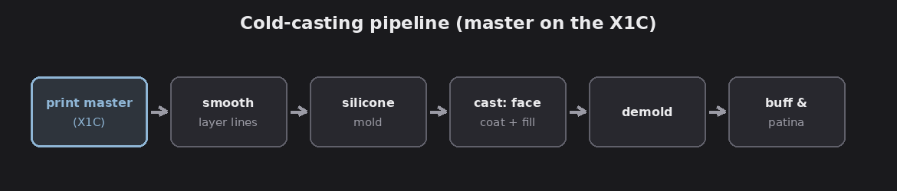
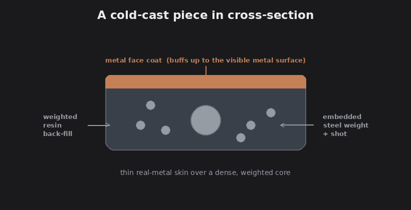
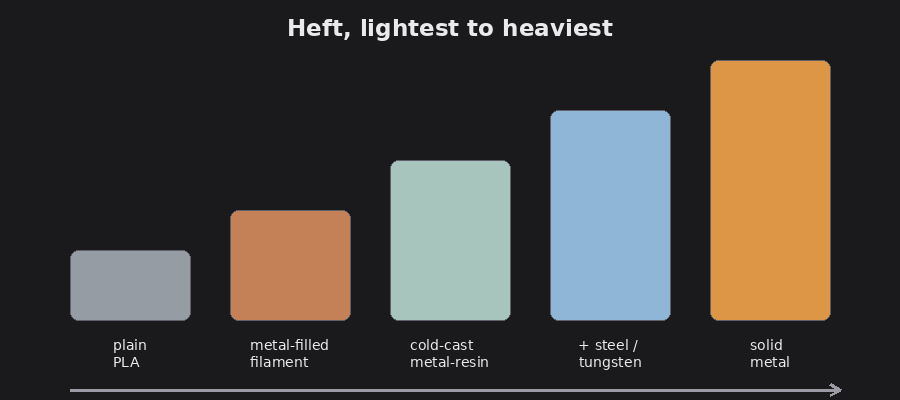

# Weighty board game pieces with cold-casting (Bambu X1C)

This is the companion to the [electroplating article](../plated-game-components). If
what you actually want is **heavy, metal-feeling** components, and you're printing on
a **Bambu Lab X1C** (an FDM filament printer), cold-casting is usually the better
route than plating: no chemistry bath, real heft, and you can pour a batch from one
mold.

The key mental shift: with cold-casting, **the X1C doesn't print the final piece, it
prints the master and the mold box.** The finished pieces are *cast*, which is where
the weight comes from.

## What the X1C is doing here

The X1C is an FDM printer, great for chunky, repeatable parts, less so for the
finest micro-detail (that's resin/SLA territory). For weighty game pieces it has two
jobs:

- **Print the master** (the pattern you mold from) and the **mold box**.
- Optionally, **print final pieces directly** in metal-filled filament (Route 2).

For coins, tokens, resource cubes, and chunky minis, FDM is plenty, with one caveat:
FDM layer lines telegraph into the mold, so masters get a smoothing step.

## Route 1 — cold-cast metal (weighty and repeatable)

FACT: "cold-casting" means mixing **metal powder into resin** and casting it in a
**silicone mold**. Once you buff the surface, it's real metal; the body underneath is
dense filled resin. Heavier than plastic, lighter than solid metal, and one mold
makes many.

*The cold-casting pipeline. Diagram.*

1. **Print the master (X1C).** Print the pattern, then smooth the layer lines (sand
   plus filler primer). The mold copies the master exactly, so flaws carry through.
2. **Make a silicone mold.** Print a mold box on the X1C, seat the master, pour
   tin- or platinum-cure silicone, degas if you can, and demold once cured.
3. **Cast with a face coat.** Brush a **metal-powder + resin slurry** into the
   cavity first, this thin layer becomes the visible metal surface. Let it go tacky,
   then **back-fill** with resin (weighted, see below). Demold when cured.
4. **Buff to expose metal.** Sand, buff, or tumble the cured surface to bring up
   bright metal, then antique/patina so recesses darken and raised detail pops.

FACT: common powders are bronze, copper, brass, and iron/steel, each gives a
different base tone.

*A cast piece in cross-section: metal face coat, weighted core. Diagram.*

## Making them genuinely weighty

This is the whole point, so push on it:

- **Load the face coat heavily** with metal powder, and use a **dense back-fill**.
- **Back-fill with metal shot** (steel) suspended in the resin; for maximum density,
  **tungsten** powder/shot (tungsten is about as dense as gold).
- **Embed a weight** (a steel washer or slug) in the core before back-filling.
- For small tokens, just **cast solid** with a heavy filler.

Assessment, the heft ladder, lightest to heaviest:

*Roughly how the options stack up by weight. Diagram.*

plain PLA  <  metal-filled filament  <  cold-cast metal-resin  <  cold-cast +
steel/tungsten fill  <  solid metal.

## Route 2 — print weighty directly on the X1C (no molds)

If you'd rather skip molding:

- **Metal-filled filament.** Copper/bronze/steel-filled PLA prints on the X1C and
  buffs up to a real metal sheen. Caveat (FACT): these filaments are **abrasive**,
  use a hardened/wear-resistant nozzle or you'll grind out a brass one fast. Denser
  than plain PLA, but the extra weight is modest, this is mostly about the look.
- **Print hollow, then fill.** Design the piece with an internal cavity, print it on
  the X1C, and fill with **epoxy + steel shot** (or lead-free fishing weights), then
  cap it. Cheap, simple, and it adds real heft, the best quick win for FDM tokens.
- **High infill / solid** helps a little, but plastic is plastic; combine with a fill
  for actual weight.

## Doing it at (some) scale

- **One master, one mold, many casts.** A good silicone mold yields tens to a couple
  hundred pulls before it degrades.
- **Multi-cavity molds.** Print a master "tree" or a mold box with several cavities
  so each pour makes a batch.
- **Be consistent.** Measure resin and powder **by weight**, mix the same ratio every
  time, and keep your pour and de-gas routine identical, that's what makes a batch
  match.

Assessment: cold-casting scales more gently than electroplating, there's no bath or
current to manage, just mixing, pouring, demolding, and buffing. The labor is the
cost.

## Safety

Less hazardous than a plating bench, but still real chemistry:

- **Resin + hardener** are skin sensitizers, wear nitrile gloves, ventilate, avoid
  skin contact, and let pieces cure fully before handling bare-handed.
- **Metal and especially tungsten powders**, don't breathe the dust: wear a
  respirator/mask when handling dry powder and when sanding cast pieces.
- **Silicone** is generally mild; follow its SDS.
- Work away from food surfaces, gloves and a mask are the baseline.

## The legal and ethical line

Same as the plating article: **don't reproduce trademarked or copyrighted designs to
sell** (the John Wick coin is fine to make for yourself, not to sell as a knockoff).
Use your own original or properly licensed designs for anything you distribute.
Personal use is a grey area; selling is where IP problems start.

## Bottom line

For weighty board-game pieces off a Bambu X1C: print masters, mold them, and
cold-cast metal-resin, then add **steel or tungsten** to the back-fill for real
heft. If you want the quick version, print the piece hollow and fill it with
**epoxy + steel shot**. Either way you get the metal feel and repeatable batches
without an electroplating bench. For the brighter, plated-metal finish instead, see
the [electroplating route](../plated-game-components).
