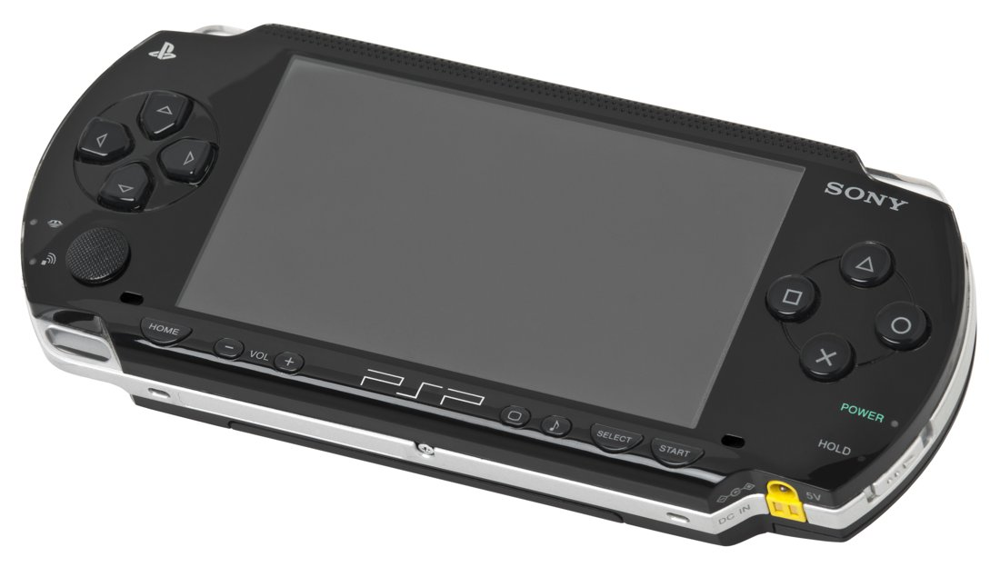
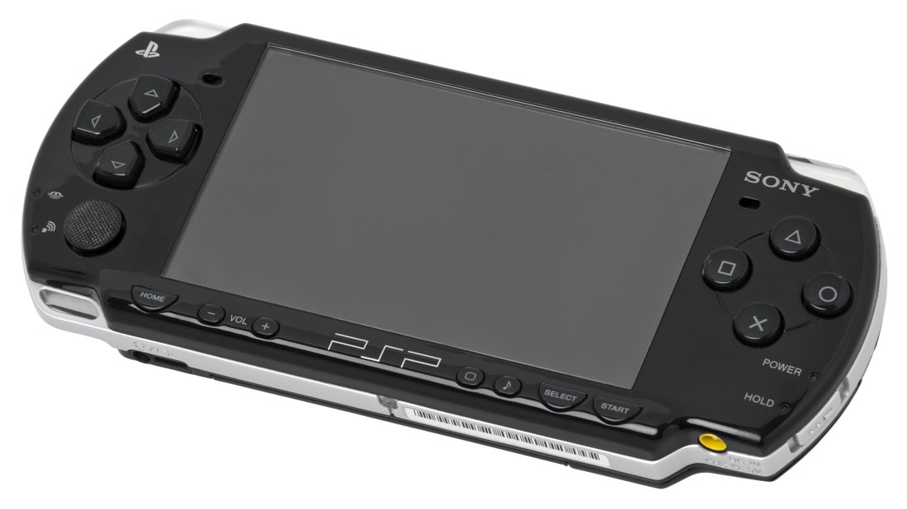
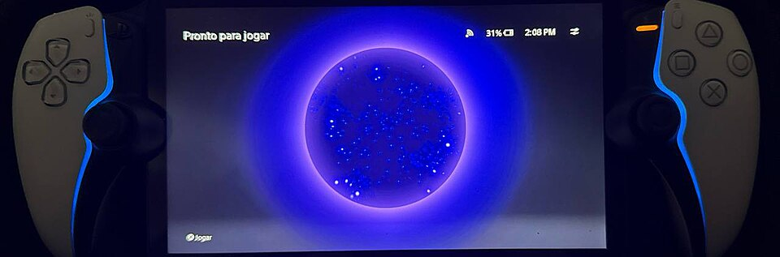

# Homebrew on portable game devices

Handheld game machines have always attracted people who want to make them do more
than the box says. That impulse has a name: **homebrew**. This is a high-level tour
of what homebrew is, why people do it, and how the landscape looks across the
portables people actually carry around. It stays deliberately on the cultural and
educational side. There are no step-by-step instructions here, and nothing about
piracy or getting around protections.

## What "homebrew" actually means

Assessment: "homebrew" is unofficial, community-made software run on hardware you
own, software the manufacturer never signed or sold. The name is literal: it's
home-brewed code, the way home-brewed beer is made outside the official brewery.

The important distinction, and the one that gets blurred in casual conversation, is
that **homebrew is not piracy.** Homebrew is people writing and sharing their own
programs: a media player, a little game, a utility, an emulator for a long-dead
console. Piracy is taking commercial games you didn't pay for. They sometimes use
overlapping technical scenes, but they are different things, and the legitimate
homebrew world has always defined itself against the piracy that rides alongside it.

## Why people do it

Assessment: the motivations are surprisingly wholesome once you look past the
"hacking" framing.

- **Run community-made apps and games.** Hobbyists and indie developers make real
  software for these devices, often delightful, weird, and free.
- **Emulate older systems.** A modern handheld can run faithful emulators of 1980s
  and 1990s consoles, which is most of what people actually want.
- **Media and utilities.** Music players, video players, ebook readers, file
  managers, the device becomes a general-purpose pocket computer.
- **Accessibility.** Custom software can add features the manufacturer never
  shipped: remapping, larger text, assistive controls.
- **Preservation.** Backing up media *you own* and keeping aging hardware useful is
  a real motivation, especially as old online stores shut down.
- **Learning.** For a lot of programmers, a games handheld was the first place they
  ever wrote low-level code and watched it run on real hardware.

## The one idea that explains the whole landscape

Assessment: every portable falls on a spectrum between **open** and **locked**, and
that single axis explains almost everything.

- **Open by design.** Some devices are meant to run whatever you install. The Steam
  Deck is the clearest example: under the hood it is a Linux PC, and Valve openly
  supports installing other software and even other operating systems. Many
  Android-based retro handhelds (from makers like Anbernic, Retroid, and Ayn) are
  similarly open, you just install apps. On these, "homebrew" is barely a hack at
  all.
- **Locked down.** Traditional consoles and handhelds only run code the
  manufacturer has cryptographically signed. To run anything else, the community
  historically had to find an *entry point*, a quirk that lets unsigned software
  load. That's the part I'll keep at altitude; the interesting story isn't the
  mechanism, it's the culture that grew around it.

The trend over the last decade has been toward the open end: the most exciting
handhelds today are ones you're *allowed* to tinker with.

## The PSP: the scene that wrote the playbook

FACT: Sony's PlayStation Portable (PSP) launched in 2004. Assessment: it went on to
host one of the most storied homebrew communities in gaming history. The PSP was
powerful for its time, had a beautiful screen, and ended up running everything from
homebrew games to emulators to media tools. Much of the modern handheld-homebrew
culture, the etiquette, the open-source ethos, the careful line against piracy, was
shaped by that scene.

*The PSP-1000, the launch model.*

*The slimmer PSP-2000.*

Assessment: what made the PSP special wasn't any single trick, it was that a large,
talented community treated it as a little computer worth writing software for, and
documented everything they learned in the open.

## The modern handheld renaissance

Assessment: we're in a golden age of handhelds, and most of it is open by default.

- **The Steam Deck** (FACT: released by Valve in 2022) is a Linux gaming PC in
  handheld form. You don't "hack" it to run other software, that's the intended
  use.
- **Android retro handhelds** from Anbernic, Retroid, Ayn and others run Android, so
  installing emulators and apps is ordinary. They exist precisely *for* this hobby.
- **Open-source firmware** projects give some budget Linux handhelds a friendly,
  community-maintained operating system.

Assessment: for someone curious about this hobby today, these open devices are the
sane, low-risk place to start, no warranties to void, no protections to worry about,
just install community software and go.

## The PS Portal: a newer, narrower frontier

FACT: Sony's PlayStation Portal, released in late 2023, is a **Remote Play
streaming device**, designed to stream games from a PlayStation 5 over your network
rather than run them itself. It is not a standalone console in the PSP sense.

*The PlayStation Portal. Photo: ArlindoPereira, CC BY 4.0, via Wikimedia Commons.*

Assessment, kept high-level: it was widely reported in 2024 that researchers and
hobbyists found ways to make the Portal run some software locally rather than only
streaming, an early, narrow homebrew scene compared with the sprawling PSP one. The
interesting takeaway for this article isn't any method, it's the pattern: even a
device built to be a simple streaming screen turns out to have a capable little
computer inside, and curious people will always probe what else it can do.

## The line, and the honest risks

Assessment, and this is the part worth stating plainly:

- **Homebrew is legitimate; piracy is not.** Writing and running your own software,
  or other people's freely shared software, on hardware you own is the hobby.
  Downloading commercial games you didn't buy, or sharing copyrighted system files
  or game files, is not, and the responsible corners of the scene have always drawn
  that line hard.
- **Respect the device's terms and the law.** Manufacturer agreements and
  copyright/DRM law vary by country and device; the safe, defensible activity is
  community software on hardware you own, not circumvention.
- **The practical risks are real.** Modifying a locked device can **brick** it
  (render it unusable), **void the warranty**, and get you **banned** from the
  manufacturer's online services. This is a big reason the open devices above are
  the friendly on-ramp.

## Why it matters

Assessment: at its best, homebrew is about ownership, creativity, preservation, and
learning, keeping good hardware useful, giving developers a playground, and saving
software and media history that the official channels eventually abandon. That's the
version of the scene worth celebrating, and it's the version this note is about.
