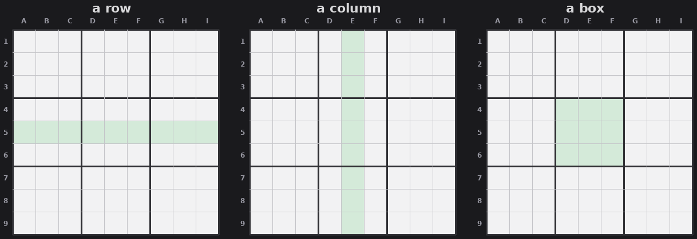

# Lesson 1 — The board, and the one rule everything rests on

A sudoku is a 9×9 grid, split into three kinds of groups. The jargon word for a
group is a **unit** (also called a **house**):

- **9 rows** (across)
- **9 columns** (down)
- **9 boxes** (the 3×3 blocks, also called **regions**)

**The only rule:** each of the digits 1–9 appears *exactly once* in every row,
every column, and every box.

*The three unit types. Each row, each column, and each 3×3 box must contain 1–9 exactly once.*

That is the whole game. Every technique is a clever consequence of that single
rule. There are no new rules later, only new ways of seeing.

## The word you'll use constantly: candidate

A **candidate** (or **pencil mark**) is a digit that is *still allowed* in an
empty cell. When you start, an empty cell may have several candidates. Solving is
the act of eliminating candidates until a cell is pinned to exactly one.

## The two questions

Keep these in your back pocket; the rest of the series is variations on them.

1. **What is the only digit that can go in this cell?** (cell-focused)
2. **Where is the only place this digit can go in this unit?** (digit-focused)
