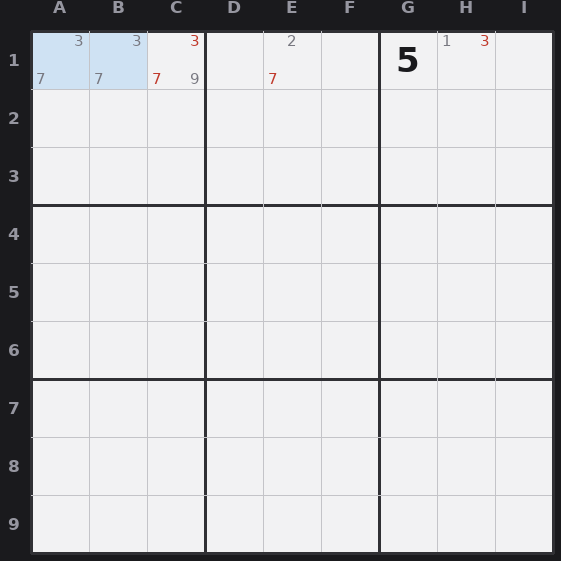

# Lesson 3 — Naked subsets (pairs, triples, quads)

A naked single was one cell with one candidate. A naked subset is the group
version: N cells in the same unit that, between them, hold only N candidates. Those
N digits get locked into those N cells, so you can erase them from every other cell
in that unit.

## Naked pair

Two cells in the same unit (row, column, or box) whose candidates are the *same two
digits* and nothing else. Say two cells both read {3,7}. One of them is the 3 and
the other is the 7, you don't know which, but between them they own the 3 and the 7
for that unit. So **erase 3 and 7 from every other cell in that unit.**

*A naked pair {3,7} in A1 and B1 (blue): they own 3 and 7 for the row, so 3 and 7 (red) are erased from the rest of row 1.*

## Naked triple

Three cells in a unit that together use only three candidates. They don't each need
all three. {3,7}, {7,9}, {3,9} is a naked triple on {3,7,9}. So is {3,7,9},
{3,7}, {7,9}. As long as three cells are confined to three digits total, those
three digits are locked to those three cells: **erase them from the rest of the
unit.**

## Naked quad

Same idea, four cells confined to four candidates total. Rarer, harder to see, same
payoff: erase those four digits from every other cell in the unit.

## How to spot them

Scan a unit for cells that have very few candidates (2 or 3). If two cells share the
exact same pair, that's a naked pair. For triples, look for two or three small cells
whose candidates all draw from the same little pool of three digits. The win is the
*elimination*, not a placement: naked subsets usually don't solve a cell directly,
they shrink other cells until a single appears.
