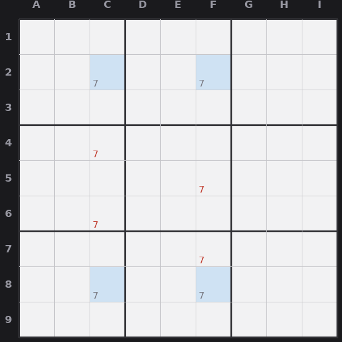

# Lesson 6 — X-Wing

This is the first technique that looks intimidating and isn't. It works on a single
digit across two rows and two columns that form a rectangle.

## The pattern

Pick one digit. Find **two rows** where that digit can only go in **exactly two
cells each**, and those candidate cells line up in the **same two columns**. The
four cells form the corners of a rectangle.

Now the logic: in each of those two rows, the digit lives in one of the two columns.
Whichever way it falls, the two columns each end up with the digit used by these
rows. So the digit cannot appear anywhere else in those two columns. **Erase the
digit from the rest of both columns.**

It works identically with rows and columns swapped: two columns where the digit has
only two spots each, lined up in the same two rows, lets you erase the digit from the
rest of those two rows.

## Plain version

"The 7 in row 2 is in column C or column F. The 7 in row 8 is also in column C or
column F. So columns C and F will get their 7s from rows 2 and 8, one each. No other
cell in column C or column F can be a 7."

*X-Wing on 7: the corners C2, F2, C8, F8 (blue) lock the 7s into columns C and F, so 7 (red) is erased elsewhere in those columns.*

## How to spot it

Go digit by digit. For your chosen digit, find rows (or columns) where it has exactly
two candidate spots. Then check whether two of those rows share the same column pair.
When they do, you've got an X-Wing, and the eliminations are in the crossing lines,
not in the four corner cells.
