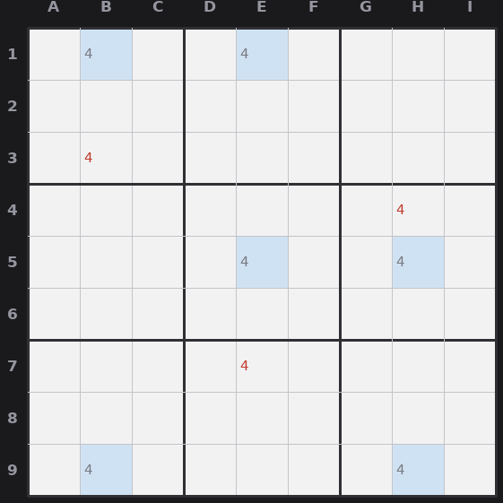

# Lesson 7 — Swordfish and Jellyfish

An X-Wing is a 2-by-2 "fish." Swordfish and Jellyfish are the same idea scaled up.
Same single-digit logic, more lines.

## Swordfish (3 by 3)

Pick a digit. Find **three rows** where the digit's candidates all fall within the
**same three columns**. Important: each row does *not* need all three spots, it can
have two or three, as long as no row uses a column outside the chosen three. Then,
just like the X-Wing, those three columns get their copies of the digit from these
three rows. **Erase the digit from the rest of those three columns.** Works with
rows and columns swapped.

## Jellyfish (4 by 4)

Same again with **four rows confined to four columns** (two to four spots per row).
Erase the digit from the rest of those four columns. Beyond jellyfish, bigger fish
exist in theory but a fifth fish is mathematically redundant in a standard sudoku, so
you never need one.

## Plain version

"For the digit 4, rows 1, 5, and 9 only ever put a 4 in columns B, E, and H. So those
three columns will get all their 4s from those three rows. No 4 anywhere else in
columns B, E, or H."

*Swordfish on 4: rows 1, 5, 9 keep the 4 within columns B, E, H (blue), so 4 (red) is erased elsewhere in those columns.*

## How to spot it

These are tedious by hand, so save them for when singles, subsets, intersections, and
X-Wing have all stalled. Go one digit at a time. Sketch which columns each row uses
for that digit. If three rows collectively touch only three columns, you have a
swordfish. The payoff, as always, is the elimination in the crossing lines.
