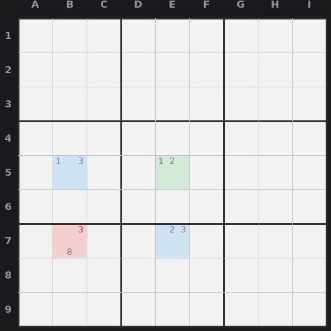

# Lesson 8 — Y-Wing and XYZ-Wing

Fish were single-digit. Wings juggle three digits across three cells. The key word
is **"sees"**: two cells *see* each other if they share a row, a column, or a box (so
one being a digit would forbid that digit in the other).

## Y-Wing (also called XY-Wing)

You need three bivalue cells (cells with exactly two candidates):

- A **pivot** with candidates {X, Y}.
- A **wing** the pivot sees, with candidates {X, Z}.
- Another **wing** the pivot sees, with candidates {Y, Z}.

Follow it through: if the pivot is X, the first wing is forced to Z. If the pivot is
Y, the second wing is forced to Z. Either way, **one of the two wings is Z.** So any
cell that sees *both* wings cannot be Z. **Erase Z from every cell that sees both
wings.** Note the pivot does not contain Z, it just routes the logic.

*Y-Wing: pivot E5 {1,2} (green), wings B5 {1,3} and E7 {2,3} (blue). One wing must be 3, so 3 (red) is erased from B7, which sees both wings.*

## XYZ-Wing

Same shape, but now the pivot also carries the Z:

- Pivot {X, Y, Z}, wing {X, Z}, wing {Y, Z}, both wings seen by the pivot.

Now Z must be in the pivot or one of the two wings. So any cell that sees **all
three** (pivot and both wings) cannot be Z. The eliminations are fewer because the
target must see the pivot too, but the logic is the same family.

## How to spot them

Hunt for bivalue cells; wings are built from them. Find a pivot, look at the bivalue
cells it sees, and check whether two of them share a third digit Z while each shares
one of the pivot's digits. Then look for any cell sitting in view of both wings, that
is where Z dies.
