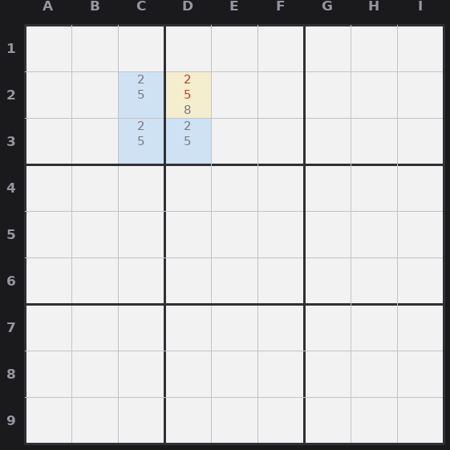

# Lesson 11 — Uniqueness tricks: Unique Rectangle and BUG

These lean on a promise: a proper sudoku has **exactly one solution**. That promise
forbids certain patterns, because they'd allow two solutions. Spotting a
near-forbidden pattern lets you eliminate the candidate that would complete it. (Use
these only on puzzles you trust to be properly made.)

## The deadly pattern

Four cells forming a rectangle, sitting in exactly **two rows, two columns, and two
boxes**, all four holding the same two candidates {X, Y}. If that ever fully formed,
you could swap X and Y around the rectangle two ways and both would be valid, so the
puzzle would have two solutions. A proper puzzle won't allow it. That contradiction
is the tool.

## Unique Rectangle (the common form)

Suppose three corners are {X,Y} and the fourth corner is {X,Y, plus extra
candidates}. If that fourth corner were also just {X,Y}, you'd have the deadly
pattern, which is illegal. So the fourth corner **must be one of its extra
candidates**, which means you **erase X and Y from that fourth corner.** There are
several UR variants, but this "extra candidates in one corner" form is the workhorse.

*Unique Rectangle: corners C2, C3, D3 are {2,5} and D2 is {2,5,8}. The four cells sit in two rows, two columns, and two boxes; if D2 were also just {2,5} the puzzle would have two solutions, so 2 and 5 (red) are erased from D2, leaving 8.*

## BUG (Bivalue Universal Grave)

A whole-grid shortcut. If you reach a state where **every unsolved cell has exactly
two candidates except one cell that has three**, the puzzle is one step from a
"deadly" all-pairs state that would have multiple solutions. The escape: in that
one three-candidate cell, the true digit is the one that appears an **odd number of
times** (three times) among the candidates in its row, column, and box. Place it.

## How to spot them

For URs, scan for three matching {X,Y} cells that form a rectangle with a fourth,
busier cell. For BUG, notice when the grid collapses to almost-all bivalue cells; the
lone three-candidate cell is your answer. Both are shortcuts, not necessities: a
puzzle is always solvable without uniqueness logic, this just gets there faster.
