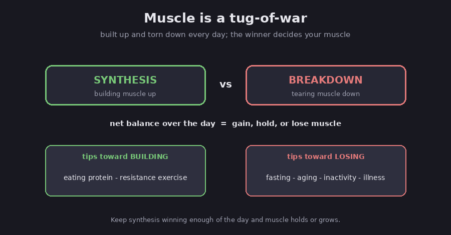

# Muscle, aging, and anabolic resistance

This started with an ad-style article for a supplement called **Apex Muscle Defense**. It
talks about "muscle protein synthesis," how muscle stops responding to protein as you age,
and how leucine plus another compound fix that. This note does two things: it lays out the
real science behind those words, checked against peer-reviewed research, and it takes an
honest look at whether the product lives up to its claims. (The "other compound" turns out
to be **HMB**, and yes, most of the underlying science is real. The gap is between the
science and what the marketing does with it.)

A quick note on labels, since this is health information: claims marked FACT are backed by a
named research source; Assessment is my read of the evidence; Speculation is a guess. None
of this is medical advice, so run big changes past a doctor.

## How muscle is built up and torn down

Muscle is not a fixed lump; it is constantly being rebuilt. Your body is always both
building new muscle protein (this is "muscle protein synthesis," or MPS) and breaking old
protein down. Which one wins, added up over the whole day, decides whether you gain, hold,
or lose muscle.

*Muscle is a daily tug-of-war between building up and breaking down. Diagram.*

FACT: two things reliably push the "building" side up: eating protein (the amino acids in it
briefly raise synthesis for a few hours) and doing resistance exercise (lifting or working
against resistance). The two work together, and exercise also makes the muscle more
responsive to the protein you eat afterward. (Reviewed in the amino-acid-sensing literature;
Moore 2015.)

## Anabolic resistance: why it gets harder with age

Here is the core idea the article is built on. FACT: as people get older, their muscle
responds *less* to the same amount of protein and exercise than a younger person's would.
The muscle is not broken, it just needs a bigger push to get the same result. Researchers
call this "anabolic resistance" ("anabolic" means muscle-building). (Zaromskyte 2021
systematic review; Moore 2015.)

*Older muscle needs a bigger dose to get the same response. Diagram.*

FACT: the numbers are fairly specific. To fully switch on muscle-building, older adults need
roughly **0.40 grams of protein per kilogram of body weight per meal**, versus about **0.24**
for younger adults. For an 80 kg (about 175 lb) older adult, that is roughly **30 to 40
grams of high-quality protein per meal**, and about **1.0 to 1.2 grams per kilogram per day**
in total, more than the old standard recommendation. (Moore 2015; PROT-AGE guidelines,
Bauer 2013.)

FACT: this blunted response is one of the main drivers of **sarcopenia**, the slow loss of
muscle mass and strength that comes with age. Small daily shortfalls add up over years.
(Zaromskyte 2021.) The causes are a mix: weaker muscle-building signals, less blood flow
delivering nutrients to the muscle, low-grade inflammation, and, importantly, **plain
inactivity**. Assessment: that last one matters a lot, because a big share of what looks
like "aging" is really the muscle getting out of shape from sitting still, and that part is
reversible.

## Leucine: the trigger, and its limits

Of all the amino acids in protein, one does most of the "start building" signaling.

FACT: **leucine** is the main trigger. It flips on a cellular switch called mTOR that kicks
off muscle-building, so leucine acts like a signal, not just a raw material. Because older
muscle needs more of a push, a leucine-rich, fast-digesting protein like **whey**, or added
leucine, can help an older person clear that higher bar in a meal. (Amino-acid-sensing
review; Zaromskyte 2021.)

FACT: but this "leucine trigger" idea is only *partly* proven. In one review of 29 studies,
16 supported it and 13 did not, and the support was strongest in older adults. Whole foods
like milk and beef can strongly boost muscle-building even without a big leucine spike, so
leucine is clearly not the whole story. (Zaromskyte 2021.)

## The catch: a short-term boost is not the same as more muscle

This is the single most important thing to understand, and it is exactly where supplement
marketing gets slippery.

FACT: a spike in muscle protein synthesis measured over a few hours does **not** reliably
predict how much muscle you actually build over weeks and months. In one well-known study,
the size of young men's synthesis spike after exercise had essentially no relationship to
how much their muscles grew over 16 weeks. (Mitchell 2014.)

FACT: when you look at the long game instead of the hours-long spike, leucine on its own is
underwhelming. A pooled analysis of 17 trials (over 1,400 people) found that **leucine
supplements alone produced no significant gain** in muscle mass or strength. (Meta-analysis,
Frontiers in Nutrition 2022.) FACT: protein supplements *do* help when paired with training,
but modestly, adding about **0.3 kg of lean mass** and a small strength bump on average, with
the benefit shrinking as people get older. (Morton 2018, 49 studies.)

Assessment: so the honest translation is this. The science that a big meal-time dose of
protein and leucine raises muscle-building in older adults is real and useful for setting how
much to eat. The leap from "raises muscle-building for a few hours" to "builds noticeable
muscle" is where the evidence gets thin, especially for a pill or powder taken without
serious exercise.

## HMB, the "other compound" (and the product's other add-ins)

The compound you half-remembered is **HMB** (beta-hydroxy beta-methylbutyrate).

FACT: HMB is actually made from leucine in your body (a small fraction of leucine is
converted to it). Its main proposed job is *anti-catabolic*, meaning it slows muscle
breakdown more than it speeds building, which is why it is pitched for holding onto muscle
during rough patches. (Reviews; MSKCC monograph.) FACT: its best result is in exactly those
situations: 3 grams a day of HMB helped older adults preserve muscle during 10 days of strict
bed rest, while a placebo group lost muscle. (Deutz 2013.)

FACT: in healthy older adults, though, the evidence is mixed and modest, HMB shows a small
gain in lean mass but inconsistent effects on strength, and much of the benefit disappears
once you are also exercising. The research is also contested, because the biggest early
results came from a handful of labs with commercial ties, and independent studies have been
less impressive. Reviewers have long said HMB's case is weaker than creatine's. (Meta-
analyses 2020-2024; clustering critique.) The dose used in nearly every positive study is
**about 3 grams a day**.

Assessment: hold that "3 grams" number, because it matters for the product below. The two
other active ingredients Apex adds, **Velositol** and **ursolic acid**, are weaker still:
Velositol has only small, short-term, maker-funded studies behind it, and ursolic acid has
actually *failed* to show a muscle or strength benefit in human trials.

## What actually works, ranked honestly

Assessment: pulling the research together, here is the order that the evidence supports for
holding onto muscle as you age, strongest first.

1. **Resistance exercise.** By far the most effective and best-proven thing you can do, more
   powerful than any supplement, and it partly reverses anabolic resistance by making muscle
   respond to protein again. (Multiple meta-analyses.)
2. **Enough total protein from good sources.** Around 1.0 to 1.2+ grams per kilogram per day,
   spread across meals, ideally including leucine-rich protein like whey. Solid support,
   especially alongside training.
3. **Creatine.** The one supplement with strong evidence as an add-on to training in older
   adults, and it is cheap. (Meta-analyses; roughly 3 to 5 grams a day.)
4. **Omega-3 (fish oil).** A modest helper with an interesting link to anabolic resistance,
   but small real-world effects. (Smith studies; meta-analyses.)
5. **HMB.** Modest, and mainly useful for *sparing* muscle during illness, bed rest, or frank
   sarcopenia, rather than building it in an otherwise healthy, active person.
6. **Vitamin D.** Worth fixing if you are deficient (and it helps prevent falls), but it does
   not build muscle if your levels are already fine. (Meta-analysis, Prokopidis 2022.)

## So, is Apex Muscle Defense worth it?

Assessment: first, the fair part. This is not a scam. FACT: it is a real, incorporated
product (a whey-protein powder, not a magic pill) from Apex Labs, fronted by Dr. Tracy Gapin,
a genuine board-certified urologist, and it publishes an ingredient panel and offers a
money-back guarantee. There is no fake celebrity, no "free trial" credit-card trap.

But it is oversold, and the specifics matter:

- FACT: **the HMB is underdosed.** Each serving has **1 gram of HMB**, but essentially every
  study that showed a benefit used **3 grams**. You are getting about a third of the studied
  amount. This is the biggest red flag.
- Assessment: **the headline "doubles muscle building / 2x muscle protein synthesis" claim**
  leans on small, short-term, ingredient-maker-funded studies of Velositol, not on real muscle
  gains from this actual product. And, as covered above, a short-term synthesis bump is not
  the same as building muscle.
- Assessment: **the flashy extra ingredients are thin.** Velositol is barely evidenced and
  ursolic acid has failed in human trials, so they read as label decoration.
- FACT: some ingredient amounts (including the leucine) are not clearly disclosed, so you
  cannot even confirm the leucine hits the useful ~2.5 to 3 gram threshold.

Assessment: the honest bottom line is that you are paying a premium (around 5 dollars a
serving) for **10 grams of whey plus a sub-clinical dose of HMB and two weak novelty
ingredients**. The genuinely evidence-based part of it, whey protein, you can buy far more
cheaply, and the one supplement actually worth adding, creatine, is not even in it.

## Bottom line

Assessment: the article's science is real. Muscle-building does slow with age (anabolic
resistance), leucine really is the trigger, and older adults really do need more protein per
meal. But the product turns that real science into a claim it cannot back up. If the goal is
to keep muscle as you age, the money-and-effort ranking is clear and boring: **lift weights,
eat enough protein (whey is a fine, cheap way to hit the higher older-adult target), and add
creatine.** A supplement like this one is, at best, an expensive way to buy some whey. This
is the same "don't get talked into it" habit as the [using-AI-well
thread](../../../connections/using-ai-well): a confident pitch is not evidence, so check what
the studies actually measured.

This is general information, not medical advice; talk to your doctor before starting a
supplement or a new exercise program, especially with any health conditions.

## See also

- **[Supplements for a midlife body](../supplements-for-midlife)** — the practical supplement plan built on this science.
- **[The core stack that actually works](../supplements-for-midlife/01-core-stack)** — where leucine and HMB are handled in the stack.
- **[If you are prone to gout (high uric acid)](../supplements-for-midlife/05-gout-and-uric-acid)** — whether any of this raises uric acid.
- **[Using AI well](../../../connections/using-ai-well)** — the same honest-appraisal habit: separate real science from marketing.

## Sources

- Moore DR et al. (2015), older adults need more protein per meal for muscle synthesis, *J Gerontol A* — https://academic.oup.com/biomedgerontology/article-abstract/70/1/57/2947642
- Zaromskyte G et al. (2021), leucine trigger hypothesis systematic review, *Front Nutr* — https://pmc.ncbi.nlm.nih.gov/articles/PMC8295465/
- Leucine supplementation meta-analysis, 17 RCTs (2022), *Front Nutr* — https://pmc.ncbi.nlm.nih.gov/articles/PMC9284268/
- Morton RW et al. (2018), protein + resistance training meta-analysis, *Br J Sports Med* — https://pmc.ncbi.nlm.nih.gov/articles/PMC5867436/
- Mitchell CJ et al. (2014), acute synthesis does not predict growth, *PLOS One* — https://pmc.ncbi.nlm.nih.gov/articles/PMC3933567/
- Bauer J et al. (2013), PROT-AGE protein recommendations for older adults, *JAMDA* — https://kclpure.kcl.ac.uk/ws/files/132005858/Moore_Witard_et_al_JAMDA_S_13_00436_I.pdf
- Deutz NEP et al. (2013), HMB preserves muscle during bed rest, *Clin Nutr* — https://pubmed.ncbi.nlm.nih.gov/23514626/
- HMB in sarcopenia, meta-analysis — https://pmc.ncbi.nlm.nih.gov/articles/PMC11272589/
- Creatine + resistance training in older adults, meta-analysis — https://pmc.ncbi.nlm.nih.gov/articles/PMC5679696/
- Vitamin D and muscle, null meta-analysis (Prokopidis 2022), *J Cachexia Sarcopenia Muscle* — https://onlinelibrary.wiley.com/doi/full/10.1002/jcsm.12976
- Apex Muscle Defense product page — https://apexlaboratories.com/products/muscle-defense
