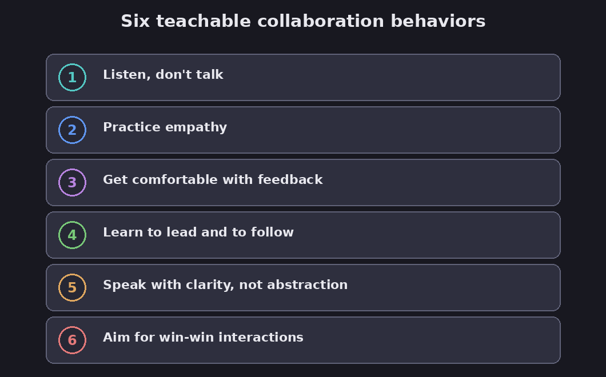

# Cracking the code of sustained collaboration

The big idea of this article is that collaboration is a *skill you can teach*, not just a value
you announce or a matter of open offices and incentives. Francesca Gino argues the underlying
mindset is "respectful engagement", genuine respect for colleagues' contributions and openness
to their ideas, and that leaders build it by training people in six specific behaviors.

FACT: this ran in Harvard Business Review in 2019. (Gino, "Cracking the Code of Sustained
Collaboration.") **Read "How much to trust this" before leaning on this one: the author's
research record was later found compromised.**

## Six behaviors to train

Gino's claim is that these six behaviors can be taught like any other skill, through classes and practice.

*Six collaboration behaviors you can actually train. Diagram.*

1. **Listen, don't talk**: ask open questions, get comfortable with silence.
2. **Practice empathy**: approach people you disagree with wanting to understand them.
3. **Get comfortable with feedback**: make it specific and about behavior; practice giving it.
4. **Learn to lead *and* follow**: the best collaborators "flex" smoothly between the two.
5. **Speak with clarity**: concrete, vivid language beats vague abstraction.
6. **Aim for win-win**: surface the other side's underlying interests, not just their position.

FACT: the examples include Pixar's listening and feedback classes (its "plus" rule: a critique
must include a constructive suggestion) and a car-parts firm's "Listen Like a Leader" course.

## How much to trust this

Assessment: the reframe, "collaboration is a set of skills you train, not a slogan you post",
is sound and matches the rest of this library, and the six behaviors are reasonable and overlap
with ideas that are better grounded elsewhere here (listening, empathy, feedback, win-win).

Now the honest caveat, and it's an unusual one worth stating plainly. FACT: the author,
Francesca Gino, was placed on unpaid administrative leave by Harvard Business School in June
2023, after an 18-month internal investigation found her responsible for research misconduct
following data-fraud allegations raised by the researchers behind the Data Colada blog. FACT:
Harvard then revoked her tenure, which no Harvard professor is known to have lost since the
1940s. She denies academic fraud and sued Harvard and Data Colada for 25 million dollars; a
federal judge dismissed the defamation part of that suit while allowing her contract claims to
proceed. (NBC News.) That does not automatically make
*this* article wrong, its advice is generic and echoed by many others, but it means you should
lean on the independently-supported versions of these ideas (listening, feedback, empathy,
win-win negotiation) rather than treating this piece as authoritative evidence. Assessment: keep
the six behaviors as a checklist, and give this source less trust than most in the library. This
is exactly why the vault labels sources rather than swallowing them.

**Evidence check (2026 review, verdict: mixed).** The core idea that collaboration is trainable holds up in independent meta-analyses: [Salas et al. (2008)](https://doi.org/10.1518/001872008X375009), in Human Factors, found moderate, positive effects of team training on team performance, and later reviews replicate it, so the headline is sound rather than weak. The mixed verdict is about the specifics. One of the six behaviors, feedback, is genuinely double-edged: [Kluger and DeNisi's 1996 meta-analysis](https://doi.org/10.1037/0033-2909.119.2.254) in Psychological Bulletin found feedback interventions worsened performance in more than a third of cases. And that evidence is for team training in general, not for this exact six-item list. Combined with Harvard's later finding of research misconduct against the author, treat the six-behavior list as a reasonable checklist, not proven science. Bottom line: it is worth actually training your team in skills like listening and feedback, because team training works in general, but don't lean on this particular list or its author as the authority.

## See also

- **[The feedback fallacy](the-feedback-fallacy)** — feedback done as drawing out, one of the
  six behaviors here.
- **[Teamwork on the fly](teamwork-on-the-fly)** — curiosity and empathy,
  the same collaborative mindset.
- **[Using AI well](connections/using-ai-well)** — the reason to label and doubt sources
  rather than trust a confident name.

## Sources

- Francesca Gino, "Cracking the Code of Sustained Collaboration", Harvard Business Review
  (November–December 2019) — https://hbr.org/2019/11/cracking-the-code-of-sustained-collaboration
- Harvard revokes Gino's tenure after the data-fraud investigation, NBC News — https://www.nbcnews.com/news/us-news/harvard-revokes-tenure-professor-famous-ethics-studies-first-time-80-y-rcna209108
- Note: the author's research record came under investigation in 2023 and Harvard found research
  misconduct; weight this source accordingly.
