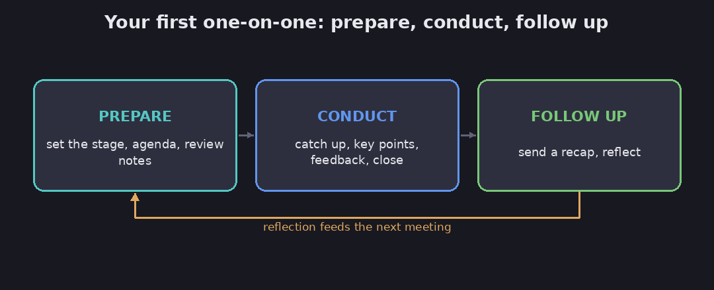

# How to lead your first one-on-one

This is the tactical starter guide for a brand-new manager running their first one-on-one
meetings. Matt Mayberry walks through a simple prepare, conduct, follow-up workflow. It pairs
with the more research-grounded [make the most of your one-on-one meetings](one-on-one-meetings);
think of this as the first-timer's how-to on-ramp.

FACT: this is a 2024 HBR.org article by Matt Mayberry. (Mayberry, "How to Lead Your First
One-on-One Meeting.")

## Prepare, conduct, follow up

*A new manager's first 1:1: prepare, conduct, follow up. Diagram.*

- **Prepare.** Put a recurring meeting on the calendar at a time you're both fresh (not right
  after a draining commitment). Ask the person early how they like to get feedback. Use a
  reusable four-part agenda: quick catch-up, key discussion points, feedback (both ways), next
  steps. Re-read last time's notes.
- **Conduct.** Be present, listen more than you talk, and follow up on prior action items. Frame
  any critical feedback around a *specific behavior* and its impact ("you were late to two
  client meetings, and it signals you don't value their time"), not the person. Ask for feedback
  on *yourself*.
- **Follow up.** Send a recap the same day splitting who owns what, and never make a promise you
  won't keep. Keep a small file per person (their priorities, how they like to communicate).

FACT: the one external evidence point is Gallup's finding that meaningful weekly conversations
are the most effective way for a manager to influence engagement.

## How much to trust this

Assessment: this is a clean, sensible checklist for someone running their very first 1:1s, and
the "critique the behavior, not the person" and "never break a promise" points are good habits.

The honest caveat is that it's a light thought-leadership piece (one Gallup citation, the rest
experience-based), and it slightly muddies whose meeting the 1:1 is, treating it as both your
alignment tool and their development space. Assessment: for the deeper, evidence-based take
(including the important "make it *their* meeting" stance), use the [Rogelberg
note](one-on-one-meetings); use this one to get started.

**Evidence check (2026 review, verdict: mixed).** the evidence base is thinner than the confident tone suggests. The Gallup engagement link is proprietary and correlational (not proof that 1:1s cause engagement), and the 'engagement' it measures overlaps heavily with ordinary job satisfaction. A landmark 1996 meta-analysis, [Kluger & DeNisi in Psychological Bulletin](https://doi.org/10.1037/0033-2909.119.2.254), pooled over 600 effect sizes and found that although feedback raises performance on average, it actually lowered performance in more than a third of cases, so the 'exchange feedback' step is not automatically helpful; the 'critique the behavior, not the person' rule is the part research supports best.

## See also

- **[Make the most of your one-on-one meetings](one-on-one-meetings)** — the research-grounded
  companion, with cadence data and a question bank.
- **[Becoming the boss](becoming-the-boss)** — the wider first-time-manager transition this
  ritual sits inside.
- **[The leader as coach](the-leader-as-coach)** — the questions to bring into a 1:1.

## Sources

- Matt Mayberry, "How to Lead Your First One-on-One Meeting", Harvard Business Review
  (April 2024) — https://hbr.org/2024/04/how-to-lead-your-first-one-on-one-meeting
