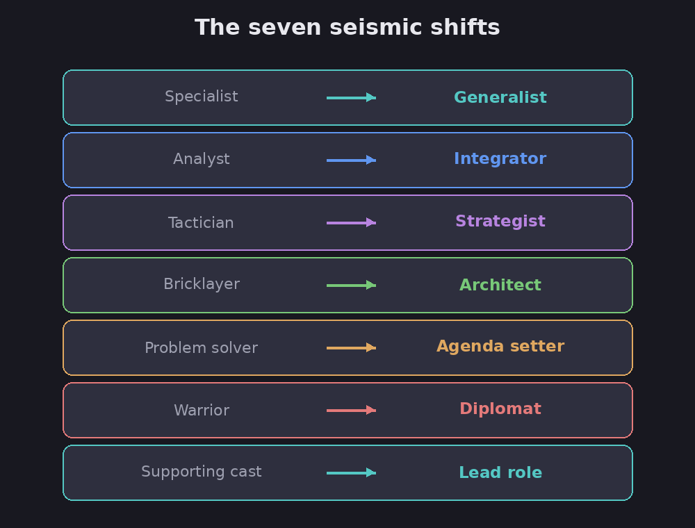

# How managers become leaders

The big idea of this article is that the leap from running one function to running a whole
business is far bigger than people expect, and the skills that earned you the promotion are
not the ones that will make you succeed. Michael Watkins maps the jump as "seven seismic
shifts", seven changes in how you think and where you spend your attention.

FACT: this ran in Harvard Business Review in 2012, built around one composite executive's
rise. (Watkins, "How Managers Become Leaders.")

## The seven shifts

Assessment: each shift is a move from the narrow, hands-on skills of a specialist toward the
broad, conceptual work of running an enterprise. You do not abandon the old skills; you just
spend far less time using them.

*The seven shifts from running a function to running a business. Diagram.*

- **Specialist to generalist** — stop being the expert in one function; learn enough of *all*
  of them to make whole-business calls and judge people whose work you can't do yourself.
- **Analyst to integrator** — stop going deep on one analysis; pull together many functions'
  knowledge and make the trade-offs between them.
- **Tactician to strategist** — lift out of the day-to-day and think in patterns and
  scenarios (Watkins calls it level-shifting, pattern recognition, and mental simulation).
- **Bricklayer to architect** — stop tinkering with the organization piece by piece; design
  it as a whole system where strategy, structure, and people fit together.
- **Problem solver to agenda setter** — stop just fixing problems well; decide *which*
  problems the organization should even be working on.
- **Warrior to diplomat** — stop focusing only on beating rivals; shape the outside world
  (regulators, media, investors, sometimes even competitors) through influence.
- **Supporting-cast member to lead role** — step onto center stage, where your every word and
  quirk is watched and copied.

FACT: the article's example, "Harald," learned this the hard way, over-managing his old
function and getting blunt feedback ("you need to give her some space"), and discovering that
an offhand comment now landed as an order (an unrequested report appeared on his desk two
weeks later).

## How much to trust this

Assessment: the core lesson, "the skills that got you here won't get you there," is true and
useful at every step up, not just the enterprise level. The seven shifts are a good checklist
for anyone taking on a much bigger job. This pairs naturally with [becoming the
boss](becoming-the-boss), which covers the *first* such leap.

The honest caveats. FACT: this is a practitioner essay built on one anonymized composite
executive plus about 40 interviews, so it is experienced observation, not measured research,
and the model lines up with the author's own consulting business. Assessment: the "left brain
to right brain" framing is a popular metaphor, not real neuroscience. Take the seven shifts as
a sharp map of a real transition, not a validated instrument.

**Evidence check (2026 review, verdict: mixed).** Independent research backs the broad direction (a 2007 study of ~1,000 managers found skill demands really do shift from technical toward strategic as you climb, and the 1980s derailment research shows early strengths can become liabilities), but the specific "seven shifts" has never been tested or validated as a model, and the "specialist to generalist" shift is actively disputed: Amanda Goodall's studies of hospitals, universities, and sports teams find leaders with deep domain expertise still outperform pure generalists even at the top. Treat it as a useful map, not a proven one, and note that all the supporting studies are correlational rather than causal.

## See also

- **[Becoming the boss](becoming-the-boss)** — the first version of this leap, from star
  individual to first-time manager.
- **[Why leadership training fails](why-leadership-training-fails)** — why sending rising
  leaders to a course rarely makes these shifts happen.
- **[Level 5 leadership](level-5-leadership)** — what the top of this ladder can look like.

## Sources

- Michael D. Watkins, "How Managers Become Leaders", Harvard Business Review (June 2012) —
  https://hbr.org/2012/06/how-managers-become-leaders
- Related to Watkins's books *The First 90 Days* and *Your Next Move*.
