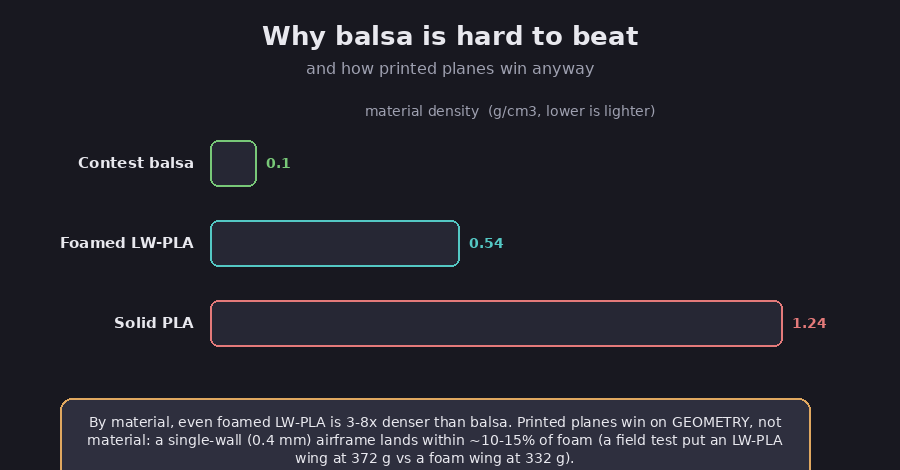
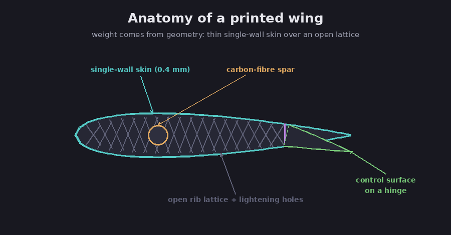
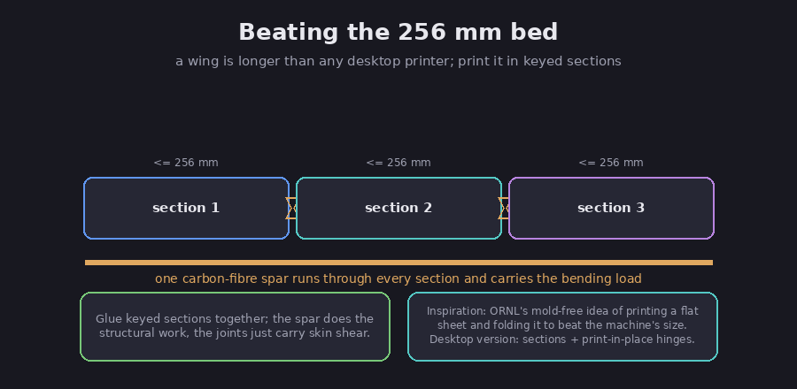
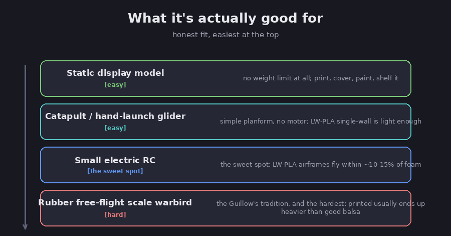

# Plastic and tissue: 3D-printed flying model aircraft

For a century, the light, flyable model airplane has been built one way: a balsa-wood
stick frame covered in tissue, shrunk tight and sealed with dope. This note asks a
simple question, can a Bambu Lab X1C (a desktop FDM filament printer) replace the
balsa with printed plastic, keep the tissue, and end up with something that still
flies? The honest answer is "yes for some of it, with real caveats," and this note is
about exactly where the line falls.

It is a companion to the other X1C making notes here, [cold-cast metal game
pieces](../cold-cast-game-pieces) and [electroplated
components](../plated-game-components): the same pattern of a 3D print plus a
traditional finishing craft, this time pointed at model aviation rather than the
tabletop. All three, and more, are gathered in the [Making with the Bambu X1C](../../../connections/making-with-the-x1c) thread.

A note on honesty up front, because this topic attracts hype. The printed *airframe*
is mature, well-trodden ground (more on the community below). The *tissue over plastic*
part is the genuinely under-documented bit, and I have labeled it as experimental
wherever the evidence is thin. Claims are tagged FACT (verified against a primary or
reliable source), Assessment (my judgment), or Speculation (forward-looking).

## Why balsa is hard to beat (and how printed planes win anyway)

The first thing to understand is a materials problem you cannot engineer away.

FACT: contest-grade balsa is extraordinarily light, roughly 0.04 to 0.16 grams per
cubic centimetre (the broader hobby range runs to about 0.25). (Model Aviation,
"Balsa Density, Grain, and Grade".) FACT: the lightest practical printing plastic,
foamed lightweight PLA (LW-PLA), comes out at about 0.54 grams per cubic centimetre
when printed; solid PLA is about 1.24. (eSUN ePLA-LW technical data sheet.)

*The material gap, and why it does not doom the idea. Diagram.*

Assessment: by raw material, even foamed LW-PLA is three to eight times denser than
balsa. You do not close that gap with a better plastic; you close it with *geometry*.
Printed planes put material only where load travels, by printing the skin as a single
0.4 mm perimeter ("vase mode") wrapped around an open internal lattice. Done that way,
the part, not the raw material, is what matters. FACT: a side-by-side field test put a
3D-printed LW-PLA wing at 372 grams against an equivalent foam wing at 332 grams,
within about 12 percent, while the same wing in standard PLA was "dramatically
noticeable in flight" from the added weight. (Fabbaloo, "A Field Test of Lightweight
PLA".) That 372-versus-332 result is the whole case in one number: modern printed
airframes are now within shouting distance of foam, which is why they fly well.

## How a printed airframe is actually built

The technique that makes this work is single-wall printing over an internal structure,
with a carbon tube doing the real structural job.

*A printed wing in cross-section. Diagram.*

FACT: the established designers print the wing and fuselage skins with a single
perimeter; 3DLabPrint's aircraft are "designed in 100% vase mode ... allowing printed
planes to be lighter than any other RC plane building technique." (3DLabPrint.) FACT:
the trick to keeping a hollow airfoil strong is to model internal ribs as part of the
same continuous perimeter so the slicer prints skin and ribs in one path, with a
cylindrical channel along the core "to fit a carbon fibre wing spar." (Hackaday, "A
Guide to 3D Printing Model Aircraft Wings".) The carbon spar carries the bending load;
the printed skin mostly carries shear and gives the shape.

For the materials, a quick map:

- **LW-PLA (foaming lightweight PLA)** is the airframe material. FACT: it integrates a
  blowing agent that foams in the nozzle, cutting part weight "by up to 60% compared to
  standard PLA." (ColorFabb.) Brands include ColorFabb LW-PLA, eSUN ePLA-LW, and
  Polymaker PolyLite LW-PLA.
- **Standard PLA** works but roughly doubles the weight; reserve it for a few
  high-stress fittings (motor mount, landing-gear blocks). PETG and ABS are generally
  discouraged for full airframes. FACT: 3DLabPrint explicitly does not recommend PETG,
  ABS, or HT-PLA for airframes, citing "lower inter-layer adhesion, brittleness, or
  excessive shrinking." (3DLabPrint materials FAQ.)
- **TPU** (flexible filament) is the go-to for printed living hinges on control
  surfaces, though piano-wire or pin hinges are common alternatives.

## Beating the 256 mm bed

A wing is longer than any desktop printer, so you do not print it in one piece.

*Sectioning a wing to fit the printer. Diagram.*

FACT: the X1C's build volume is 256 by 256 by 256 mm. (Bambu Lab X1-Carbon
specifications.) Assessment: the standard answer is to split the fuselage into roughly
240 mm barrel sections and each wing into one or two panels, print printed alignment
keys or dovetails, run a carbon spar tube through the lot, and glue the sections
together. The spar carries the bending, so the glued seams only have to carry skin
shear. FACT: this is exactly how the sectioned "Type M1" wing was built, designed so
each part "fits within 220 x 220 x 250 mm" and assembles from 25 printed parts on a
carbon tube. (RC Wing 3D Printer / ColorFabb.)

This is also where the inspiration that started this note comes in. FACT: Oak Ridge
National Laboratory (ORNL) has shown a mold-free, "origami-inspired" method that prints
a flat composite sheet onto a fabric base and then folds it into a 3D shape, which it
says "allows the fabrication of objects larger than the printing machine itself."
(ORNL, "Advanced 3D printing creates origami-inspired structures".) Be clear-eyed about
what that is, though. Assessment: ORNL's process is industrial composite manufacturing
(carbon-fibre ABS and epoxy resins bonded to fibreglass or nylon fabric), not a desktop
technique, and its headline savings ("95% faster, 90% cheaper") are, in ORNL's own
words, from a single "test print" of a one-off design where mold cost dominates, with
no peer-reviewed paper behind them yet (a patent is filed). Read it as the *idea*, print
a flat developable shape and fold it to beat the machine's size, not a method you run at
home. The desktop equivalent of that idea is print-in-place living hinges (good for
low-cycle control surfaces) plus the sectioning above (good for primary structure).

## The X1C-specific catch: cooling versus foaming

There is one quirk worth knowing before you print, because the X1C's strengths fight
this particular filament.

FACT: the X1C ships with a hardened steel nozzle, so the old worry about abrasive
filament is moot, and plain LW-PLA is not abrasive anyway (the blowing agent has no hard
particles). Assessment: the real issue is cooling and speed. Active-foaming LW-PLA wants
to be printed slowly with little or no part cooling so the gas can expand; FACT: ColorFabb
advises reduced flow and to "use reduced fan speeds or even turn off cooling entirely."
The X1C is built for the opposite, very high speed with aggressive automatic cooling.
The practical recipe is to cap speed around 30 to 40 mm/s, turn the part fan off (and
confirm it actually stays off), cut flow to roughly 50 to 60 percent, print around 235 C
with a single 0.4 mm wall, and tune density with temperature. Flightory publishes ready-
made X1C profiles for this. Assessment: if fiddling with foaming control is a hassle, a
*pre-foamed* LW-PLA (such as Polymaker PolyLite) is the X1C-friendly fallback, you print
it fast with the fan on like normal PLA at a fixed lower density.

## The covering: tissue over plastic

Here is the part that is genuinely experimental, and where I want to be most careful.

The classic craft is well understood. FACT: "dope" is a plasticised nitrocellulose (or
butyrate) lacquer; brushed over tissue it fills the pores, and as the solvent
evaporates the film contracts and tautens the skin, adding real torsional stiffness to
the frame. (Wikipedia, "Aircraft dope".) On balsa this works because balsa is porous:
the dope soaks in and keys mechanically. Printed plastic is the problem.

*Why covering a printed frame is not a solved problem, and how to get around it. Diagram.*

Assessment: two physical facts collide here. First, PLA is smooth and non-absorbent, so
dope cannot soak in; it can only sit on the surface as a weak film. Second, FACT: PLA's
glass-transition temperature is about 60 C, where printed parts go soft and deform; but
heat-shrink covering films are ironed on at roughly 80 to 150 C, above that threshold,
so direct ironing on a printed rib will warp it. Foamed LW-PLA, being thinner-walled,
is even less forgiving.

The defensible workarounds, all Assessment drawn from how builders cover non-absorbent
foam: add a real adhesive (a thinned PVA line, or a film and fabric adhesive like
Balsarite) at every contact point rather than relying on dope soaking in; choose the
lowest-temperature film available, or shrink it with a heat gun aimed at the open bay
rather than ironing directly on the plastic; anneal the prints first to raise their heat
tolerance; or sidestep the heat problem entirely by using classic water-shrink tissue
and a light sealant instead of a heat-shrink film. Speculation: water-shrink tissue with
a separate edge adhesive is probably the lowest-risk path on plastic, but I have not
found it well documented, so treat it as something to test, not a recipe.

One more reason covering choice matters: weight lands on the largest area of the model.
FACT: Japanese tissue weighs about 12 to 14 grams per square metre, light laminating
films about 35, and durable RC films like Monokote about 67 to 79, roughly two to six
times heavier than tissue. (LCAA, "Comparative Weights of Covering Materials".)
Assessment: on a small, light model, tissue or an ultralight film is effectively
mandatory; the heavy films are only worth their weight on a larger RC model where
durability earns it.

## What it's actually good for

This is the honest verdict, and it is not "anything Guillow's makes."

*Where printed-and-tissued models fit, easiest first. Diagram.*

Assessment, from easiest to hardest:

- **Static display models** have no weight limit at all. Print, cover, paint, and shelf
  it. This is the trivially easy win.
- **Catapult and hand-launch gliders** are simple, motorless, and forgiving; a
  single-wall LW-PLA airframe is light enough.
- **Small electric RC** is the sweet spot and the proven case. FACT: Eclipson's EBW-160
  flying wing has a 1.6 m span, a 265 gram LW-PLA airframe, an all-up weight of 680
  grams, and a wing loading of 23 grams per square decimetre, normal, flyable
  territory. (Eclipson.) The lithium battery doubles as nose ballast for balance.
- **Rubber-powered free flight,** the actual Guillow's tradition (rubber-motor scale
  warbirds), is the hardest case. FACT: it *is* possible, Free Flight Lab sells an
  LW-PLA printed free-flight kit that comes in under 19 grams including the motor
  (crediting Eclipson for the design). Assessment: but a faithful printed copy of a
  heavy scale warbird will usually end up heavier than a skilled balsa build, because
  the plastic is several times denser and you cannot go thinner than one 0.4 mm wall.
  Printed free flight works best for small, simple planforms designed from scratch
  around single-wall LW-PLA, not for scale conversions of chunky warbirds. Small IC
  (glow or gas) engines are a poor match entirely: vibration and heat exceed what PLA
  tolerates.

A historical aside worth resisting: the geodetic lattice airframe of the Vickers
Wellington (Barnes Wallis's basket-weave structure, famous for bringing bombers home
with huge holes in them) is a tempting thing to print. FACT: one builder who actually
printed a geodesic fuselage structure found it came out *heavier* than his plain
double-wall baseline (about 92 grams versus 72) and took far longer. (rc3dprint.) Treat
printed geodetics as a beautiful homage, not the lightest engineering choice.

## Standing on the community's shoulders

Assessment: the printed airframe is not new, and the article would be dishonest if it
pretended otherwise. The novelty here is the tissue-over-printed-frame skin as a
balsa-and-tissue homage, layered on top of a mature ecosystem you should learn from and
credit:

- **3DLabPrint** pioneered fully-printed RC warbirds and the single-perimeter airfoil
  technique (Spitfire, P-51D Mustang, A6M Zero).
- **Eclipson Airplanes** has a large catalogue of printable designs, including a B-17
  and "the lightest 3D printed RC airplane."
- **ColorFabb** invented and popularised LW-PLA (around 2019) and co-designed planes for
  it.
- **Free Flight Lab** sells the sub-19-gram LW-PLA free-flight kits, the clearest
  "printed answer to balsa free flight."
- **FliteTest** bridges the foam-board and printed crowds and hosts printed warbird
  builds.

## Safety and the legal line

FACT: in the United States, recreational flyers must pass the free online TRUST test
(The Recreational UAS Safety Test) regardless of aircraft weight, and must register
(5 dollars, valid 3 years) any aircraft weighing 250 grams or more, marking the
registration number on it. Heavier-than-250-gram models must also broadcast Remote ID.
Fly within visual line of sight, keep clear of and give way to crewed aircraft, and
follow a community organisation's safety code; the Academy of Model Aeronautics (AMA) is
the recognised body and offers flying sites and insurance. (FAA recreational flyers;
AMA National Model Aircraft Safety Code.)

FACT: dope and its solvents are seriously hazardous, the lacquers are highly flammable
(nitrocellulose is chemically akin to guncotton) and the solvent vapours are toxic, so
use forced ventilation or work outdoors, wear an organic-vapour respirator, and keep
ignition sources away. (Aircraft dope MSDS sources.) Assessment: FDM printing and
sanding PLA also have mild hazards (ultrafine particles, plastic dust); print in a
ventilated space and wear a dust mask when sanding.

On intellectual property, the same line as the other making notes here: Assessment, a
personal, non-commercial replica of a real aircraft, including its national markings, is
low practical risk (an aircraft's shape generally is not protectable; markings are
trademark). The risk appears when you *sell or distribute* models reproducing
trademarked liveries or markings, so use original or properly licensed designs for
anything you put out into the world. Kit plans and design files are copyrighted by their
authors; build from them, but do not redistribute them.

## Bottom line

Assessment: "plastic and tissue" is a real and appealing idea, but it is a *new skin on
a mature airframe*, not a from-scratch revolution. Lean on the printed-airframe
community for the structure (LW-PLA, single-wall skins, a carbon spar, sectioning to
beat the bed), expect to fight the X1C's cooling to foam LW-PLA well, and treat the
tissue covering itself as the experimental frontier where a separate adhesive and gentle
heat are your friends. Point it at static models, gliders, and small electric RC and it
works today; point it at a rubber-powered scale warbird and you are taking on the one
job balsa still does best.

## Sources

- Model Aviation (AMA), *Balsa Density, Grain, and Grade* — https://www.modelaviation.com/balsa
- eSUN ePLA-LW technical data sheet (density 0.54 g/cm3) — https://www.esun3d.com/uploads/eSUN_ePLA-LW-Filament_TDS_V4.02.pdf
- ColorFabb, *How to Print with LW-PLA* — https://colorfabb.com/blog/post/how-to-print-with-colorfabb-lw-pla
- Fabbaloo, *A Field Test of Lightweight PLA* (372 g vs 332 g) — https://www.fabbaloo.com/news/3d-print-materials-count-a-field-test-of-lightweight-pla
- Hackaday, *A Guide to 3D Printing Model Aircraft Wings* — https://hackaday.com/2022/08/26/a-guide-to-3d-printing-model-aircraft-wings/
- 3DLabPrint, *Materials for 3D printing planes* — https://3dlabprint.com/faq/materials-for-3d-printing-planes/
- Eclipson EBW-160 (weights and wing loading) — https://www.eclipson-airplanes.com/ebw-160-rc
- RC Wing 3D Printer / ColorFabb, *Type M1* sectioned wing — https://colorfabb.com/blog/post/rcwing3dprinter-x-colorfabb
- Free Flight Lab, LW-PLA free-flight kit (sub-19 g) — https://freeflightlab.org/product/lw-pla-3d-printed-airplane-kit-printed-parts-only/
- Bambu Lab X1-Carbon specifications (256 mm bed, hardened nozzle) — https://public-cdn.bambulab.com/store/bambulab-X1-carbon-tech-specs.pdf
- ORNL, *Advanced 3D printing creates origami-inspired structures* — https://www.ornl.gov/news/advanced-3d-printing-creates-origami-inspired-structures
- New Atlas, *Origami-inspired 3D printing needs no molds* — https://newatlas.com/3d-printing/origami-inspired-3d-printing-no-molds/
- Wikipedia, *Aircraft dope* — https://en.wikipedia.org/wiki/Aircraft_dope
- LCAA, *Comparative Weights of Covering Materials* — https://lcaa.org/pdf/comparative_weights_of_covering_material.pdf
- rc3dprint, *3D printing geodesic internal structure* (heavier result) — https://www.rc3dprint.com/post/3d-printing-geodesic-internal-structure
- Guillow's, *About Us* — https://www.guillow.com/about-us/
- FAA, *Recreational Flyers* / TRUST — https://www.faa.gov/uas/recreational_flyers
- AMA, *National Model Aircraft Safety Code* — https://www.modelaircraft.org/content/official-ama-national-model-aircraft-safety-code
