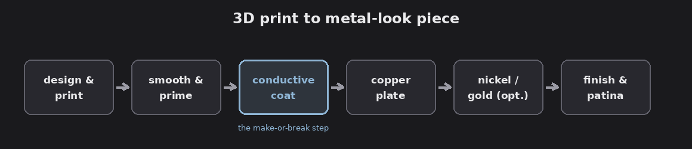
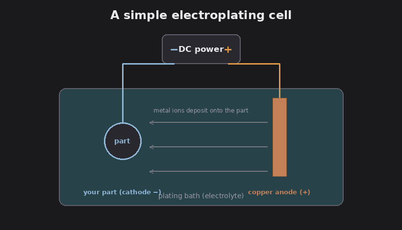
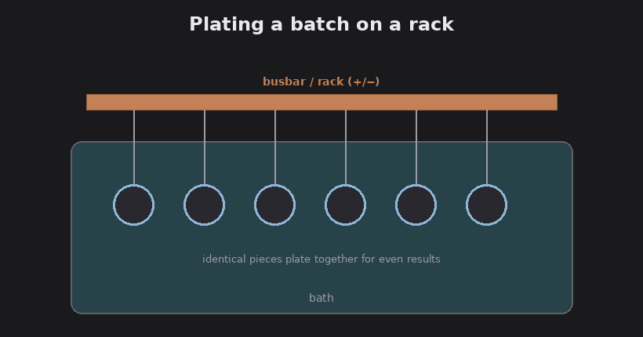

# Metal-look board game pieces at scale (3D printing + electroplating)

There's a satisfying maker trick going around: take a 3D-printed plastic part and
**electroplate real metal onto it** so it looks and feels like a solid metal
collectible. The inspiration here is a short by HEN3DRIK, who turned a 3D-printed
"John Wick" coin into a convincing gold-and-copper piece. This article is about
applying that same pipeline to **board game components**, coins, resource tokens,
objective markers, miniatures, and doing it at a small batch scale rather than one
piece at a time.

It's a practical overview, not a chemistry manual. Where real hazards are involved
I point you to proper guides rather than improvising. Read the safety section first.

## Safety first (genuinely, before anything else)

FACT: Electroplating combines electricity with reactive chemistry, and several
common plating chemicals are hazardous. Treat this as a real chemistry activity:

- **PPE:** chemical-resistant gloves, eye protection, an apron; work somewhere you
  can't contaminate food surfaces.
- **Ventilation:** plating baths can off-gas; work with good airflow or extraction.
- **Specific hazards:** nickel is a common skin sensitizer (allergy); strong acids
  burn; and **cyanide-based gold baths are dangerous**, hobbyists should use
  cyanide-free or immersion-gold alternatives instead.
- **Waste:** spent plating solution is *not* drain-safe. Neutralize and dispose of
  it per your local hazardous-waste rules.
- **Keep kids and pets away**, and follow the safety data sheet (SDS) for every
  chemical you buy.

Assessment: if that list feels like a lot, that's the honest signal, this is a
rewarding hobby but it's closer to a darkroom or a small chem bench than to
painting minis. Start small and cautious.

## What the technique actually is

FACT: Plastic doesn't conduct electricity, so you can't plate it directly. The
pipeline gets around that by coating the print in a **conductive layer** first, then
growing real metal on top of it in a plating bath. The result is a thin but real
metal skin over a plastic core, lighter than solid metal, but with genuine metal
sheen, and it takes a patina like the real thing.

*The pipeline for one piece. Diagram.*

## The pipeline, one piece at a time

1. **Design & print.** Resin (SLA) prints capture fine detail (coin reliefs,
   sigils, faces) and are ideal; FDM works but usually needs smoothing first. Add a
   small **contact tab** to each piece, that's where the electrical clip attaches.
2. **Smooth & prime.** Sand, fill, and prime so the surface is clean and even.
   Plating mirrors whatever is underneath, so every scratch and layer line shows in
   the finished metal.
3. **Make it conductive (the make-or-break step).** Coat the part in conductive
   paint, graphite-based, or copper/silver for a brighter, faster start. Even,
   complete coverage here is the single biggest driver of a good result.
4. **Copper plate.** An acid copper bath lays down a smooth, leveling base layer.
   The part is the **cathode**, a copper **anode** feeds the metal, a low-voltage DC
   supply drives it, and gentle agitation keeps the deposit even.
5. **Optional bright/hard layers.** Nickel adds a hard, bright surface; gold or
   other finishes give the final look (use safe baths, see above).
6. **Finish & patina.** Polish, then antique for the tabletop: darken the recesses
   and buff the raised detail so a token "reads" clearly across a table.

*A simple electroplating cell. Diagram.*

## Doing it at "somewhat of a scale"

The jump from one coin to a batch is mostly about **consistency and fixturing**:

- **Standardize the design.** A consistent contact tab, flat-ish backs, and shapes
  that rack neatly make everything downstream easier.
- **Batch the prints.** Resin printers happily fill a plate with 20-50 small pieces
  at once; print runs, not singles.
- **Racks, jigs, and busbars.** Hang many pieces from a conductive rack so they
  plate together; even spacing gives even current and even thickness.
- **Coat in batches.** Dip or spray the conductive layer onto many pieces at once;
  this is where batch consistency is won or lost.
- **Size the bath to the load.** More total surface area needs a bigger bath, more
  anode area, and a higher total current (set for the *whole* batch's area), plus
  agitation and filtration for evenness.
- **Expect a yield.** Some pieces will come out poorly; keep a simple QC checklist
  (coverage, adhesion, finish) and accept a reject rate.

*Racking a batch so pieces plate together. Diagram.*

Assessment: for a hobbyist, "somewhat of a scale" realistically means **tens to a
low-hundreds of pieces per run**, not a factory. Labor (coating, racking,
finishing) dominates the cost far more than materials, so the real question is how
much hand-time each piece is worth to you. Past a few hundred a run, you're into
proper production plating lines, or outsourcing.

## The simpler ladder (if full plating is too much)

The "metal look" is a spectrum; electroplating is the top rung, not the only one:

- **Metallic paint / wax gilding (Rub 'n Buff).** Easiest, no chemistry, surprisingly
  good for tokens; no real heft.
- **[Cold-cast metal](../cold-cast-game-pieces).** Mix metal powder into resin when
  casting, then buff to expose real metal at the surface, heavier feel, no plating
  bath. This is the **weighty** route, and it has its own article.
- **Outsource the plating.** Print and prep in batches, send them to a plating shop.
- **Full DIY electroplating.** Most effort and setup, best look and feel.

Assessment: for most board-game projects, cold-casting or good metallic paint gets
you 80% of the effect for 20% of the hassle. Reserve full electroplating for hero
pieces (a legacy-game coin, a campaign trophy) where the real metal feel matters.

## The legal and ethical line

- **Never counterfeit real currency.** That's a crime, full stop.
- **Don't sell replicas of trademarked or copyrighted designs.** The John Wick coin
  in the source video is a movie prop, fine to make one for yourself, not to sell as
  a knockoff. If you plan to *sell* components, use your own original designs or
  properly licensed ones.
- Making others' designs for personal use is a grey area; **selling** is where the
  IP problems actually start.

## The payoff

Done well, this gives you tabletop components with real metal weight, shine, and
patina, at a scale a dedicated hobbyist can manage at home. The advice that matters
most: nail the **conductive-coating** step on a single coin first, then scale up the
**racking and batching**, that's the whole game.

Source / inspiration: HEN3DRIK, ["I made a FAKE John Wick coin look 100%
REAL!"](https://youtube.com/shorts/8qB9KIB8rwo) (electroplating 3D prints).
