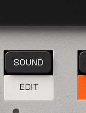

# Chapter 4 — Sound mode and loading sounds

*The SOUND button (SHIFT+SOUND for sound edit). Photo: Teenage Engineering.*

`SOUND` mode is where you decide which sample sits on each pad. This chapter covers
that screen and the four ways to get audio onto the device.

## Sound mode basics

FACT: Press `SOUND` to enter. Select a group (`GROUP A`-`D`) and tap the pad you
want to fill. Then:

- `-` / `+` browse the sound library; the selected pad updates as you go.
  `SHIFT` + `-`/`+` jumps ten slots at a time.
- `knob X` sets that pad's amplitude (level, shown as `AMP`) and `knob Y` sets its
  pitch (`PTC`) right here, for quick tweaks. Deeper editing lives in Sound Edit
  (`SHIFT` + `SOUND`, see [chapter 7](07-shaping-sounds.md)).
- To target a specific slot number, hold `SOUND`, type the number on the pads, and
  press `ENTER`.

Remember from [chapter 2](02-how-its-organized.md): assigning a sound points the pad
at a library slot. The audio is shared, so reusing a sample elsewhere costs no extra
memory.

## The four ways to load sounds

FACT:

1. **Factory and existing library sounds.** Browse with `-`/`+` in Sound mode as
   above. The device ships with a categorized library, and anything you have
   sampled before is also in there.
2. **Sampling into the device.** Record from the built-in mic or the 3.5 mm input
   straight onto a pad. This is the next chapter, [chapter 5](05-sampling.md).
3. **Transferring from a computer.** Use the browser-based **EP Sample Tool** over
   USB-C to drag audio files into slots and onto pads. It auto-converts formats, so
   you don't have to prepare files first. Covered in
   [chapter 15](15-samples-and-computer.md).
4. **Resampling.** Record the K.O. II's own output (with effects baked in) back onto
   a pad. This is a power feature for layering and freeing voices; see
   [chapter 16](16-advanced-techniques.md).

Assessment: a fifth path worth knowing is **chopping** ([chapter 6](06-chopping.md)),
which isn't a separate "load" method so much as a way to populate a whole group of
pads from one long recording.

## Deleting a sound to free memory

FACT: Clearing a pad does not reclaim memory, because the audio lives in the shared
library. To actually remove a sample, hold `ERASE` + `SOUND` until `SND` blinks;
that permanently deletes the selected sample from the device. Do this deliberately,
it cannot be undone, and back up first if the sample matters
([chapter 15](15-samples-and-computer.md)).

Watch the screen: `FUL` means the sample memory is full, and you will see a low-disk
warning when only about 20 seconds of recording space remain.

Next: [Sampling](05-sampling.md).
