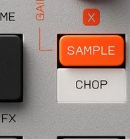

# Chapter 6 — Chopping

*CHOP is SHIFT+SAMPLE. Photo: Teenage Engineering.*

Chopping takes one longer sample (a drum break, a vocal phrase, a melodic loop) and
spreads slices of it across the 12 pads of a group, so each pad plays a different
piece. It is how you turn a record into an instrument.

## Two ways to chop

FACT: Enter chop with `SHIFT` + `SAMPLE`.

- **Auto-chop:** select a group (`GROUP A`-`D`) and the K.O. II uses beat tracking
  to divide the sample into even slices, filling pads from bottom-left to top-right.
  Set how many slices with `-` / `+`. Important: **auto-chop overwrites the pad
  assignments in that whole group**, so chop into a group you are happy to dedicate
  to it.
- **Live chop:** play the sample and tap pads as it goes by to drop slice points on
  the fly (the "lazy chop" method from MPCs). Where you tap sets where each slice
  begins.

## Refining the slices

FACT: With a slice selected, `knob X` sets its start point and `knob Y` sets its end
point. Hold `SHIFT` while turning for fine resolution. Slices map across the 12 pads
of the group, so once chopped you can immediately re-sequence them into a new order,
which is the classic way to flip a break.

Assessment: auto-chop gets you 80% there in seconds; then nudge the start/end of the
one or two slices that landed off the transient. Re-sequencing chopped slices into a
new rhythm (rather than playing them in order) is where chopping stops being a
utility and becomes composition.

## After chopping

Each slice is now a normal pad sound, so everything else in the course applies: you
can [shape each slice](07-shaping-sounds.md) (pitch, envelope, trim),
[sequence them](08-sequencing.md), and [add effects](10-effects.md). If you build a
great chopped phrase and want to lock it down as one sound to save voices, bounce it
with [resampling](16-advanced-techniques.md).

Next: [Shaping a sound](07-shaping-sounds.md).
