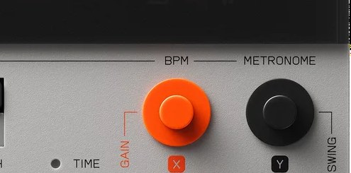

# Chapter 7 — Shaping a sound

*knob X and knob Y set the two parameters on each edit page. Photo: Teenage Engineering.*

Each pad has its own set of playback parameters. They change how that pad plays the
underlying sample, without altering the stored audio. This is "sound edit."

## Entering sound edit

FACT: Press `SHIFT` + `SOUND`. You move between pages with `-` / `+`, and each page
gives you two parameters, one on `knob X` and one on `knob Y`. Hold `SHIFT` while
turning for fine adjustment. Hold `SHIFT` + `SOUND` for about two seconds to save
your edits.

## The pages (per pad)

FACT, the six sound-edit pages:

1. **Play mode + pan.** `knob X` chooses the play mode: `oneshot` (plays the whole
   sample when triggered), `key` (gated, plays only while held), or `legato`
   (monophonic, glides between notes). `knob Y` sets pan.
2. **Trim.** `knob X` sets the start point, `knob Y` sets the length (end). This is
   how you tighten a one-shot or isolate part of a sample.
3. **Envelope.** `knob X` is attack (fade-in), `knob Y` is release (tail after the
   note ends). That is the **entire** envelope: there is **no decay, hold, or
   sustain stage, and no filter envelope** (FACT, and a real limitation to plan
   around).
4. **Time-stretch.** `knob X` picks the mode: `BPM` (conform the sample to the
   project tempo) or `BAR` (fit the sample to a set number of bars). `knob Y` sets
   the source tempo or bar count. Pitch is preserved. Extreme stretch settings get
   artifacty (Assessment: keep it modest for clean results, lean in for lo-fi
   character).
5. **MIDI.** `knob X` sets the pad's MIDI channel, `knob Y` its root note, for
   driving external gear (see [chapter 14](14-midi-and-sync.md)).
6. **Mute group.** Assign pads to a group so they cut each other off, the classic
   open-hat/closed-hat choke (see [chapter 13](13-performing-live.md)).

Pitch and level are also adjustable right in Sound mode (`knob Y` and `knob X`
there), so quick tuning doesn't require entering sound edit.

## Know the limits before you fight them

FACT, the honest list of what the K.O. II does **not** do per sound:

- **No sample reverse.**
- **No looped playback mode** (no synth-style sustain loop; `oneshot`/`key`/`legato`
  are the only modes). You can re-trigger a loop with note repeat, but a pad won't
  hold a looping sustain on its own.
- **No per-sound resonant filter.** The cutoff/resonance filter is a **group send
  effect** ([chapter 10](10-effects.md)), shared by the group, not an
  independent per-pad filter.
- **No per-sound parameter automation.** You cannot automate, say, one pad's pitch
  on its own. Automation happens at the **group** level through the fader
  ([chapter 9](09-fader-and-automation.md)).

Assessment: these constraints are the device's personality, not bugs. Design with
them: bake a reverse or a filter sweep into the audio by
[resampling](16-advanced-techniques.md) when you truly need it, and think in groups
rather than per-pad when you want movement.

Next: [Sequencing](08-sequencing.md).
