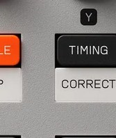

# Chapter 8 — Sequencing

*The TIMING button (SHIFT+TIMING for timing correct). Photo: Teenage Engineering.*

This is the deep chapter on building patterns: how to record them, set the grid, add
groove, and edit individual hits. Remember there is no 16-step button row here; you
work with `RECORD`, the pads, the `-`/`+` buttons, and `TIMING`.

## Recording a pattern

FACT, two methods:

- **Live (real-time):** press and release `RECORD`, then `PLAY`, for a four-beat
  count-in and then recording as the loop runs. Or press `RECORD` + `PLAY` together
  to start with no count-in. Play the pads in time; the pads are velocity and
  pressure sensitive, so your dynamics are captured.
- **Step:** while stopped, move through the steps with `-` / `+`, and at each step
  hold `RECORD` and press a pad to write that hit. The screen shows your position as
  bar.beat.subdivision so you know where you are.

FACT: Adding and removing are separate actions (not a toggle): `RECORD` + pad adds a
hit, `ERASE` + pad removes hits for that pad. To overdub, let `PLAY` run, hold
`RECORD`, and tap in more parts.

## The grid: note interval and quantize

FACT: Press `TIMING` and turn `knob X` to set the note interval (the grid
resolution): `1/8`, `1/8T` (triplet), `1/16` (default), `1/16T`, or `1/32`. The
triplet grids give 12 steps per bar (`8T`) or 24 (`16T`).

FACT: While recording, `-` and `+` set the feel: `-` quantizes (snaps your hits to
the grid) and `+` records in free time (keeps your exact timing). Free time
preserves human feel; quantize cleans it up.

## Swing and length

FACT: Swing/groove is on `knob Y` in the `TIMING` menu (0 is straight, higher
shuffles). Swing applies only to the 1/8 and 1/16 grids.

FACT: A new pattern is 1 bar. To change length, hold `RECORD` and press `-` / `+`
(up to 99 bars). Move between bars with `SHIFT` + `-`/`+`.

FACT (verify on device): a time signature editor is reachable via `MAIN` + `TEMPO`
(`knob X` numerator, `knob Y` denominator, default 4/4). This one comes from a
third-party manual rather than the official page, so confirm it on your unit before
relying on it. Tempo itself is on `knob X` in `TEMPO` mode, with an extended range
(roughly 40-399 BPM) by holding `TEMPO` and typing the number on the pads.

## Editing individual hits

FACT:

- **Delete a hit:** hold `ERASE` and press the pad.
- **Nudge / micro-timing:** navigate to the step, hold `SHIFT`, hold the pad with
  the note, and press `-` / `+`. In quantize it nudges by whole steps; in free time
  it nudges by ticks for fine human feel.
- **Per-step velocity and duration:** hold `SHIFT` and turn `knob X` to set the
  velocity of the notes on the selected step, or `knob Y` for note duration.
- **Timing correct (after-the-fact quantize):** `SHIFT` + `TIMING`, then press a pad
  to snap that pad's notes to the grid, or hold a pad during playback to quantize it
  in real time. MPC-style, selective.

## Note repeat (rolls and fast hats)

FACT: Hold `TIMING` and press a pad to repeat that pad at the current note interval,
the way you get machine-gun hats or snare rolls. The repeats respond to velocity and
pressure, so you can build dynamic fills. You can also lock note repeat on a pad
(press `TIMING`, then hold `SHIFT` and press the pad).

Assessment: a reliable workflow is to record loose in free time for feel, then use
timing correct selectively on just the parts that need to be tight (usually the
kick and snare), leaving hats and percussion human. That keeps the groove alive
instead of grid-stiff.

Next: [The fader and automation](09-fader-and-automation.md).
