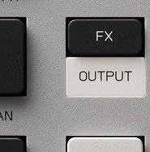

# Chapter 10 — Effects

*The FX button. Photo: Teenage Engineering.*

The K.O. II has two distinct effects systems plus master processing. Keeping them
straight is the key to using them well.

## Group (send) effects: always on, one per group

FACT: Each group has one **send effect** active at a time, chosen with `-` / `+`,
and the `FADER` (assigned to FX) sets how much of the group goes into it. The six
effects, each with two knob parameters:

- `Delay` — `knob X` length, `knob Y` feedback
- `Reverb` — `knob X` length, `knob Y` color
- `Distortion` — `knob X` drive, `knob Y` color
- `Chorus` — `knob X` modulation, `knob Y` feedback
- `Filter` — `knob X` cutoff, `knob Y` resonance
- `Compressor` — `knob X` drive, `knob Y` speed

FACT: This is also where the resonant **filter** lives. It is a group effect, not a
per-pad filter, so a filter sweep affects the whole group at once.

## Punch-in FX 2.0: momentary performance effects

FACT: Hold `FX` and the 12 pads become **punch-in effects**. They are
pressure-sensitive (press harder for more intensity) and **stackable** (hold more
than one). They apply only while held and snap back the instant you let go. Reviews
report the set includes low-pass and high-pass filter sweeps, stutter/beat-repeat,
bit-crush, loop captures, slow-downs and pitch warps, an extra FX send, and
sample-replacement (the official guide doesn't print individual names, so treat the
specific list as review-sourced).

FACT, two limitations that shape how you use them:

- Punch-in FX are **performance-only: they do not record into a pattern.**
- They **cannot be triggered over external MIDI.**

Assessment: because they aren't recordable, the way to "keep" a punch-in move is to
[resample](16-advanced-techniques.md) the output while you perform it, which bakes
the effect into a new sample you can then sequence. That one trick turns the punch-in
FX from a live-only toy into a production tool.

## How to think about the two systems

Assessment: use the **group send FX** for the steady character of a part (a room
reverb on the snare group, a gentle delay on the chords, the filter for sweeps), and
the **punch-in FX** for live drama and transitions (a stutter into the drop, a
high-pass riser at the end of a bar). The master compressor and sidechain that glue
it all together are in the next chapter.

Next: [Mixing and the master](11-mixing-and-master.md).
