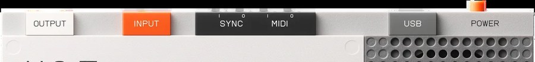

# Chapter 14 — MIDI and sync

*The MIDI and sync jacks sit along the top edge. Photo: Teenage Engineering.*

The K.O. II is a full MIDI sequencer, not just a sampler. It can play external
synths, sync with other gear, and act as a controller for your computer.

## The connections

FACT: There are two MIDI transports:

- **USB-C**, which is class-compliant (no drivers; works with any DAW), and
- **3.5 mm TRS MIDI in and out** (Type A pinout), which need a TRS-to-5-pin-DIN
  adapter to reach classic MIDI gear.

There are also dedicated **analog sync in and out** jacks for pulse-based gear, at
1/8, 1/16 (default), or 24 PPQ.

FACT: It **sends and receives** clock, start, stop, continue, song-position, notes,
and CC; it additionally **receives** pitch bend, program change, and key/channel
pressure. There is no built-in Bluetooth MIDI (a separate CME WIDI adapter on the
TRS jacks adds it).

## Sequencing external gear

FACT: Any pad can send MIDI. In sound edit (`SHIFT` + `SOUND`), the MIDI page sets
that pad's MIDI channel on `knob X` and its root note on `knob Y`. A sequence you
record on that pad then plays the external instrument. A pad needs **no sample
loaded** to transmit MIDI, so you can dedicate pads (a common choice is part of
Group D) to external channels without using sample memory, and a pad can play a
sample and send MIDI at the same time.

## Clock and sync

FACT: Master/follower clock is set in the system menu (enter with `SHIFT` +
`ERASE`). The MIDI clock codes are 100 (off, default), 101 (receive/follow), and 102
(send/master); both devices must agree on who is master. MIDI channel behavior has
its own codes (110-127), and analog sync has codes 200-212. OS 2.0 added **MIDI
thru**, so incoming MIDI is passed back out to chained devices.

Assessment: decide one device to be the clock master for your whole setup and set
everything else to follow it; mismatched masters are the most common "why won't it
sync" problem.

## As a controller / with a DAW

FACT: Over USB-C the velocity-sensitive pads send notes to your DAW with no setup,
and in keys mode different pads send different pitches, so it doubles as a compact
pad controller and playable keyboard. (It is **not** a USB audio interface, though,
USB carries MIDI and sample-tool data, not audio; see
[chapter 15](15-samples-and-computer.md).)

Assessment: the K.O. II makes a great hardware brain for a small setup, sequencing a
synth or two over MIDI while it handles the drums and samples itself. Keep one group
for its own sounds and another aimed at external channels, and you have a complete
little studio.

Next: [Samples and your computer](15-samples-and-computer.md).
