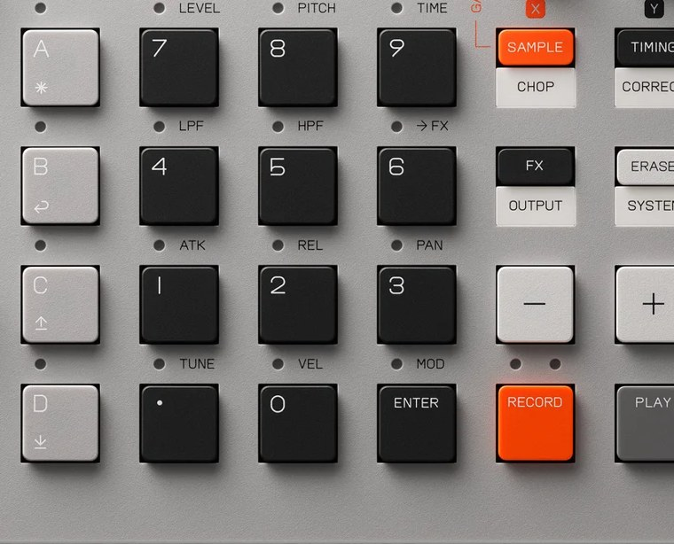

# Chapter 18 — Recipes

*The pads and group buttons you'll build on. Photo: Teenage Engineering.*

Eight beats you can build start to finish, each in a different style, to turn the
techniques from earlier chapters into muscle memory.

Assessment: these are creative starting points, not rules. The tempos and patterns
are general production conventions (Assessment); the button steps trace back to the
FACT chapters (sampling, sequencing, FX), so follow the links when you need the
mechanics. Patterns are written as steps on a 16-step bar (step 1 = the downbeat);
to enter them, set the grid to `1/16` in `TIMING`, then play live (`RECORD` then
`PLAY`) or step-record (hold `RECORD`, move through steps with `-`/`+`, press the
pad). "Kick: 1, 7, 11" means put a kick on steps 1, 7, and 11. Group convention
throughout: `GROUP A` drums, `GROUP B` bass/808, `GROUP C` melody/chords, `GROUP D`
texture.

## Genre cheat sheet

| Style | Tempo | Feel | Signature element |
|---|---|---|---|
| Boom Bap | 85-92 | swung | chopped soul sample, cracky snare |
| House | 120-128 | straight | four-on-floor kick, offbeat open hat |
| Trap | 140 (half-time) | half-time | sliding 808, triplet hat rolls |
| Drum & Bass | 172-176 | breakbeat | two-step or Amen break, Reese/sub |
| Drill | 140-144 | half-time | gliding 808, offbeat snare, hat triplets |
| Lo-fi / ambient | 70-85 | swung, loose | sampled chords, vinyl crackle, wobble |
| Punk Rock | 180-200 | driving, straight | sampled power chords, distortion, stops |
| Grunge | 90-115 | loose, dynamic | loud-quiet-loud, resampled walls of fuzz |

---

## Boom Bap

Dusty, head-nodding, sample-based hip-hop: a chopped loop, a hard kick and snare,
and swing. Tempo about **88 BPM**, grid `1/16`, with a moderate amount of swing
(`knob Y` in `TIMING`) — swing is what makes it boom bap.

- **Drums (`GROUP A`):** kick on **1, 11** (ghost on 8 for bounce); snare on **5,
  13**; closed hat on the off-8ths **3, 7, 11, 15** riding the swing; open hat on
  **15** occasionally. Vary velocity by playing live.
- **The chop (`GROUP C`):** sample a few seconds of a soul/jazz loop and
  [auto-chop](06-chopping.md) it across the group, then re-sequence two or three
  slices into a new phrase. The re-flip is the craft.
- **Bass (`GROUP B`):** a simple sub or upright in `key` mode following the chop's
  root on the kicks.
- **FX/mix:** roll the group [filter](10-effects.md) down on the chop for dust; short
  reverb on the snare; [master compressor](11-mixing-and-master.md) for knock; vinyl
  crackle on `GROUP D`.
- **Make it pro:** [resample](16-advanced-techniques.md) the chopped phrase (filter
  baked in) to one pad to free voices, and [nudge](08-sequencing.md) a few hits off
  the grid so it breathes.

## House

Four-on-the-floor, hypnotic, built for movement. Tempo about **124 BPM**, grid
`1/16`, mostly straight.

- **Drums (`GROUP A`):** kick on **1, 5, 9, 13** (four on the floor); clap/snare on
  **5, 13**; open hat on the offbeats **3, 7, 11, 15** (the signature "tss"); closed
  16ths optional for drive.
- **Bass (`GROUP B`):** a short plucky bass in `key` mode on the offbeats **3, 7,
  11, 15**, or rolling 16ths.
- **Stab (`GROUP C`):** a short organ/piano chord played syncopated (try **3, 11**
  plus a push before the bar turns).
- **FX/mix:** [sidechain](11-mixing-and-master.md) the bass and chord to the kick for
  the pumping feel; bright reverb on the clap; a little delay on the stab.
- **Make it pro:** record a slow [filter sweep](09-fader-and-automation.md) on the
  chord across 8 bars to open into a drop; resample a punch-in high-pass riser as a
  transition.

## Trap

Half-time swagger, booming 808s, skittering hats. Written as **140 BPM** but it
*feels* half-time (like 70). Grid `1/16`, switching to triplets for rolls.

- **Drums (`GROUP A`):** kick on **1** plus a syncopated hit near **11**; snare/clap
  on **9** only (the one backbeat = the half-time signature); closed hat as straight
  16ths.
- **Hat rolls:** use [note repeat](08-sequencing.md) (hold `TIMING` + hat pad) at
  `1/16T` or `1/32` for bursts; vary pressure.
- **808 (`GROUP B`):** a long 808 in `legato` mode so notes glide, played from
  `KEYS`; write a melodic line following your melody's roots and let some notes
  slide.
- **Melody (`GROUP C`):** dark, sparse bells or a minor sample.
- **FX/mix:** [sidechain](11-mixing-and-master.md) the 808 to the kick; light reverb
  on melody; distortion on the 808 to cut on small speakers.
- **Make it pro:** [resample](16-advanced-techniques.md) the 808 line (glide and
  saturation baked in) to one pad for consistency and free voices.

## Drum & Bass

Fast, rolling breakbeats over deep sub. Tempo about **174 BPM**, grid `1/16`.

- **Drums (`GROUP A`), two routes:** (A) program a two-step, kick **1, 11**, snare
  **5, 13**, fast 16th hats with ghost snares; or (B) sample a drum break and
  [auto-chop](06-chopping.md) it across the group, then re-sequence the slices, the
  authentic DnB move.
- **Bass (`GROUP B`):** a clean deep **sub** under everything, plus optionally a
  growlier Reese on another pad; `legato` for glides.
- **Atmosphere (`GROUP C`):** a lush pad with the group filter rolled down.
- **FX/mix:** lock kick and sub (a touch of sidechain); big reverb on the snare;
  master compressor to hold the fast transients.
- **Make it pro:** [resample](16-advanced-techniques.md) the chopped break to one
  pad, then chop *that* again for double-time fills.
- **Arrange:** intro → drop → breakdown → second drop; a 16-bar breakdown into the
  drop is the signature.

## Drill

Dark and menacing, built on a **sliding 808** and a syncopated half-time groove.
Tempo about **142 BPM**, half-time feel, minor key, grid `1/16`.

- **Drums (`GROUP A`):** kick on **1** plus syncopated **7, 11** to taste; the drill
  trademark is an **offbeat** snare, main snare on **9** with a second ghost around
  **11-12** for the stumble; hats in 16ths with frequent `1/16T` triplet rolls.
- **808 (`GROUP B`):** long 808 in `legato`, played from `KEYS`, **sliding between
  notes** (often landing the slide on a kick). It's a lead as much as a bass.
- **Melody (`GROUP C`):** a dark piano/bell, sparse and eerie.
- **FX/mix:** hard [sidechain](11-mixing-and-master.md) of the 808 to the kick; keep
  drums dry and upfront; tight, controlled low end.
- **Make it pro:** [resample](16-advanced-techniques.md) your best 808-slide take to
  a pad for clean triggering; resample a punch-in sweep as a riser before changes.

## Lo-fi / ambient sampling

The "sample anything, make it dreamy" recipe, in the texture-first spirit Red Means
Recording is known for. Tempo about **78 BPM**, grid `1/16`, with heavy swing for a
lazy, behind-the-beat feel.

- **Start by sampling something real:** use the [mic or line in](05-sampling.md) to
  grab a record, a piano chord, rain, room tone, anything.
- **Chords (`GROUP C`):** [auto-chop](06-chopping.md) your musical sample, find a 2-4
  chord phrase, detune it slightly and give it a long attack/release so chords swell.
- **Drums (`GROUP A`):** soft round kick on **1, 11**; rim/brushed snare on **5, 13**
  at low velocity; quiet swung off-8th hats. Keep it loose and a little sloppy.
- **Texture (`GROUP D`):** vinyl crackle, tape hiss, or rain running under
  everything, the secret sauce.
- **Bass (`GROUP B`):** soft sub on the chord roots, sparse.
- **FX/mix:** roll the [filter](10-effects.md) down; reverb and a slow chorus for
  wobble; gentle master comp and a light sidechain pulse.
- **Make it pro (the RMR move):** record a slow pitch wobble with the
  [fader](09-fader-and-automation.md) to fake tape warble, then
  [resample](16-advanced-techniques.md) the whole loop (crackle and all) to one
  sample, and chop *that* for glitchy variations. Embrace the artifacts.

## Punk Rock (experimental)

Fast, loud, three chords and the truth. Experimental on purpose: a groovebox is not
a band, so you bend it toward a punk record with sampled guitars and distortion. How
real it sounds depends mostly on the guitar you feed it. Tempo about **180 BPM** (up
to 200 for skate punk), grid `1/16`, straight and driving.

- **The guitar (`GROUP C`):** sample a **distorted power chord** (a guitar through a
  fuzz pedal into the [line in](05-sampling.md) is ideal) and play **I-IV-V** in
  `KEYS` mode; for fast chugs use [note repeat](08-sequencing.md) at `1/8` or `1/16`.
- **Drums (`GROUP A`):** kick on **1, 5, 9, 13** (add **7, 15** for a galloping
  push); snare on **5, 13** hit hard; ride/hat straight 8ths at full velocity; crash
  on **1** of each section. Play slightly ahead of the beat for urgency.
- **Bass (`GROUP B`):** gritty bass on the root in driving 8ths, locked to the
  guitar, a touch of distortion.
- **FX/mix:** [distortion](10-effects.md) on guitar and bass; almost no reverb;
  [master compressor](11-mixing-and-master.md) pushed hard.
- **Make it pro:** [resample](16-advanced-techniques.md) the chord progression to one
  pad; use a [mute group](07-shaping-sounds.md) for hard full-band stops; sample a
  shouted "hey!" for gang-vocal stabs.

## Grunge (experimental)

Heavy, dynamic, emotional: the loud-quiet-loud world of Pearl Jam and Smashing
Pumpkins. The most "band in a box" thing you can ask a sampler to do, so it leans on
sampled guitars and **resampling to build a wall of fuzz**, plus **scenes for
dynamics**. Tempo about **100 BPM** (try 90-115), grid `1/16`, loose; record drums in
free time and only [timing-correct](08-sequencing.md) the kick and snare.

- **The guitars (`GROUP C`):** sample a **clean-ish** guitar for verses and a
  **thick, fuzzy** one for choruses via the [line in](05-sampling.md) (drop-D power
  chords are the staple); play a slow minor progression in `KEYS`.
  - *Pearl Jam flavor:* rawer and more dynamic, fewer layers, let notes ring.
  - *Smashing Pumpkins flavor:* build a **wall of fuzz**, record one distorted pass,
    [resample](16-advanced-techniques.md) it, layer a slightly detuned pass, resample
    again, repeat. Each resample stacks another guitar into the density.
- **Drums (`GROUP A`):** big room kit, kick **1, 9** (syncopated **11** in
  choruses); fat reverby snare on **5, 13**; 8th hats in verses, crash-heavy in
  choruses; a tumbling tom fill before each chorus.
- **Bass (`GROUP B`):** thick, slightly fuzzy, following the guitar root; carries the
  quiet verses almost alone.
- **The dynamics (the soul of it):** build a **verse scene** (clean guitar low, soft
  drums, sparse) and a **chorus scene** (distorted wall, loud drums) and switch
  between them ([scenes](12-arranging.md)); automate a [fader](09-fader-and-automation.md)
  swell into the chorus so it explodes rather than just switches.
- **FX/mix:** [distortion](10-effects.md) on the chorus guitar, a slow chorus effect
  for early-90s shimmer, reverb on snare and guitars; master comp to glue the loud
  parts without crushing the quiet ones.
- **Make it pro:** 2-4 stacked, slightly detuned guitar resamples sound enormous;
  sample amp feedback/noise on `GROUP D` under section changes; pitch a chord down for
  a heavier bridge.

---

Assessment: building all eight, even the styles that aren't "yours," is the fastest
way to grow, because each one drills a different core skill (chopping, four-on-floor
groove, 808 glides, breakbeat editing, syncopation, texture, and resampling walls).
Those skills transfer everywhere.

Back to the [course overview](index.md).
