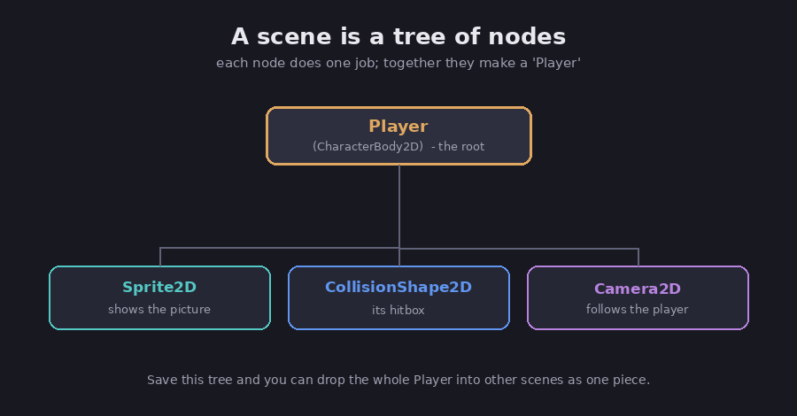

# Nodes and scenes

If you learn only one thing about Godot, learn this. Almost everything in the engine is
built from two ideas, nodes and scenes, and once they click, the rest of Godot makes
sense. This chapter is the foundation the whole course stands on.

## Nodes: the building blocks

FACT: a node is the basic building block of a Godot game, and each kind of node does one
specific job. (Godot docs, *Nodes and scenes*.) A `Sprite2D` shows a picture. A `Label`
draws text. A `Camera2D` acts as the camera. A `CollisionShape2D` is a hitbox, the shape
the game uses to tell when two things touch. A `CharacterBody2D` is a body you move around
as a player or enemy.

Every node has a name you choose, a set of settings you can adjust, and the ability to sit
inside another node as its "child." Assessment: the useful way to think about a node is as
one small, single-purpose part. You do not look for a single "player" node, because there
is no such thing; you build a player out of several simple nodes working together.

## Scenes: nodes arranged in a tree

FACT: when you arrange nodes together, you get a scene, which is a tree of nodes. A scene
always has one node at the top, called the root, with the others hanging beneath it as
children and grandchildren. (Godot docs, *Nodes and scenes*.)

*A "Player" built as a small tree of single-purpose nodes. Diagram.*

So a "player" in Godot is really a little tree: a `CharacterBody2D` at the root to handle
movement, with a `Sprite2D` child for the picture, a `CollisionShape2D` child for the
hitbox, and maybe a `Camera2D` child that follows along. Each node does its one job, and
together they make something that behaves like a player.

FACT: a scene gets saved to disk as a file ending in `.tscn`, and you can load it back
whenever you need it. (Godot docs, *Nodes and scenes*.)

## Scenes are reusable, and they nest

Here is where the idea pays off. FACT: once you save a scene, it becomes a reusable piece
you can drop into other scenes, where it shows up as a single node with its inner parts
tucked away. (Godot docs, *Nodes and scenes*.) Putting a saved scene inside another scene
is called "instancing" it.

Assessment: this is the engine's whole approach to building big things out of small ones.
You build a Player scene once, then drop it into your Level scene. You build one Coin
scene, then drop a hundred copies into the level. If you later improve the Coin scene,
every copy updates. It is the same "build a part once, reuse it everywhere" habit that good
building always relies on.

## The scene tree: your whole game

FACT: when your game runs, all of its scenes come together into one big tree, which Godot
calls the scene tree. (Godot docs, *Overview of Godot's key concepts*.) Godot walks this
tree from the top down to run your game, and any node can find the tree it belongs to. You
do not have to manage this by hand at first; the point to take away is that a running Godot
game is one tree of nodes, grouped into scenes.

## One naming habit to save you headaches

FACT: in Godot 4, the names of 2D nodes end in `2D` and the names of 3D nodes end in `3D`,
for example `Sprite2D` and `Node3D`. This was tidied up in the 2023 rewrite, so the old
Godot 3 names (like `Sprite`, `Spatial`, or `KinematicBody`) no longer exist under those
spellings. (Godot docs, *Upgrading from Godot 3 to Godot 4*.) Assessment: this is the
single most common thing that trips up beginners following an older tutorial, the node it
names simply is not there anymore. If a name does not turn up, check whether it needs a
`2D` or `3D` on the end.

## The takeaway

Assessment: nodes are single-purpose parts, scenes are trees of nodes you save and reuse,
and your running game is one big tree of those scenes. Hold onto that and every later
chapter, the editor, scripting, signals, will slot neatly onto it. The
[next chapter](02-the-editor) shows you where all of this lives on screen.

## Sources

- Godot docs, *Nodes and scenes* — https://docs.godotengine.org/en/stable/getting_started/step_by_step/nodes_and_scenes.html
- Godot docs, *Overview of Godot's key concepts* — https://docs.godotengine.org/en/stable/getting_started/introduction/key_concepts_overview.html
- Godot docs, *Using the SceneTree* — https://docs.godotengine.org/en/stable/getting_started/step_by_step/scene_tree.html
- Godot docs, *Upgrading from Godot 3 to Godot 4* — https://docs.godotengine.org/en/stable/tutorials/migrating/upgrading_to_godot_4.html
