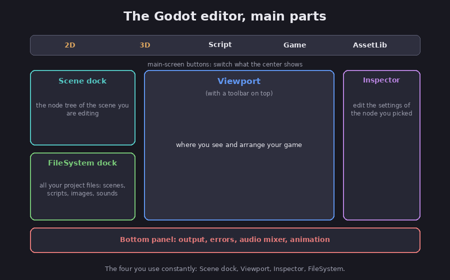

# The editor and your first project

Now that you know Godot is built from [nodes and scenes](01-nodes-and-scenes), this chapter
shows you where they live on screen. The Godot editor is the single program you use to build
everything, and although it looks busy at first, you really only need a handful of its parts
to get going, and the rest can wait until you have a reason to touch it.

## The parts of the screen

FACT: these are the main areas of the editor, using the names the documentation uses.
(Godot docs, *First look at Godot's editor*.)

*The Godot editor, with the parts a beginner uses most. Diagram.*

- **The Viewport** is the big area in the middle where you see and arrange your game, with a
  small toolbar sitting on top of it that holds tools to move and resize things.
- **The Scene dock** (upper left) shows the node tree of the scene you are editing, the very
  same kind of tree from the last chapter, and it is where you add and rearrange nodes.
- **The FileSystem dock** (lower left) lists all of your project's files in one place,
  including its scenes, scripts, images, and sounds.
- **The Inspector** (on the right) is where you edit the settings of whatever node you have
  selected, things like its position on screen, its picture, or its speed.
- **The Bottom panel** holds output messages, errors, the sound mixer, and more, though at
  first you will mostly glance at it to read the errors when something goes wrong.

FACT: across the very top are the main-screen buttons, labeled 2D, 3D, Script, Game, and
Asset Library, which switch what the center of the editor shows. (Godot docs.) Assessment:
the four parts you will touch constantly are the Scene dock, the Viewport, the Inspector,
and the FileSystem dock. The rest you can ignore until you need it.

## Building a scene, in plain steps

Assessment: putting a scene together follows the same rhythm every time. Drawing on the
node-and-scene ideas from the last chapter, here is the loop.

1. **Start a scene** by adding a root node in the Scene dock, since the root is the top node
   that everything else in the scene hangs from.
2. **Add child nodes** for each job you need, such as a `Sprite2D` to show a picture or a
   `Label` for text, placing each one underneath the root.
3. **Set each node up** in the Inspector, where, for a `Sprite2D` for example, you would drag
   an image file from the FileSystem dock into its picture slot.
4. **Save the scene,** which (as the docs note) writes a `.tscn` file that you can reopen and
   reuse later. [FACT, Godot docs, *Nodes and scenes*.]
5. **Run it** with the play button to see it in action, and then go back and adjust, because
   most game building is really this short loop repeated many times over.

## A first taste

Assessment: a good five-minute first exercise, with the editor open, is to make a new
project, add a `Sprite2D`, drag the friendly Godot robot icon that ships with every project
onto it, and press play. Seeing your own image appear in a running window is a small but
real milestone, and it proves the whole loop works before you write a single line of code.

That code is the next step. The [GDScript chapter](03-gdscript) shows how a script attaches
to one of these nodes and makes it actually do something.

## Sources

- Godot docs, *First look at Godot's editor* — https://docs.godotengine.org/en/stable/getting_started/introduction/first_look_at_the_editor.html
- Godot docs, *Nodes and scenes* — https://docs.godotengine.org/en/stable/getting_started/step_by_step/nodes_and_scenes.html
