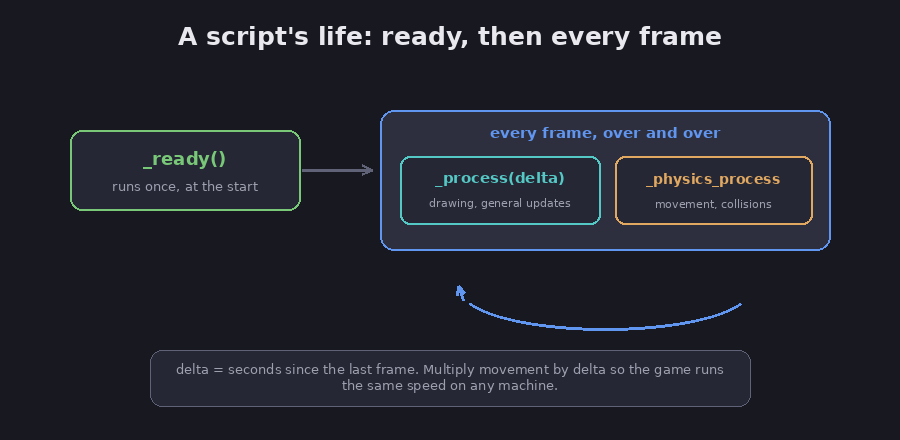
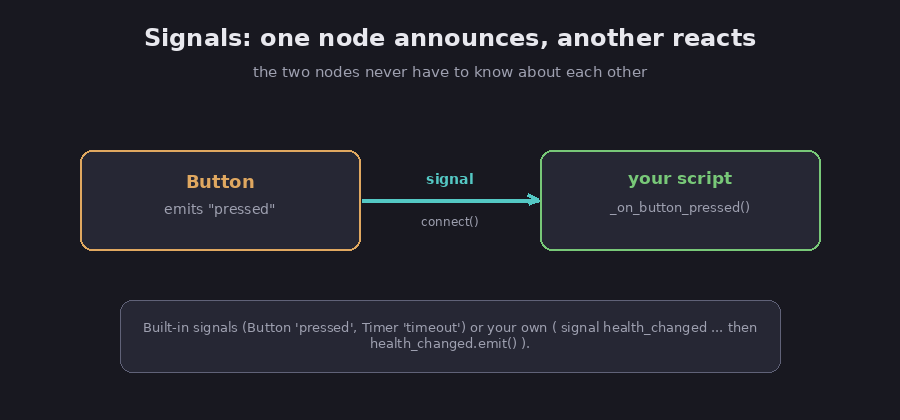

# Making it interactive

A game has to respond: move when a key is pressed, react when two things collide, update
the score when a coin is grabbed. This chapter covers the three pieces that make that
happen, the game loop, player input, and signals. It builds straight on the
[GDScript chapter](03-gdscript).

## The game loop: code that runs every frame

A game redraws the screen many times a second, and each redraw is called a frame. Godot
gives your script a few special functions that it calls automatically at the right moments.

FACT: `_ready()` runs once, right after the node and its children are set up, which makes it
the place for first-time setup. `_process(delta)` runs every single frame, as fast as the
machine can manage, and is where you put general per-frame updates. `_physics_process(delta)`
runs on a steady, fixed schedule (60 times a second by default), and is the right place for
anything involving movement and collisions. (Godot docs, *Idle and Physics Processing*.)


*A script runs _ready() once, then loops every frame. Diagram.*

That `delta` matters more than it looks. FACT: `delta` is the number of seconds since the
last frame, and the standard rule is to multiply any movement by `delta`. (Godot docs.)
Assessment: the reason is fairness across machines. A fast computer draws more frames per
second than a slow one, so without `delta` your character would zoom on a fast machine and
crawl on a slow one. Multiplying by `delta` cancels that out, and everyone gets the same
real-world speed.

## Reading the player's input

FACT: Godot has a built-in helper called `Input` that you can ask about the keyboard,
mouse, or controller at any time. Instead of checking specific keys, you define named
actions in the project's Input Map, like `move_left` or `jump`, and then ask about the
action. This lets you change the keys later without touching your code. (Godot docs,
*Input examples*.) FACT: every project also ships with a set of ready-made actions whose
names start with `ui_`, such as `ui_accept`, used for menus. (Godot docs.)

```gdscript
extends CharacterBody2D

@export var speed = 300

func _physics_process(delta):
    var direction = Input.get_vector("move_left", "move_right", "move_up", "move_down")
    position += direction * speed * delta
```

FACT: `Input.get_vector(...)` turns four movement actions into a single direction, which is
the clean way to handle arrow keys, WASD, or a joystick at once; `Input.is_action_pressed("jump")`
returns true while a key is held. (Godot docs, *Input class*.) Assessment: read that script
top to bottom and it says, "every physics step, find which way the player is pointing, and
move that way at `speed`, scaled by `delta`." That is a complete, working movement script.

## Signals: how parts of your game talk

The last piece is how one node tells another that something happened, without the two being
wired tightly together.

FACT: a signal is a message a node sends out when a specific event occurs, and other nodes
can connect to that signal so one of their functions runs when it fires. It lets nodes react
to each other without each one needing a direct reference to the other. (Godot docs, *Using
signals*.) Built-in examples are a `Button` that emits a `pressed` signal when clicked, and a
`Timer` that emits `timeout` when its time runs out.


*One node announces with a signal; another reacts. Diagram.*

FACT: you can connect a signal by clicking, using the Node dock's Signals tab in the editor,
or in code with `.connect()`. (Godot docs.)

```gdscript
func _ready():
    $Button.pressed.connect(_on_button_pressed)

func _on_button_pressed():
    print("the button was clicked")
```

FACT: you can also make your own signals with the `signal` keyword and send them with
`.emit()`, which is how a deep part of your game can announce news, like a health change,
that other parts care about. (Godot docs.)

```gdscript
signal health_changed(new_value)

func take_damage(amount):
    health -= amount
    health_changed.emit(health)   # tell whoever is listening
```

Assessment: signals are worth getting comfortable with early, because they keep a game tidy.
Your health bar can listen for `health_changed` and update itself, without the player code
needing to know the health bar exists.

FACT: a Godot 3-versus-4 warning, since this trips up everyone following old tutorials. The
modern syntax is `some_node.some_signal.connect(my_function)` and `my_signal.emit(value)`.
Godot 3 used an older string-based form, `connect("pressed", self, "...")` and
`emit_signal("...")`, which will not work in Godot 4. (Godot docs.)

## The takeaway

Assessment: the loop runs your code (`_ready` once, `_process` and `_physics_process` every
frame), `Input` tells you what the player is doing, and signals let the parts of your game
talk. With [nodes and scenes](01-nodes-and-scenes), [the editor](02-the-editor), and
[scripts](03-gdscript), that is everything you need to build a small game, which is exactly
what the [next chapter](05-first-game) does.

## Sources

- Godot docs, *Idle and Physics Processing* — https://docs.godotengine.org/en/stable/tutorials/scripting/idle_and_physics_processing.html
- Godot docs, *Input examples* — https://docs.godotengine.org/en/stable/tutorials/inputs/input_examples.html
- Godot docs, *Input class reference* — https://docs.godotengine.org/en/stable/classes/class_input.html
- Godot docs, *Using signals* — https://docs.godotengine.org/en/stable/getting_started/step_by_step/signals.html
