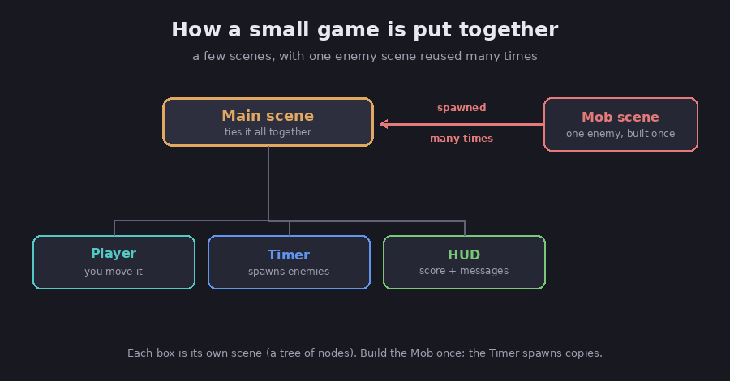

# Building a small game

Time to see the pieces work together. The best first game to build is the one in Godot's
own free tutorial, a little arcade game called "Dodge the Creeps," where you move a
character around and try to avoid a growing crowd of enemies. This chapter is not a
keystroke-by-keystroke guide (the official tutorial does that well). Instead, it shows how
everything from the last four chapters fits into one real game, so the steps make sense
while you follow along.

FACT: "Dodge the Creeps" is the project built in Godot's official "Your first 2D game"
tutorial, which walks through setting up the project, the player, the enemies, the main
scene, and a heads-up display for the score. (Godot docs, *Your first 2D game*.)

## How the game is put together

The whole game is just a few scenes, each one a tree of nodes, exactly the model from
[chapter 1](01-nodes-and-scenes).

*A small game is a few scenes, with one enemy scene reused many times. Diagram.*

- **The Player scene** is a `CharacterBody2D` with a child that shows its animation and a
  child `CollisionShape2D` for its hitbox. Its script reads the player's input and moves it,
  the movement script from [chapter 4](04-interactivity).
- **The Mob scene** (the enemy) is built once, then spawned over and over during play. This
  is the reuse idea from chapter 1: you design one enemy and instance many copies of it.
- **The Main scene** ties it together. It holds the Player, a `Timer` that fires on a
  schedule to spawn new enemies, and the HUD.
- **The HUD** (short for heads-up display) is the on-screen score and messages, built from
  UI nodes.

## How the concepts show up

Assessment: every idea in this course earns its place here.

- **Scenes as building blocks.** The game is assembled from separate Player, Mob, Main, and
  HUD scenes, each saved and reused, rather than one giant pile of nodes.
- **Instancing.** One Mob scene becomes the dozens of enemies on screen. Improve the Mob
  scene once and every enemy improves.
- **The game loop and input.** The Player moves inside `_physics_process`, reading `Input`
  and scaling by `delta`, so it runs at the same speed on any machine.
- **Signals everywhere.** The `Timer` emits a `timeout` signal to spawn each new enemy. The
  Player emits its own signal when an enemy touches it, which ends the game. The HUD listens
  for score changes and updates itself. None of these parts has to reach directly into the
  others; they just announce and react.

## The build loop

Assessment: notice the rhythm, because it is how all Godot work goes, the same loop from
[chapter 2](02-the-editor). You design a scene, add its nodes, attach a script, wire up the
signals, press play to test, and then adjust. You do that for the Player, then the Mob, then
the Main scene, then the HUD, and at the end you have a working game. Nothing here is a new
idea; it is the four earlier chapters, applied in order.

## Now go build it

Assessment: read this chapter as the map, then build the real thing with the editor open
and the official "Your first 2D game" tutorial beside you. Following along and seeing your
own character dodge enemies on screen will teach you more in an hour than any amount of
reading. When you finish, the [last chapter](06-going-further) points you toward 3D,
physics, sound, and how to share your game with other people.

## Sources

- Godot docs, *Your first 2D game* (Dodge the Creeps) — https://docs.godotengine.org/en/stable/getting_started/first_2d_game/index.html
