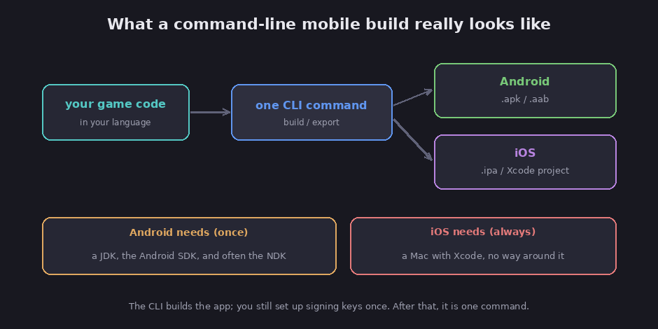
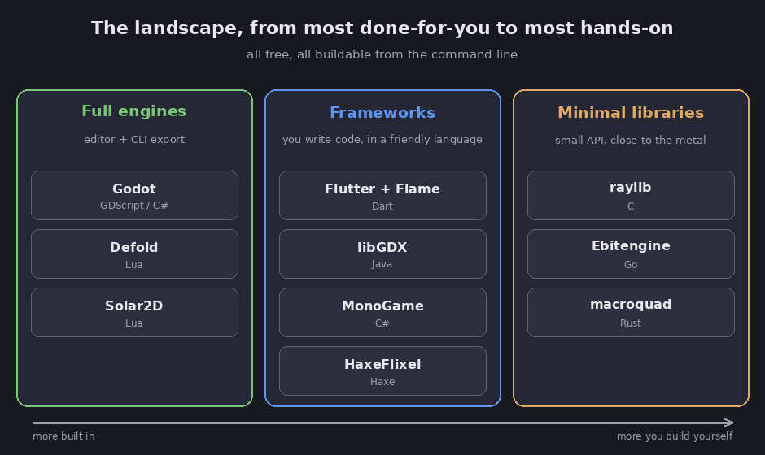

# Mobile game engines you can drive from the command line

This section surveys the free game engines and frameworks a hobbyist or solo developer can
use to build phone games (Android and iOS) from the command line, without living inside a
heavy graphical program. It is a map of the options, with the current facts on each,
verified against their official sources. Claims are labeled FACT (checked against a primary
source), Assessment (my judgment), or Speculation.

Everything here is free and open source, and everything can be built with a terminal
command. Where a tool's mobile support is shaky or a project looks thin, I say so plainly.

## Why a command-line workflow, and why it suits hobbyists

Assessment: building from the command line is worth caring about for a few practical
reasons. A terminal command is repeatable and scriptable, so you can automate builds, run
them on a server or in a continuous-integration service, and get the exact same result every
time. It is lightweight, since you are not required to open a multi-gigabyte editor just to
produce a build. And these tools are free and open source, so there are no royalties, no
seat fees, and no risk of a company pulling the rug out from under a finished game. For a
solo developer on a budget, that combination is the whole appeal.

## The honest reality check

Before the tour, two things are true no matter which tool you pick, and it is kinder to say
them up front.

*A command-line mobile build, and its two unavoidable prerequisites. Diagram.*

FACT: to build for **Android** you need a Java Development Kit (JDK) and the Android SDK
installed, and many tools also need the Android NDK (the kit for building native code). To
build for **iOS** you need a Mac running Xcode, with no way around it; every tool in this
survey that exports to iOS produces an Xcode project or requires Xcode to finish the build.
(Confirmed across the official docs of Godot, LÖVE, Defold, Flutter, and the rest.)

Assessment: so "command-line mobile development" is real and genuinely convenient, but it
sits on top of the platforms' own toolchains. You set those up once, plus a signing key so
the phone will trust your app, and after that a build really is one command. The tools below
mostly differ in how much they hide that setup for you.

## The landscape

Assessment: the options sort into three groups, from the ones that do the most for you to
the ones that hand you the most control.

*The three tiers, from most done-for-you to most hands-on. Diagram.*

- **[Full engines](01-full-engines)** come with a visual editor but also build from the CLI:
  Godot, Defold, Solar2D.
- **[Frameworks](02-frameworks)** hand you a friendly language and a game library, and you
  write code: Flutter with Flame, libGDX, MonoGame, HaxeFlixel.
- **[Minimal libraries](03-minimal-libraries)** give you a small, fast API and little else:
  raylib, Ebitengine, macroquad.

## The whole field at a glance

FACT: current facts for each, as of mid-2026. "Android" and "iOS" mark whether mobile export
is officially supported. (Sources are listed in each chapter.)

| Tool | Language | 2D/3D | Android | iOS | License | Latest |
|---|---|---|---|---|---|---|
| Godot | GDScript / C# | 2D + 3D | yes | yes | MIT | 4.7 (2026) |
| Defold | Lua | 2D (+3D) | yes | yes | Defold (free, no royalties) | 1.13 (2026) |
| Solar2D | Lua | 2D | yes | yes | MIT | 2026.3730 |
| Flutter + Flame | Dart | 2D | yes | yes | MIT / BSD | Flame 1.37 (2026) |
| libGDX | Java | 2D + 3D | yes | yes | Apache 2.0 | 1.14 (2026) |
| MonoGame | C# | 2D + 3D | yes | yes | Ms-PL | 3.8.4 (2025) |
| HaxeFlixel | Haxe | 2D | yes | yes | MIT | 6.1 (2026) |
| raylib | C | 2D + 3D | yes | community only | zlib | 6.0 (2026) |
| Ebitengine | Go | 2D | yes | yes | Apache 2.0 | 2.9 (2026) |
| macroquad | Rust | 2D | yes | manual | MIT / Apache | 0.4.15 (2026) |

## How to choose

Assessment: a few plain rules cover most people.

- **Want the most complete, most popular option, and both 2D and 3D?** Pick Godot. It has
  the biggest community and a real CLI export, and there is a whole
  [Godot course](../godot) here already.
- **Want free with no royalties, a clean single-command build, and a gentle 2D focus?** Look
  at Defold.
- **Want mobile-first with a modern toolchain and fast reloading?** Flutter with Flame is the
  strongest fit, since it is the only one here built for phones from the start.
- **Already comfortable in a language?** Use the tool that speaks it: Java to libGDX, C# to
  MonoGame, Go to Ebitengine, C to raylib, Rust to macroquad, Haxe to HaxeFlixel.
- **Want the smallest, simplest possible thing?** raylib (in C) or Ebitengine (in Go) have
  tiny, friendly APIs.

Two cautions to carry in. Assessment: Solar2D is genuinely maintained and pleasant, but it
is a small, community-run project, so it carries more single-maintainer risk than Godot or
Defold. And for the C and Rust libraries, iOS support is community-made or manual, so if you
care about iPhone, favor a tool with official iOS export.

## The chapters

1. **[Full engines](01-full-engines)** — Godot, Defold, Solar2D.
2. **[Frameworks](02-frameworks)** — Flutter + Flame, libGDX, MonoGame, HaxeFlixel.
3. **[Minimal libraries](03-minimal-libraries)** — raylib, Ebitengine, macroquad, plus a note
   on Bevy.
