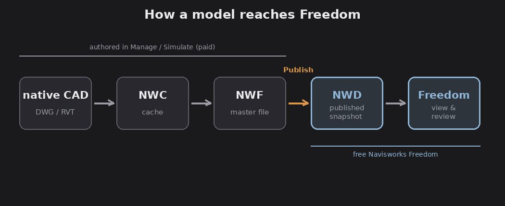

# Chapter 1 — Install and open a model

## Getting Freedom

FACT: Navisworks Freedom is completely free, no purchase or subscription. You do
need to sign in with an Autodesk account to download it (a free account is fine).
Download it from Autodesk's 3D viewers page
(autodesk.com/products/navisworks/3d-viewers), then run the installer (it needs
administrator rights to install).

FACT: System requirements for the Navisworks 2026 family are modest: 64-bit
Windows 11 or Windows 10, a multi-core CPU, a DirectX/OpenGL-capable graphics
card, and roughly 15 GB of disk for installation. 2 GB of RAM is the stated
minimum, but 16 GB or more is recommended for real project models. (Verify the
exact recommended figures on Autodesk's current 2026 system-requirements page;
they shift slightly year to year.)

## What Freedom can open, and what it can't

FACT: Freedom opens **published** files only:

- `.nwd` — a Navisworks Document, the main format you'll use.
- `.dwf` / `.dwfx` — Autodesk's Design Web Format (3D).
- `.rcs` / `.rcp` — Autodesk ReCap point-cloud files.

FACT: Freedom **cannot** open the Navisworks working formats or native CAD:

- `.nwc` (Navisworks cache) — must be converted to NWD in Simulate/Manage first.
- `.nwf` (Navisworks file set) — needs a full Navisworks product plus the original
  referenced files.
- native CAD like `.dwg` or `.rvt` — opening one gives a "no plug-in exists to
  open this" error.

If someone hands you a file Freedom won't open, the answer is almost always "ask
them to publish it as an NWD."

## The three Navisworks file types (worth understanding)

FACT, because it explains why Freedom behaves as it does:

- **NWC (cache):** a cached copy of one source CAD/BIM file's geometry and data.
  The bridge that gets native CAD into Navisworks.
- **NWF (file set):** the master coordination file. It holds **no geometry of its
  own**, only pointers to the NWC/CAD files plus coordination data (clash tests,
  viewpoints). This is where authors work.
- **NWD (document):** a **published, self-contained snapshot**. It bakes all the
  geometry plus all the review data into one file: object properties, saved
  viewpoints, redlines and comments, clash results, 4D `TimeLiner` data, object
  animations, and materials/lighting.

*Authors build and Publish an NWD in Manage/Simulate; free Freedom opens it. Diagram.*

Assessment: the NWD is the whole reason Freedom exists. An author in Manage or
Simulate opens the NWF, then **Publishes** an NWD, a frozen, shareable snapshot,
and hands it to reviewers who open it in free Freedom. NWD is also robust to share
because, unlike an NWF, it has no external links to break.

## Opening a model

FACT: Launch Freedom, then open an NWD via the application menu (Open) or by
double-clicking the file. The model loads into the **Scene View**, and the saved
viewpoints, properties, and any embedded review data come with it. A published NWD
can carry a password or an expiry date set by the author; if so, Freedom will
prompt or refuse accordingly.

Next: [The interface](02-interface.md).
