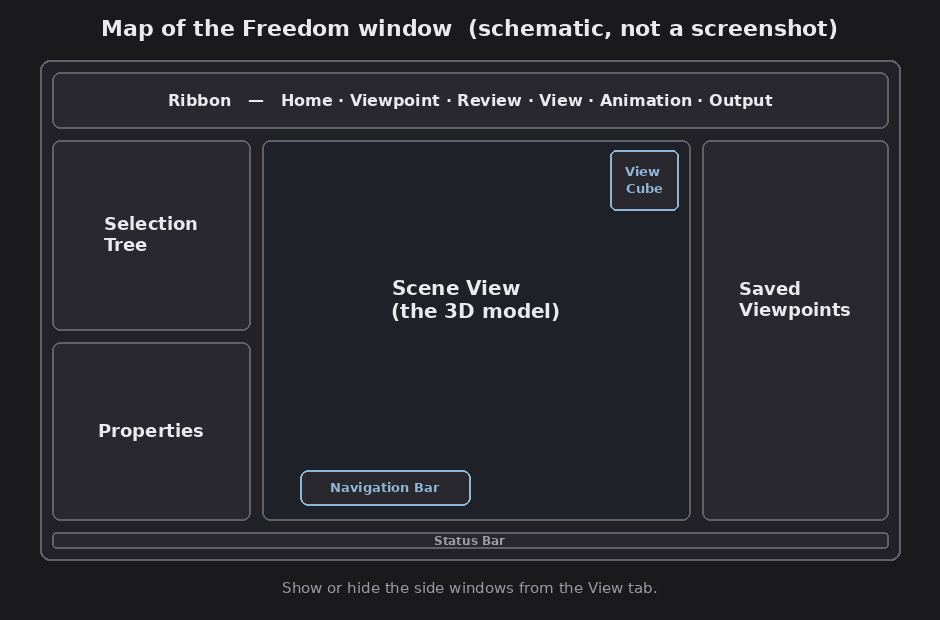

# Chapter 2 — The interface

Freedom uses the standard Autodesk ribbon interface. This chapter names the parts
so the rest of the course can refer to them.

*A layout map of the Freedom window (schematic, not a screenshot).*

## The main areas

FACT:

- **Application menu** (the big button, top-left): open files, print, export an
  image, and reach `Options`.
- **Quick Access Toolbar:** a small row of common commands next to the
  application menu.
- **Ribbon:** the tabbed command area across the top, organized into tabs and
  panels. Some tabs are contextual (a `Sectioning Tools` tab appears only when you
  turn sectioning on).
- **Scene View:** the large 3D area where you view and move through the model.
- **Status Bar:** along the bottom, with performance/position readouts.
- **Dockable windows:** panels you can show, hide, float, or dock (Selection Tree,
  Properties, Saved Viewpoints, Comments, Measure Tools, TimeLiner).

## The ribbon tabs (Freedom)

FACT (panel groupings; a couple of exact panel names are worth confirming on your
own install):

- **Home** — `Project`, `Select & Search`, `Visibility`, `Display`, `Tools`.
- **Viewpoint** — `Camera`, `Navigate`, `Render Style`, `Sectioning`, and
  save/load/playback of viewpoints.
- **Review** — `Measure` and `Comments` (comments are view-only in Freedom).
- **View** — navigation aids, scene-view options, and which windows are shown.
- **Animation** — playback of animations saved in the file.
- **Output** — `Print` and image export (the `Visuals` panel).
- **Sectioning Tools** — appears only while sectioning is enabled.

Assessment: you'll live mostly on **Viewpoint** (navigation, camera, render style,
sectioning) and **Review** (measure), with the dockable windows open on the side.

## The on-screen navigation aids

FACT, three controls sit in or beside the Scene View:

- **ViewCube** (top-right corner of the scene): shows the current orientation and
  lets you click faces, edges, or corners to snap to standard views (top, front,
  isometric, and so on).
- **Navigation Bar:** a small toolbar with the navigation tools, ViewCube,
  SteeringWheels, Pan, Zoom, Orbit, Look, and Walk/Fly.
- **SteeringWheels:** a cursor-tracking wheel that bundles several navigation tools
  into one (press-drag a wedge to use it, release to return).

These are the subject of the next chapter.

## The key dockable windows

FACT:

- **Selection Tree:** the model hierarchy (files, layers/categories, instances).
- **Properties:** the data attached to the currently selected object.
- **Saved Viewpoints:** the views the author saved in the file.
- **Comments / Measure Tools / TimeLiner:** review, measurement readouts, and 4D
  playback, covered in their own chapters.

Show or hide windows from the **View** tab. You can also reach `Options`
(application menu > Options) to change the interface theme and which windows
appear.

Next: [Navigating the model](03-navigation.md).
