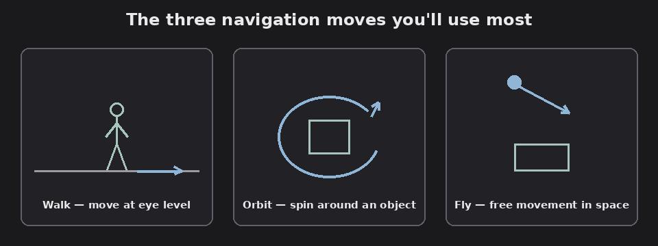

# Chapter 3 — Navigating the model

Moving around the model is the heart of using Freedom. It gives you the full
Navisworks navigation toolset.

*The three core navigation moves. Diagram.*

## The navigation tools

FACT, from the Navigation Bar (or the keyboard shortcuts in
[chapter 8](08-output-tips-shortcuts.md)):

- **Walk** — move through the model at eye level, as if walking. A center circle
  appears and you drag in the direction you want to go; speed scales with how far
  you drag.
- **Fly** — free, flight-simulator-style movement anywhere in space (no ground
  constraint).
- **Look Around** — swivel the camera in place (turn your head without moving).
- **Pan** — slide the view parallel to the screen.
- **Zoom** / **Zoom Window** — magnify; Zoom Window zooms to a box you draw.
- **Orbit** / **Free Orbit (Examine)** — rotate the model around a pivot. Plain
  Orbit keeps the model upright; Free Orbit/Examine rotates freely.
- **Turntable** — rotate the model about a vertical axis like a turntable.

Assessment: Walk and Orbit cover 90% of review work, Walk to move through a space,
Orbit to spin a component and look at it from all sides. Reach for Fly only when
Walk's ground behavior gets in your way.

## ViewCube and SteeringWheels

FACT:

- **ViewCube:** click a face for a straight-on standard view, a corner for an
  isometric, and drag it to tumble the model. The home icon resets to the default
  view.
- **SteeringWheels:** the Full Navigation Wheel has eight wedges, Zoom, Rewind,
  Pan, Orbit, Center, Walk, Look, and Up/Down, so you can switch tools without
  leaving the wheel. **Rewind** is especially handy: it scrubs back through your
  recent views when you've navigated somewhere you didn't mean to.

## Realism: walking like a person

FACT: On the **Viewpoint** tab, the `Realism` options make Walk/Fly behave
physically:

- **Collision** (`Ctrl+D`) — you can't pass through walls or objects.
- **Gravity** (`Ctrl+G`) — you stay on the floor (use with Collision).
- **Auto Crouch** — you duck under low obstacles automatically.
- **Third Person** (`Ctrl+T`) — show a human avatar so you can see scale and how a
  person fits the space.

Assessment: turn on Collision + Gravity (and optionally Third Person) for a
realistic walkthrough, this is how you sanity-check headroom, door widths, and
clearances. All four are off by default.

## Camera and speed

FACT:

- **Perspective vs Orthographic** (Viewpoint > Camera): perspective gives natural
  depth; orthographic keeps parallel lines parallel (good for lining up elevations).
  Orthographic isn't available while using Walk or Fly.
- **Field of view (FOV):** a slider widens or narrows the lens.
- **Speed:** the `<` and `>` keys change navigation speed; hold `+` for a temporary
  boost. You can also set default linear/angular speed in `Options`.

## How the model is drawn (render style)

FACT: On the **Viewpoint** tab, the `Render Style` panel sets:

- **Render modes:** `Full Render` (materials + lighting), `Shaded`, `Wireframe`,
  `Hidden Line`.
- **Lighting modes:** `Full Lights`, `Scene Lights`, `Head Light`, `No Lights`.

Assessment: Full Render is the prettiest but heaviest; if navigation gets choppy on
a big model, drop to Shaded to keep things smooth.

Next: [Selecting objects and reading properties](04-selection-and-properties.md).
