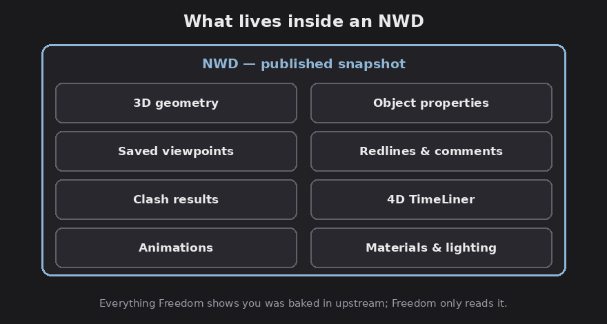
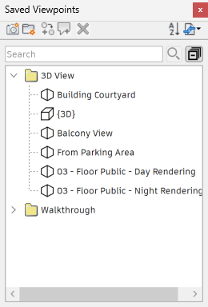

# Chapter 5 — Saved viewpoints and review data

An NWD usually arrives full of review data the author packed in: saved views,
markups, comments, and clash results. This is what makes Freedom useful for
coordination, you're reviewing someone's findings, not starting from scratch.

*What an NWD carries, and therefore what Freedom can show you. Diagram.*

## Saved viewpoints

*The Saved Viewpoints window. Screenshot: Autodesk.*

FACT: The **Saved Viewpoints** window lists the views the author saved. Click one
to jump the camera straight there, no need to navigate manually. Icons distinguish
folders, orthographic viewpoints, perspective viewpoints, animation clips, and
section cuts.

FACT, the read-only line: you can recall and reorder viewpoints in the window, but
**you cannot create, edit, or save viewpoints in Freedom**, the docs are explicit
that you "cannot save any changes." Recalling a viewpoint also restores whatever
state it stored (camera, plus any hide/override and section it was saved with).

Assessment: saved viewpoints are the author's guided tour, issues, key areas,
review angles. Working through them top to bottom is usually the fastest way to
understand what a model is trying to show you.

## Redlines, comments, and tags

FACT: Freedom **views** the redline markups, comments, and tags embedded in the
file (comments appear in the `Comments` window, markups draw over their viewpoints).
You **cannot add or edit** any of them in Freedom.

## Clash results

FACT: Clash detection itself is a Manage feature; Freedom cannot run it. But when
an author runs clashes in Manage and publishes the NWD, the **results travel with
the file** and Freedom can review them:

- They usually appear as **saved viewpoints**, often grouped in folders by clash
  test. Clicking one jumps the camera to the exact clash location with the clash
  highlighted, restoring the view the author saw.
- The clash's details (the report data) ride along as the viewpoint's **comment**,
  readable in the Comments window.

Assessment: this is the everyday coordination workflow for a reviewer with free
Freedom, the BIM coordinator runs clashes in Manage and publishes an NWD; you open
it, click through the clash viewpoints, read the comment on each, and see precisely
what's hitting what. You just can't re-run or re-group the clashes yourself.

Next: [Sectioning and measuring](06-sectioning-and-measuring.md).
