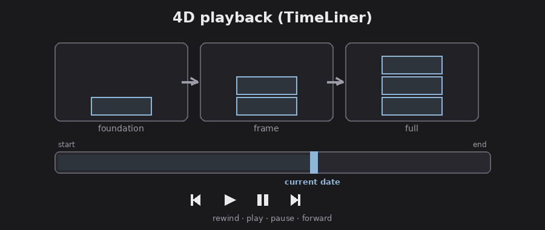

# Chapter 7 — Playing back 4D simulations and animations

One of Freedom's best tricks: if an author built a 4D construction sequence or
object animations and published them into the NWD, Freedom can **play them back**.
You can't build them in Freedom, but you can watch the building assemble itself.

## 4D construction sequences (TimeLiner)

*4D playback: the model builds along a schedule, with VCR-style controls. Diagram.*

FACT: `TimeLiner` is Navisworks' 4D tool, it links model objects to a schedule of
tasks (with dates) so the model "builds" over time. Authoring it needs
Simulate/Manage, but Freedom plays back a sequence saved in the NWD.

FACT: Open the TimeLiner window (`Ctrl+F3`) and use the **Simulate** tab. Playback
is VCR-style:

- **Rewind** (to the start), **Step Back**, **Reverse Play**, **Play**, **Step
  Forward**, **Forward** (to the end), and **Pause**.
- A timeline/slider shows the current date as the sequence runs; pause any time to
  stop and look around the model at that point in the schedule, then play on.

Assessment: this is a powerful way to communicate a construction plan to anyone,
hand a stakeholder the free Freedom viewer and an NWD, and they can scrub the
schedule from groundbreaking to topping-out and see what's built when. The
`Settings` (Simulation Settings) define how the sequence simulates; in Freedom
treat that as read-only context, you're viewing the author's setup, not changing it.

## Object and viewpoint animations

FACT: Animations authored in the NWD play back in Freedom too:

- **Object animations** (made with the author's `Animator`): doors swinging,
  equipment moving, a crane rotating.
- **Viewpoint animations**: a saved camera fly-through, a sequence of viewpoints
  played as keyframes (these also show in the Saved Viewpoints window as animation
  clips).

FACT: Authoring tools (the `Animator` and `Scripter`) are not available in Freedom;
playback is. A 4D simulation can also drive an associated camera animation, so the
view moves along with the construction sequence, and Freedom plays the whole thing.

Assessment: between TimeLiner playback and animations, Freedom is a surprisingly
strong **presentation** tool, free, runs on any Windows machine, and plays the
author's full 4D story without anyone needing a paid seat.

Next: [Output, performance, and shortcuts](08-output-tips-shortcuts.md).
