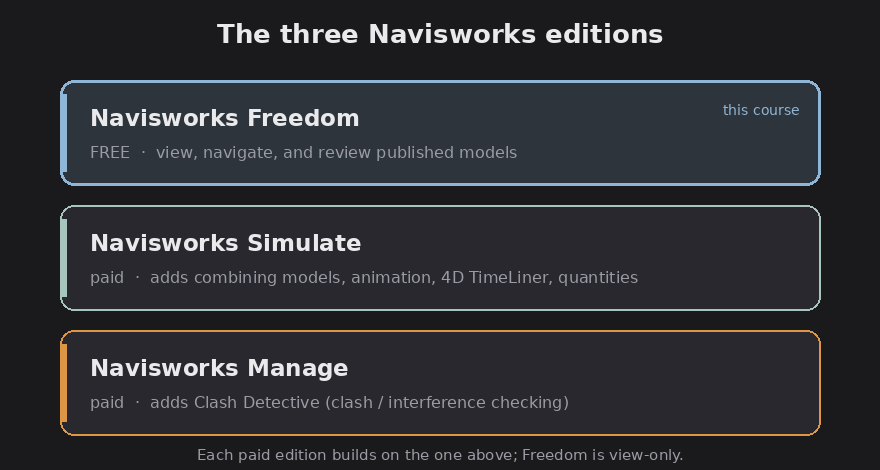

# Navisworks Freedom 2026: a complete course

This is a practical course for Autodesk Navisworks Freedom 2026, the **free,
read-only viewer** in the Navisworks family. It takes you from installing and
opening a model through navigating, reading object data, using saved viewpoints
and clash results, sectioning and measuring, and playing back 4D construction
simulations.

## What Freedom is (and is not), in one paragraph

FACT: Navisworks Freedom is a free desktop viewer for **published** Navisworks
models. It opens `.nwd` and 3D `.dwf` / `.dwfx` files (plus ReCap `.rcs` / `.rcp`
point clouds), lets you walk through the model, read object properties, recall
saved viewpoints, view redlines, comments and clash results, and play back
animations and 4D schedules that were baked into the file. It is strictly
**read-only**: anything you do in a session (measurements, section cuts, hide,
markups) is temporary and cannot be saved.

## Freedom vs Simulate vs Manage

FACT: There are three Navisworks editions. The clean mental model is
**Manage and Simulate author and publish; Freedom consumes.**

- **Navisworks Freedom** (free): view, navigate, review published files. No
  authoring, no saving.
- **Navisworks Simulate** (paid): adds combining models, object animation, 4D
  `TimeLiner` simulation, and `Quantification`. No clash detection.
- **Navisworks Manage** (paid): everything in Simulate plus `Clash Detective`
  (clash/interference checking) and coordination tools.

*The three editions: Freedom (free) views; Simulate and Manage add authoring. Diagram.*

So in Freedom you can *see* clash results and 4D sequences, but you cannot create
them. If you need to run clashes or build schedules, you need Manage or Simulate,
tell me and I'll write that course instead.

## How this course is labeled

Per the vault's rule, every claim is FACT, Assessment, or Speculation:

- **FACT** = how Freedom 2026 actually behaves, drawn from Autodesk's official
  Navisworks Freedom 2026 help and product documentation.
- **Assessment** = workflow advice and judgment, useful, but my opinion.
- A few details Autodesk's docs left ambiguous (some exact panel names, certain
  measure options) are flagged **(verify on a live install)**.

## The chapters

1. [Install and open a model](01-install-and-open.md)
2. [The interface](02-interface.md)
3. [Navigating the model](03-navigation.md)
4. [Selecting objects and reading properties](04-selection-and-properties.md)
5. [Saved viewpoints and review data](05-viewpoints-and-review.md)
6. [Sectioning and measuring](06-sectioning-and-measuring.md)
7. [Playing back 4D simulations and animations](07-simulation-playback.md)
8. [Output, performance, and shortcuts](08-output-tips-shortcuts.md)
9. [Glossary and file types](09-glossary.md)

Start with [Install and open a model](01-install-and-open.md).
